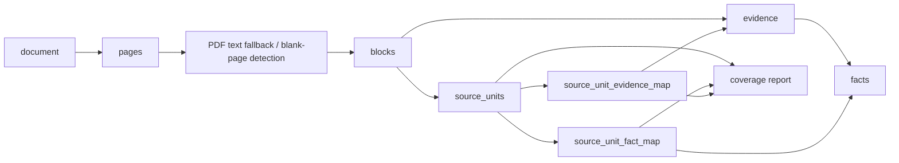
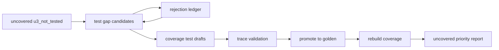
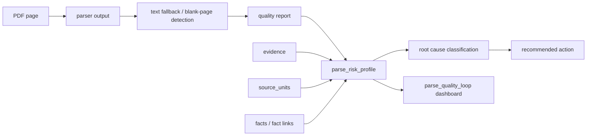
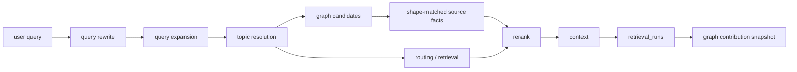
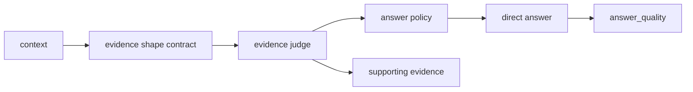
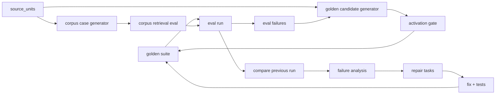
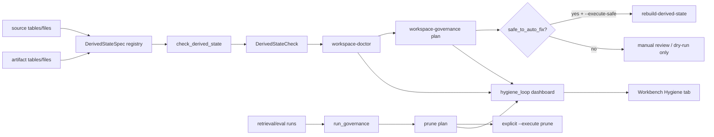

# 六个闭环架构

## 入库闭环

关键对象：`documents`、`pages`、`blocks`、`evidence`、`facts`、`source_units`、`source_unit_fact_map`、`source_unit_evidence_map`。

关键指标：`page_parse_success_rate`、`block_count`、`evidence_count`、`source_unit_coverage_rate`、`evidence_coverage_rate`、`fact_coverage_rate`、`uncovered_units`、`actionable_uncovered_units`。

`source_units` 是入库覆盖的最小追踪单元；`source_unit_fact_map` 和 `source_unit_evidence_map` 是它到 facts/evidence 的一等映射，不能只藏在 coverage JSON 或 `metadata_json` 里。Dashboard 的 `evidence_coverage_rate` 和 `fact_coverage_rate` 必须从这两张映射表按 distinct `unit_id` 计算；`legacy_evidence_coverage_rate` 只保留为旧字段兼容，含义等同于 `source_unit_coverage_rate`，不能再当 evidence 覆盖率使用。

新文档入库不能只以 pipeline 返回成功为完成标准。`validate-document-ingestion` 是通用验收入口，它在构建后检查 document、pages、blocks、evidence、facts、wiki、source_units、coverage artifact、coverage 阈值、document diagnostics 和 document knowledge contract，并把结果写入 `acceptance_reports/{doc_id}.ingestion_acceptance.json/.md`。该报告是判断“任意新文档能否顺利跑完整个过程”的主证据。

Pipeline 阶段可观测性属于入库闭环的框架能力。`enterprise_agent_kb.pipeline` 提供统一 `PipelineEvent`，覆盖 register、parse、quality、evidence、facts、entities、wiki、graph、coverage、ingestion_acceptance 以及 golden 相关阶段。CLI 的 `--progress` 和 API background job 均消费这套事件；不能在 CLI/API 各自维护不同阶段列表。长文档超时或中断时，最后一条 stage event 是定位根因的第一证据。

`enterprise_agent_kb.knowledge_contracts` 是入库闭环的知识类型合同层。它按 `standard_metadata`、`definition`、`parameter`、`process_activity`、`requirement`、`test_method` 声明 source unit 类型/role、fact types、expected evidence shape 和 active golden 的一致性要求。合同不是为某个文档写规则，而是检查“文档里已经出现的知识类型”是否从 source unit 追踪到 evidence/fact，并最终进入 golden 回归保护。`failed` 表示链路断裂，例如 source unit 无 fact/evidence 映射；`warn` 表示链路可用但还没完整产品化，例如某个 shape 没有 active golden。

Golden coverage 统计同时识别两种目标文档归属：普通 generated golden 使用 `golden_cases.doc_id`，corpus eval 这类跨 suite golden 使用 `metadata_json.expected_doc_id`。合同层必须同时读取这两个位置，否则 source-unit/corpus 生成的 active golden 会被误判为没有覆盖目标文档。Coverage draft promotion 和 golden 去重必须保留并合并 `expected_evidence_shape`；同一个 case 的旧版本缺 shape、新版本有 shape 时，应补齐约束而不是保留低信息版本。

`requirement` 是一等 evidence shape。`constraint` query type 的合同允许 `parameter_definition`、`process_activity` 和 `requirement`；evidence judge 通过 `requirement/table_requirement` fact、`shall`、`规定`、`要求` 等证据形状判断 requirement sufficient。这样 requirement source unit 不会被错误塞进 parameter/process 合同，也不会在 golden eval 中因为 shape contract 缺失而失败。

标准文档元数据抽取属于入库闭环，不属于查询 alias 补丁。`document_standard` 必须通过标准号形状和来源上下文校验；版权页、页眉页脚、`© ISO 2013`、copyright office 等出版 boilerplate 不能生成标准事实。若首页文本层缺失标准号，可从 `source_filename` 作为候选来源提取 `ISO 14229-1—2013` 等稳定锚点，但仍必须经过同一候选质量门。

现有工作区允许从 `source_units.metadata_json.covered_by` 做幂等回填，以迁移历史 coverage matrix 结果；新 coverage 构建必须在 `sync_source_units_from_matrix` 阶段直接写入映射表。

`fact_fallback` 生成的 source unit ID 必须由 `doc_id`、`unit_type`、页码、语义键和原文片段稳定计算，不能嵌入 `FACT-*`。`FACT-*` 可能在重建 facts 后变化；若 source unit ID 跟着变化，coverage golden case 会在下一次重建后变成 `trace_unit_not_found`。

golden-gap 治理由 `close-coverage-test-gaps` 形成批量闭环：

`coverage_test_gap_rejections.json` 记录验证失败、弱锚点、噪声型草案。后续批次必须跳过这些 unit，避免同一批低质量候选反复占用自动生成预算。历史 coverage golden 的 trace 校验允许在 `coverage_unit_id` 找不到时用 `coverage_semantic_key` 回退匹配当前 matrix，以兼容旧 ID。

source unit inventory 在进入覆盖义务前过滤结构性噪声和低价值残片，包括目录/目次/引言/结语、短结构标题、目录点线条目、图例标引说明、表格语法残片、纯符号参数行。过滤发生在 source unit 构建阶段，而不是在答案或测试失败后补救。目录点线条目通常表现为大量连续点号、页码和多个章节标题拼接；它们不能生成 requirement source unit 或 corpus/golden 候选。

当 inventory 规则删除 source unit 后，coverage golden promotion 会剪掉既无 `coverage_unit_id` 命中、也无法通过 `coverage_semantic_key` 命中当前 matrix 的 obsolete coverage case；能语义命中的历史 case 必须保留，避免 facts/source unit ID 重建导致误删有效样例。

当前入库闭环基线：

- `source_unit_count`: 2145
- `source_unit_coverage_rate`: 0.987879
- `evidence_coverage_rate`: 1.0
- `fact_coverage_rate`: 1.0
- `uncovered_units`: 26
- `actionable_uncovered_units`: 0
- Remaining uncovered root cause: `test_gap_rejected` only

## 解析质量闭环

关键对象：`parse_views`、`page_parse_selection`、`pages`、`quality_reports.report_json.pages`、`evidence`、`source_units`、`source_unit_fact_map`、`fact_evidence_map`、`document_diagnostics.parse_quality`、`closed-loop-dashboard.parse_quality_loop`。

关键指标：`parse_risk_pages`、`actionable_parse_risk_pages`、`chain_gap_pages`、`review_only_pages`、`evidence_backed_high_risk_pages`、`source_unit_backed_high_risk_pages`、`fact_backed_high_risk_pages`、`fully_backed_high_risk_pages`。

PDF 解析不能只信主解析器输出。若主解析器给出空 `blocks`，解析层必须用 PDF 原生文本层做通用回填；若文本层也为空且页面视觉上接近空白，则标记为 `blank`。`page_status`、`risk_level`、`parser_confidence`、`ocr_confidence` 必须写入 normalized JSON，避免质量层和后续闭环丢失解析阶段的页面级判定。

PDF provider routing 采用 fast-text-first 策略，但不能只看文本层是否存在。`parse._profile_pdf_text_layer` 同时统计文本覆盖率、平均语义字符数、可读页数、平均 readability、symbol ratio 和 unreadable ratio；只有覆盖率和可读性同时达标时，primary parser 才直接使用 `pymupdf_fast_text`。文本层乱码、符号噪声过高或可读页不足时，必须回退到 `minimax_primary+astron_backup+paddlevl` 慢路径。MiniMax/Astron 仍可用，但不应成为所有 PDF 的默认入口。

PyMuPDF fast text 不是裸文本直通。解析层会把 NFKC 归一化后的文本块按通用章节号、附录号和步骤号拆成 heading/paragraph blocks，保证 procedure/test-method、requirement 和 section facts 可以从数字 PDF 中形成独立知识单元。多解析视图 selection 还会把结构分数与 readability、重复行和页眉页脚噪声绑定，防止 PyMuPDF HTML 中逐字换行或伪章节号页面覆盖更可靠的文本/OCR 视图。

`parse_risk_pages` 是 raw 质量 backlog，不等同于待修解析缺口。解析质量闭环按证据链把 high-risk 页面拆成 `no_evidence`、`evidence_without_source_unit`、`source_unit_without_fact`、`fully_backed`。`actionable_parse_risk_pages` 只统计没有 evidence 的页面；`chain_gap_pages` 只统计已经形成 source unit 但没有 fact 映射的页面；`review_only_pages` 表示页面已有 evidence，且没有解析链路阻断。`source_units` 不是每页必有的页面级对象，不能把“有 evidence 但没有 source unit”直接当解析失败。

Document diagnostics 不再把所有 `low_readability` 页面直接变成验收 warning。它必须先生成 `parse_quality` profile：证据链完整的页面进入复核 backlog，真正缺 evidence 或链路断开的页面才进入 warning。这样新文档验收不会因为可解释的低可读性页面误报失败，也不会掩盖真实解析缺口。

多解析视图是解析质量闭环的候选层。`parse_views` 保存每页候选视图，`page_parse_selection` 保存被选中的视图和 `selected_reason`。PDF 解析当前会登记主解析器输出，并额外生成 `pymupdf_html` 候选；最终 `pages`、`blocks` 和 normalized JSON 由 selected view 驱动。后续更强的 OCR-to-HTML 或外部 PDF-to-HTML provider 只能作为新增候选接入，不能绕过 selection 直接写最终 facts。

Parse risk 自动归因必须由 `doc_diagnostics.parse_quality` 输出，而不是由 Workbench 前端临时判断。归因类型包括 `provider_quality_issue`、`selection_rule_issue`、`extraction_chain_issue`、`review_only` 和 `test_coverage_gap`；它们把风险页映射到 provider、selection、抽取链路、人工复核或测试覆盖动作。

解析质量闭环通过 `enterprise_agent_kb.parse_risk_actions` 接入回归闭环，但不直接污染 golden suite。`parse-risk-actions` 读取 `document_diagnostics.parse_quality`，输出 dry-run 行动计划：provider/selection/extraction 问题生成修复任务建议，只有 `test_coverage_gap` 生成 golden/corpus 候选请求，并且仍需经过 readiness/activation gate。这个桥接层用于防止把解析 provider 或抽取链路问题误归类为答案回归问题。写入 `repair_tasks` 必须显式开启；持久化时按 `reason + module + action` 聚合成系统级任务，文档和页码只进入 metadata，避免每个页面生成一条噪声任务。

目录、图表目录、双语 contents/sommaire、list of figures/list of tables 这类导航页属于 `structural_navigation_noise`。它们可以有 high-risk readability flags 和 evidence，但不应该要求生成 source unit 或 fact，也不能被误归因为 provider/extraction/test gap。行动计划和 repair review 同时写 latest 报告和 timestamped history 报告，供趋势审计使用。

`parse_risk_history` 汇总 timestamped action/review 报告，并挂在 `closed-loop-dashboard.parse_quality_loop.parse_risk_history`。Dashboard 展示每个文档最新归因、历史样本数、归因 delta 和 review 状态分布，用于判断解析质量闭环是否真的改善。

`/closed-loop-dashboard` 必须暴露 `parse_quality_loop`，与入库、召回、答案、回归、派生状态治理同级。入库闭环可以保留 legacy `parse_risk_profile` 字段兼容旧 UI，但健康判断应由解析质量闭环负责，避免两个闭环重复告警。

当前解析质量闭环基线：

- `parse_risk_pages`: 120
- `actionable_parse_risk_pages`: 0
- Raw high-risk pages are currently review backlog unless `no_evidence` or chain-gap counts appear.

## 召回闭环

关键对象：`retrieval_runs`、query context、graph candidates、rerank explanations。

关键指标：`Recall@5`、`Recall@10`、`MRR`、`nDCG@5`、`negative_hit_rate`、`must_hit_coverage`、`graph_retention_rate`、`graph_lost_after_rerank_runs`。

Graph 贡献度由 closed-loop dashboard 从最近 `retrieval_runs.metadata_json` 聚合，不参与事实裁决，只用于判断 graph 候选是否被最终 top context 保留。

Graph 候选必须是可进入 top context 的证据候选，而不是只证明关系存在的边证据。当前 `has_process` 生命周期查询会沿 process wiki 的 `source_fact_ids` 扩展，并按 `process_activity` 证据形状优先返回带 BP 锚点的 `process_fact`，避免 Raw retrieval metadata 显示 graph 命中但最终上下文仍是概览表或章节标题。

`retrieval_runs.code_version` 是召回闭环的版本边界。Dashboard 展示 graph contribution 时必须同时展示 `current_code_version_runs` 和 `stale_or_unknown_runs`，并在当前版本已有样本时优先使用 `current_version_graph` 判断 graph retention，避免用旧代码运行结果判断当前修复效果。

短缩写歧义等 `clarification` case 属于非召回契约：评测应验证 `clarification_required` 和选项，不写 `retrieval_runs`，也不参与 recall/MRR 失败统计。

缩写召回必须区分裸缩写和上下文缩写。裸 `CP是什么意思`、`CC是什么意思` 先进入 clarification；`CP控制导引是什么意思` 这类复合主题必须在 rewrite 中保留上下文，不得坍缩为 `CP`。Graph/topic resolution 可以用 `CP` 作为 protected anchor，但最终召回和 evidence judge 的目标主题必须仍包含用户提供的上下文，否则会退化成参数表、章节标题或跨文档噪声竞争。

## 答案闭环

关键对象：`evidence_judgement`、`supporting_facts`、`supporting_evidence`、answer quality metrics。

关键指标：`answer_pass_rate`、`citation_correct_rate`、`forbidden_contains_rate`、`answer_mode_accuracy`、`confidence_calibration`。

`eval_runs.code_version` 是答案闭环的版本边界。Dashboard 读取 `answer_quality` 时只使用当前 `code_version` 的 eval run；旧版本 answer eval 只能作为 `latest_historical_eval_*` 背景展示，不能决定当前 Answer Loop 健康状态。

Answer Loop 的 Failure Analysis 必须绑定到同一个 `latest_answer_eval`，不能复用全局最新 eval run；否则先后运行不同 suite 时会出现 answer metrics 和 failure_count 不属于同一评估样本。

Evidence judge 的 `sufficient=false` 是答案策略的硬门之一。当前已对 query type 为 `standard_lookup` 的标准定义类查询启用硬降级：如果证据裁判判定候选不足，answer policy 必须降级为“证据不足以确认”，并返回缺失证据形状和拒绝原因；不能继续用模板或 LLM 生成最终事实。后续扩展到 `lifecycle_lookup`、`test_method_lookup`、`timing_lookup`、`parameter_value`、`parameter_meaning` 前，必须先补齐对应 evidence shape contract，避免把标准实施日期这类 lifecycle 查询误判成 process_activity。LLM judge 只能裁判候选，不能绕过规则校验直接给出事实。

`definition` 的证据合同是动态收窄的：无参数意图时只接受 `term_definition`；只有文本明确带 `阻值`、`电压`、`PWM`、`检测点`、`参数` 等参数意图时，才允许 `parameter_definition`。答案层的章节 fallback 必须尊重强匹配术语定义；当候选 term 同时覆盖用户复合主题中的缩写和上下文时，不能用章节导言、前言或标准替代关系覆盖它。

含标准号的发布日期/实施日期问法虽然 query type 可归为 `lifecycle_lookup`，答案策略仍应使用标准元数据策略，而不是 process/timing 策略。标准生命周期事实来自 `document_standard`、`document_lifecycle`、`document_versioning`，不能落到过程表或时序表。

## 回归闭环

关键对象：`golden_cases`、`eval_runs`、`eval_results`、`repair_tasks`、`GoldenCandidate`、corpus case JSON。

关键指标：`new_failures`、`fixed_failures`、`stable_pass_rate`、`retrieval_regression_count`、`answer_regression_count`。

回归闭环的当前健康只看最新 eval run 的失败与其生成/复现的 `repair_tasks`。历史 `repair_tasks` 作为 backlog 通过 `historical_repair_task_status_counts` 展示，不能直接让当前 Regression Loop 失败；否则旧版本失败会污染当前版本的回归结论。

所有 eval runner 必须通过 `record_eval_run` 写入 `code_version`。`record_eval_run` 默认使用运行时源码内容指纹，只有迁移历史数据或构造测试夹具时才允许显式写入非当前版本。源码指纹不使用文件 mtime，避免单纯 touch 文件造成版本噪声。

评估 runner 的召回窗口不能小于对外报告的最大 K 值。当前系统报告 `Recall@10`，因此 user-query eval 和 generated golden eval 的默认检索 limit 至少为 10；否则 rank 9-10 的有效候选会被采样窗口截断，导致指标失真。

Retrieval Loop 的 dashboard 指标优先来自 `regression:user_query_retrieval*` 套件。其他 eval（例如 query repair smoke）即使包含 `retrieval_quality`，也只是该套件的附带指标，不能覆盖专门召回闭环的当前样本。

Corpus scale eval 是入库闭环到回归闭环的规模化验证入口。`generate-corpus-eval-cases` 从 `source_units` 中确定性抽样 definition、parameter 和 process_activity case，保留 `coverage_unit_id`、`expected_doc_id`、`expected_query_type`、`expected_evidence_shape` 和 `retrieval_must_hit`，但不从错误召回结果反推断言。`run-corpus-retrieval-eval` 复用 `build_query_context`，把结果写入 `golden_cases(source=corpus_eval)`、`eval_runs` 和 `eval_results`。它的失败表示全局召回/形状契约缺口，应进入 Failure Analysis 或 issue 流程，而不是在生成器里硬编码规避。

Corpus eval 支持 `case_offset`/`case_limit` 分批窗口。分批窗口只限定本次 `eval_results`，完整 case file 仍会同步到 `golden_cases(source=corpus_eval)`，避免子集评测把未运行 case 误标为 deprecated。`eval_runs.result_summary_json.evaluation_window` 记录 `total_case_count`、`case_offset`、`case_limit` 和 `evaluated_count`，用于审计大规模基线是否被完整覆盖。`duration_summary` 汇总本批总耗时、平均耗时和最大单 case 耗时；CLI 的 `--progress` 在每条 case 结束后输出 JSON 进度事件，用于长批次观察和性能归因。

Corpus eval 的 `evidence_shape_quality` 统计 case 级严格期望形状是否命中，`shape_contract_quality` 统计 evidence judge 自身的形状契约是否匹配。这两类指标不能混用：前者用于发现 source-unit 派生样例的召回质量缺口，后者用于判断 judge contract 是否误判。

Golden Generation v1 由 `enterprise_agent_kb.golden_generation` 统一自动候选语义层。候选必须包含 `origin`、`confidence_tier`、`assertion_contract`、`trace` 和 `readiness`；`generate-golden-candidates` CLI 只输出 JSON/Markdown dry-run report，默认不写入 active golden。source-unit 候选继承 corpus eval 的稳定契约但标记为 `corpus_eval_requires_review`；eval-failure 候选只能从原 case 的稳定 expected contract 继承断言，实际错误召回 top items 只允许进入 trace，不能反向成为 `must_hit`。activation gate 是进入 active golden 前的规则校验层，不能由 LLM 直接决定。

Source-unit 候选桥接层必须在 corpus eval 和 golden generation 之间复用同一套 anchor quality gate。英文长锚点按词边界截断，requirement 锚点会去掉 `Table N specifies...`、`Figure N shows...` 等说明性尾巴；同一文档、同一 case type、同一 query/primary anchor 的重复候选以 `duplicate_candidate` 跳过。这个规则属于候选质量门，不属于某个文档的例外处理。

自动生成的 requirement/constraint 查询必须走规则优先召回。`有哪些要求/有什么要求/要求有哪些/要求是什么` 这类显式问法在 rewrite 层直接归为 `constraint`，在 expansion 层直接生成 `requirement_set`，不能为每条 corpus/golden case 调 LLM 规划。英文 topic 要先剥离中文问题后缀并作为 must term 保留；lowercase `data/requirement/shall` 等泛词不能升为 hard anchor。召回层通过 `direct_requirement` channel 按 normalized topic 注入 `requirement/table_requirement` facts，再交给 evidence judge 做形状校验。

检索路由不能把所有 expansion terms 都当作结构化检索 seed。对 `constraint` 查询，`要求`、`requirement`、`requirements`、`shall`、`must`、`should` 是证据形状提示词，不是 facts/evidence/wiki 全库搜索锚点；`retrieval_router._structured_search_seeds` 必须去重并过滤这些泛词，只保留 topic、标准号、缩写、表号、数值等有区分度的锚点。否则 corpus eval 会正确但不可扩展，表现为单条 case 花费数十到上百秒。

Generated golden pytest 是回归闭环的一层执行物，不应把长文档测试耗时放大到不可控。`context_contains` 类 generated case 默认关闭 LLM evidence judge，以规则 judge 和检索 trace 验证召回；全量长文档 suite 仍应支持 smoke/分批运行。若 full suite 超时，归因到性能预算或测试分层，不把低质量样本删成“通过”。

Source-unit 到 corpus/golden candidate 之间必须有 evidence-shape gate。`definition_unit` 不能只因为有 `canonical_title` 和 fact/evidence link 就生成“X 是什么意思”；它还必须证明 anchor 出现在正文中，正文前段有定义/解释 cue，且 anchor 不是姓名列表、作者行或摘要碎片。未通过的单元归因到 `weak_definition_shape`，后续应修 source unit/解析/coverage 质量，而不是在查询或 golden 层硬编码单条过滤。

英文标准术语定义与中文术语定义共享同一 evidence-shape gate。`facts._definition_has_publishable_signal` 是英文定义信号的来源，`corpus_eval._has_definition_evidence_shape` 复用该规则；`is a/is an/is the`、`function that`、`data that`、`software which`、`part of`、`set of` 等定义体可生成 source-unit/corpus/golden 候选。这样 facts、coverage doctor、corpus eval 和 golden generation 不会各自维护一套互相矛盾的“定义形状”。

`workspace-doctor --scope coverage` 也必须复用同一套 source-unit candidate quality 判定。它把 `weak_definition_shape` 汇总为 `source_unit_weak_definition_shape`，并提供样例；这让入库闭环可以直接看到“误标 definition”的根因，而不是等 Golden 生成或用户查询时才暴露。

定义类答案事实选择先满足证据形状，再比较 graph/subgraph 近邻信号。精确匹配的 `term_definition`/`concept_definition` 必须排在同名 `section_heading` 前面；章节标题可作为导航证据补充，但不能成为定义答案的首要支撑事实。这个约束保证 `direct_answer` 与首要 `supporting_facts` 一致。

定义类比较键必须去掉 Markdown 包裹和行首结构符号。解析器可能把术语写成 `**vehicle connector**` 或反引号包裹形式；如果答案层不做同一规范化，会误判精确定义缺失并触发 section fallback，造成 `supporting_facts` 正确但 `direct_answer` 来自无关章节。

图例、作者行和摘要碎片的根因修复应在 `knowledge_units._looks_like_definition_term` 层完成：这些块不能被配对为 `definition` knowledge unit。修复抽取规则后，必须重新生成受影响文档的 facts/knowledge_units，并刷新 entities、wiki、graph、coverage，确保 DB 中的 `source_units` 不保留旧误分类。

定义 source unit 的准入不能只看“标题短 + 正文含解释词”。正文如果是表格数值块，例如高数字密度、状态/等级/Hz/%/工频周期等矩阵型 token 密集出现，应判为 table/value body，不得与前一短标题配成 definition unit。这类问题应在 `knowledge_units` 抽取层修复，coverage/golden 只负责暴露 `weak_definition_shape`，不能用单条 case 黑名单掩盖。

英文标准文档的 requirement 抽取同样属于知识单元形状层，而不是 query 或 golden 层。`shall`、`should`、`must`、`is/are/be required to` 是英文规范性 requirement 信号；ISO/IEC 专利、版权、trade-name 等 boilerplate 即使包含 `shall` 也必须被过滤。图示 Key、时序图编号、纯数字 heading、`See (n)` heading、以及 `T_Data/S_Data/N_USData/DoIP_Data...:` 步骤说明不能更新 `current_heading`，否则会污染后续 requirement 的 `canonical_key` 并生成错误 golden query。

## 派生状态治理闭环

关键对象：`DerivedStateSpec`、`DerivedStateCheck`、`facts_fts`、`evidence_fts`、`wiki_fts`、`logs/fts_index.stamp`、`retrieval_runs`、`eval_runs`、`eval_results`。

当前已落地范围：`enterprise_agent_kb.derived_state` 登记 FTS 派生状态，并提供只读检查入口。检查会比较 source/artifact 计数、missing/orphan ID 和 `logs/fts_index.stamp` 中记录的源行签名，返回 `fresh`、`stale` 或 `missing`，同时给出 `severity` 与 `recommended_actions`。源行签名只覆盖 FTS 真正依赖的 `facts`、`evidence`、可检索 `wiki_pages/entities` 内容，避免 retrieval/eval run 写入导致整库 mtime 误报。

`enterprise_agent_kb.retrieval.search_knowledge_base_expanded` 在 own connection 和 shared connection 两条路径都会执行 FTS freshness guard。guard 消费 `DerivedStateCheck`，在 FTS 缺失或过期时复用同一个刷新节点重建 `evidence_fts`、`facts_fts`、`wiki_fts`，避免 query context 主链路因为复用 connection 而看见陈旧 `facts_fts`。guard 按 FTS state 判断是否刷新，不依赖公开 CLI 命令字符串。

`enterprise_agent_kb.workspace_doctor` 是派生状态治理闭环的只读操作者入口。`workspace-doctor --scope all|fts|graph|wiki|coverage|runs --json` 输出 `WorkspaceDoctorReport`，汇总 `DerivedStateCheck`、graph/wiki/source unit 映射 orphan、可疑空 DB 文件，以及 retrieval/eval runs 的旧或未知 `code_version` 风险。每个 issue 只给 `recommended_actions`，不执行刷新、重建、剪枝、隔离或删除。

`enterprise_agent_kb.workspace_governance` 是 doctor 之上的策略编排层。`workspace-governance --scope all --json` 复用 doctor 输出生成治理计划，把 issue 分成 `safe_to_auto_fix`、`historical_residue`、`manual_review_required` 和 `active_data_corruption`。默认只输出计划；显式传入 `--execute-safe` 时，保守策略只执行 FTS、graph、wiki、coverage 映射 orphan 这类可幂等回滚的派生状态重建，并在执行后再次运行 doctor 形成 post-check。graph/wiki/coverage reconcile 会改变 FTS 依赖源，因此 governance 在结构派生物修复成功后必须级联执行 `rebuild-derived-state --scope fts`，避免把一个残留转化为 stale FTS。旧/未知 `code_version` 的 runs 只归为历史残留，仍保留 `prune-stale-runs --dry-run`，不能由 governance 自动删除。

`enterprise_agent_kb.derived_state_rebuild` 是派生状态治理闭环的显式修复入口。`rebuild-derived-state --scope fts` 会执行幂等 FTS rebuild，并输出重建前后的 `DerivedStateCheck` 摘要、changed counts 和状态；`--dry-run` 只报告 planned action，不创建 FTS 表、不写 stamp。`--scope graph|wiki|coverage` 执行 structural reconcile：graph 清理 src/dst entity 已不存在的 `graph_edges` 以及 edge/evidence 已不存在的 `edge_evidence_map`；wiki 清理 entity/source fact/source doc 无效或 source JSON 无法解析的 `wiki_pages`；coverage 清理 unit/fact/evidence 已不存在的 source unit 映射行。`--scope all` 先执行 graph/wiki/coverage reconcile，再执行 FTS rebuild，避免 wiki 行变更后立即留下 stale `wiki_fts`。

`rebuild-derived-state --mode full` 是结构派生物的全量再生成入口。它和默认 `--mode reconcile` 显式区分：reconcile 只清 orphan artifact row；full mode 复用文档级构建器从主数据重建 graph/wiki/coverage。`--doc-id DOC` 可限定一个 active document；不带 `--doc-id` 时遍历所有 active documents。`--scope all --mode full` 固定按 wiki、graph、coverage、fts 执行，以匹配入库 pipeline 并确保 wiki 变化后刷新 `wiki_fts`。文档级 graph build 会先删除该 doc 的旧 `graph_edges`/`edge_evidence_map`，wiki build 会删除该 doc 中本轮仍为 stale 的 `wiki_pages`，coverage build 继续由 `sync_source_units_from_matrix` 执行文档级替换。全库 full rebuild 用全局 doctor 状态判定成功；doc-scoped full rebuild 用该 doc 的派生物完整性判定成功，同时在 after 摘要保留全局 doctor issues，避免其他文档残留污染本次 doc 级状态。

`enterprise_agent_kb.run_governance` 是运行派生物的显式治理入口。`prune-stale-runs --dry-run` 是默认行为，只输出旧/未知 `code_version` 的 retrieval/eval run 候选、候选数量和最多 50 个样例 ID；当候选超过样例上限时用 `candidate_ids_truncated` 标记。只有显式传入 `--execute` 才删除候选 `retrieval_runs`、`eval_runs`，并先删除对应 `eval_results`。执行删除前必须写 JSON archive，默认目录是 `knowledge_base/quarantine/run-prune`，也可以用 `--archive-dir` 指定。`--execute` 还有当前版本基线安全门：当待剪枝表没有任何 current `code_version` rows 时，命令返回 blocked，不写 archive、不删除；只有显式 `--allow-without-current-baseline` 才能越过该保护。`--suite-id` 只作用于 `eval_runs`，因为 `retrieval_runs` 没有 suite 维度；指定 suite 时 retrieval 分支返回 skipped，避免错误套用过滤条件。`--older-than-days` 是额外年龄过滤，时间戳无法解析的记录不会在年龄过滤启用时被删除。`--keep-latest-code-versions N` 可在 current code version 之外保留每张 run 表中最近 N 个非空源码版本，适合保留短期调试背景；unknown runs 不会被该策略保护。doctor 的 run issue 必须包含 `current_count`、`unknown_count`、`stale_count` 和 `total_count`，让操作者区分“当前版本没有样本”和“历史残留仍需治理”。

运行派生物治理的删除边界是固定约束：不删除 `golden_cases`、`repair_tasks`、source units、facts、evidence、wiki、graph 或报告文件；不改写历史 run 的 `code_version`；不把旧 run 伪装成当前版本。`workspace-doctor --scope runs` 发现旧/未知 runs 时只推荐 `prune-stale-runs --keep-current-code-version --dry-run`，不直接执行剪枝。

`enterprise_agent_kb.db_hygiene` 是额外可疑 DB 文件的显式治理入口。`quarantine-suspicious-db-files` 默认 dry-run，只扫描 primary database 之外的 `.db` 文件；当文件为 0 字节、无法读取或没有用户表时才进入候选。只有显式 `--execute` 才把候选移动到 `knowledge_base/quarantine/db`，不直接删除，也不触碰主库 `knowledge_base/db/knowledge.db`。

`enterprise_agent_kb.api_server` 在 `/closed-loop-dashboard` 中暴露 `hygiene_loop`，作为派生状态治理闭环的只读 dashboard contract。它调用 `run_workspace_doctor(scope="all")` 获取 FTS、graph、wiki、coverage、runs 风险，再调用 `prune_stale_runs(dry_run=True, keep_current_code_version=True)` 获取旧/未知 runs 的剪枝计划摘要。Workbench Overview 展示 Six Loop Dashboard，Hygiene tab 展示 doctor issues、derived state checks、dry-run prune plan 和 recommended actions。

`tests/test_residual_state_regression.py` 是派生状态治理闭环的系统级残留态回归套件。它在临时 workspace 中主动构造 stale FTS、orphan graph/wiki/coverage refs 和旧/未知 runs，分别验证 `check_derived_state`/retrieval guard、`workspace_doctor`/`hygiene_loop`、`prune_stale_runs` dry-run/execute 边界。`tests/test_workspace_governance.py` 验证 doctor issue 的策略分类、`--execute-safe` 边界和 CLI JSON 契约。该 suite 的职责是防止后续改动重新引入残留污染，不承担具体业务 query 答案正确性断言。

当前明确不做：registry/check 本身不执行刷新；dashboard 不执行 `rebuild-derived-state` 或 `prune-stale-runs --execute`；`workspace-governance --execute-safe` 不删除历史 runs、不改写 run 的 `code_version`，也不处理需要重新 parse/evidence/facts 的主数据问题；full rebuild 不重跑 parse/evidence/facts/entities，也不生成新的主数据事实。
