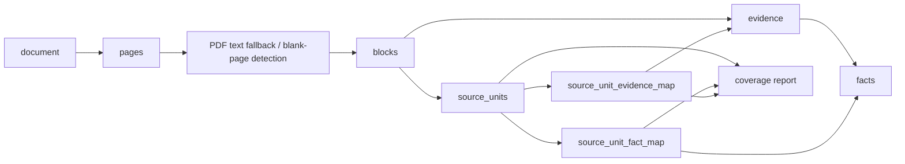
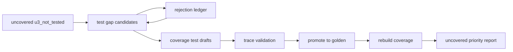
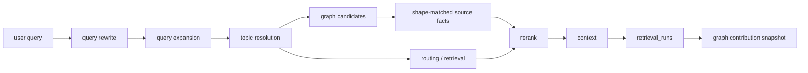
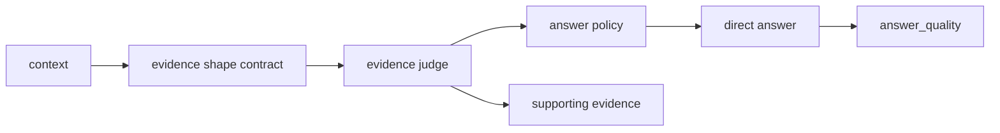
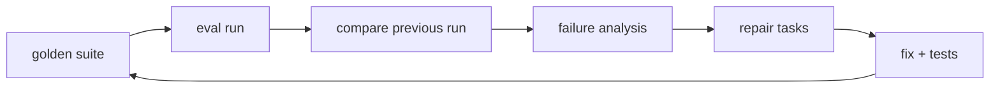

# 四个闭环架构

## 入库闭环

关键对象：`documents`、`pages`、`blocks`、`evidence`、`facts`、`source_units`、`source_unit_fact_map`、`source_unit_evidence_map`。

关键指标：`page_parse_success_rate`、`block_count`、`evidence_count`、`source_unit_coverage_rate`、`evidence_coverage_rate`、`fact_coverage_rate`、`uncovered_units`、`actionable_uncovered_units`、`parse_risk_pages`、`actionable_parse_risk_pages`、`parse_risk_profile`。

PDF 解析不能只信主解析器输出。若主解析器给出空 `blocks`，解析层必须用 PDF 原生文本层做通用回填；若文本层也为空且页面视觉上接近空白，则标记为 `blank`。`page_status`、`risk_level`、`parser_confidence`、`ocr_confidence` 必须写入 normalized JSON，避免质量层和后续闭环丢失解析阶段的页面级判定。

`parse_risk_pages` 是 raw 质量 backlog，不等同于待修解析缺口。Dashboard 健康只按 `actionable_parse_risk_pages` 告警，其定义是 high-risk 页面里没有任何 evidence 的页面。`parse_risk_profile` 必须把 raw high-risk 页面拆成 `no_evidence`、`evidence_without_source_unit`、`source_unit_without_fact`、`fully_backed`，从证据链根因判断下一步动作。

`source_units` 是入库覆盖的最小追踪单元；`source_unit_fact_map` 和 `source_unit_evidence_map` 是它到 facts/evidence 的一等映射，不能只藏在 coverage JSON 或 `metadata_json` 里。Dashboard 的 `evidence_coverage_rate` 和 `fact_coverage_rate` 必须从这两张映射表按 distinct `unit_id` 计算；`legacy_evidence_coverage_rate` 只保留为旧字段兼容，含义等同于 `source_unit_coverage_rate`，不能再当 evidence 覆盖率使用。

现有工作区允许从 `source_units.metadata_json.covered_by` 做幂等回填，以迁移历史 coverage matrix 结果；新 coverage 构建必须在 `sync_source_units_from_matrix` 阶段直接写入映射表。

`fact_fallback` 生成的 source unit ID 必须由 `doc_id`、`unit_type`、页码、语义键和原文片段稳定计算，不能嵌入 `FACT-*`。`FACT-*` 可能在重建 facts 后变化；若 source unit ID 跟着变化，coverage golden case 会在下一次重建后变成 `trace_unit_not_found`。

golden-gap 治理由 `close-coverage-test-gaps` 形成批量闭环：

`coverage_test_gap_rejections.json` 记录验证失败、弱锚点、噪声型草案。后续批次必须跳过这些 unit，避免同一批低质量候选反复占用自动生成预算。历史 coverage golden 的 trace 校验允许在 `coverage_unit_id` 找不到时用 `coverage_semantic_key` 回退匹配当前 matrix，以兼容旧 ID。

source unit inventory 在进入覆盖义务前过滤结构性噪声和低价值残片，包括目录/目次/引言/结语、短结构标题、图例标引说明、表格语法残片、纯符号参数行。过滤发生在 source unit 构建阶段，而不是在答案或测试失败后补救。

当 inventory 规则删除 source unit 后，coverage golden promotion 会剪掉既无 `coverage_unit_id` 命中、也无法通过 `coverage_semantic_key` 命中当前 matrix 的 obsolete coverage case；能语义命中的历史 case 必须保留，避免 facts/source unit ID 重建导致误删有效样例。

当前入库闭环基线：

- `source_unit_count`: 2145
- `source_unit_coverage_rate`: 0.987879
- `evidence_coverage_rate`: 1.0
- `fact_coverage_rate`: 1.0
- `uncovered_units`: 26
- `actionable_uncovered_units`: 0
- `parse_risk_pages`: 120
- `actionable_parse_risk_pages`: 0
- Remaining uncovered root cause: `test_gap_rejected` only

## 召回闭环

关键对象：`retrieval_runs`、query context、graph candidates、rerank explanations。

关键指标：`Recall@5`、`Recall@10`、`MRR`、`nDCG@5`、`negative_hit_rate`、`must_hit_coverage`、`graph_retention_rate`、`graph_lost_after_rerank_runs`。

Graph 贡献度由 closed-loop dashboard 从最近 `retrieval_runs.metadata_json` 聚合，不参与事实裁决，只用于判断 graph 候选是否被最终 top context 保留。

Graph 候选必须是可进入 top context 的证据候选，而不是只证明关系存在的边证据。当前 `has_process` 生命周期查询会沿 process wiki 的 `source_fact_ids` 扩展，并按 `process_activity` 证据形状优先返回带 BP 锚点的 `process_fact`，避免 Raw retrieval metadata 显示 graph 命中但最终上下文仍是概览表或章节标题。

`retrieval_runs.code_version` 是召回闭环的版本边界。Dashboard 展示 graph contribution 时必须同时展示 `current_code_version_runs` 和 `stale_or_unknown_runs`，并在当前版本已有样本时优先使用 `current_version_graph` 判断 graph retention，避免用旧代码运行结果判断当前修复效果。

短缩写歧义等 `clarification` case 属于非召回契约：评测应验证 `clarification_required` 和选项，不写 `retrieval_runs`，也不参与 recall/MRR 失败统计。

## 答案闭环

关键对象：`evidence_judgement`、`supporting_facts`、`supporting_evidence`、answer quality metrics。

关键指标：`answer_pass_rate`、`citation_correct_rate`、`forbidden_contains_rate`、`answer_mode_accuracy`、`confidence_calibration`。

`eval_runs.code_version` 是答案闭环的版本边界。Dashboard 读取 `answer_quality` 时只使用当前 `code_version` 的 eval run；旧版本 answer eval 只能作为 `latest_historical_eval_*` 背景展示，不能决定当前 Answer Loop 健康状态。

Answer Loop 的 Failure Analysis 必须绑定到同一个 `latest_answer_eval`，不能复用全局最新 eval run；否则先后运行不同 suite 时会出现 answer metrics 和 failure_count 不属于同一评估样本。

## 回归闭环

关键对象：`golden_cases`、`eval_runs`、`eval_results`、`repair_tasks`。

关键指标：`new_failures`、`fixed_failures`、`stable_pass_rate`、`retrieval_regression_count`、`answer_regression_count`。

回归闭环的当前健康只看最新 eval run 的失败与其生成/复现的 `repair_tasks`。历史 `repair_tasks` 作为 backlog 通过 `historical_repair_task_status_counts` 展示，不能直接让当前 Regression Loop 失败；否则旧版本失败会污染当前版本的回归结论。

所有 eval runner 必须通过 `record_eval_run` 写入 `code_version`。`record_eval_run` 默认使用运行时源码指纹，只有迁移历史数据或构造测试夹具时才允许显式写入非当前版本。

评估 runner 的召回窗口不能小于对外报告的最大 K 值。当前系统报告 `Recall@10`，因此 user-query eval 和 generated golden eval 的默认检索 limit 至少为 10；否则 rank 9-10 的有效候选会被采样窗口截断，导致指标失真。

Retrieval Loop 的 dashboard 指标优先来自 `regression:user_query_retrieval*` 套件。其他 eval（例如 query repair smoke）即使包含 `retrieval_quality`，也只是该套件的附带指标，不能覆盖专门召回闭环的当前样本。
