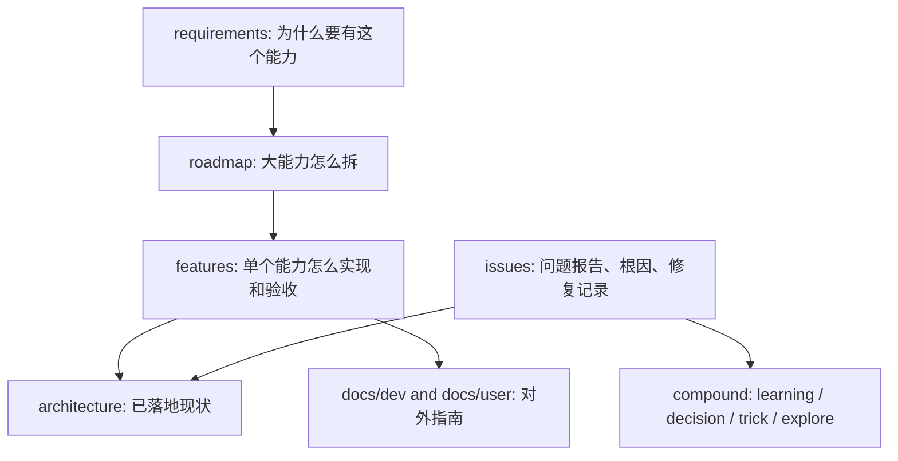
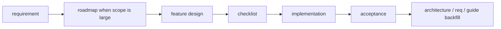
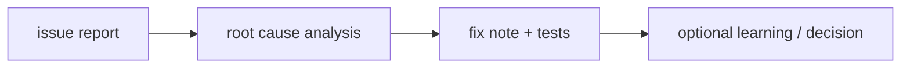

# CodeStable 开发流程架构

## 文档分层

## 标准开发路径

## 问题修复路径

## 本项目硬约束

- 所有 CodeStable 子技能先读 `.codestable/attention.md`。
- 代码变更必须先找根因，再决定修复层级。
- 不把局部失败点当作唯一输入，优先修框架边界。
- 不移动旧 `docs/` 历史文档；新开发流程文档写入 `.codestable/` 和 `docs/dev/`。
