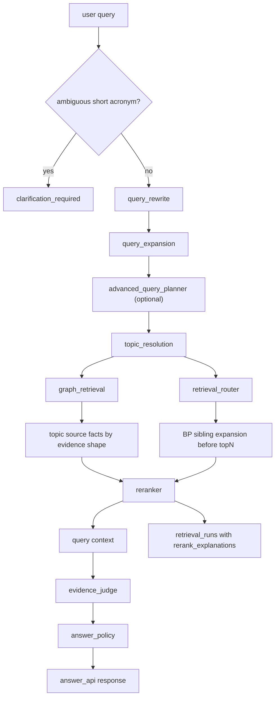

# 查询与答案链路架构

## 主链路

## LLM 边界

- Query Expansion 可以扩写检索计划，但必须保留硬锚点。
- Advanced Query Planner 默认关闭，只作为实验性多视角规划链路。
- Evidence Judge 只能在候选 fact/evidence ID 集合内裁判。
- Answer API 不允许把 LLM 输出当最终事实来源。
- 短缩写定义类查询先进入歧义澄清或规则回退，不应先交给 LLM 扩写。

## 关键入口

| 入口 | 作用 |
|---|---|
| `query_api.build_query_context` | 构建结构化召回上下文；短缩写歧义先返回 clarification context，其余查询写入 retrieval_runs。 |
| `answer_api.answer_query` | 构建可解释答案，短缩写歧义先澄清。 |
| `query_expansion.expand_query` | 结构化查询扩写，带规则准入门和 fallback。 |
| `evidence_judge.judge_evidence` | 根据 evidence shape 和候选约束判定证据是否足够。 |

## 已知边界

- `query-context` 对短缩写歧义查询返回 `clarification_required=true`，不进入 retrieval/rerank，也不写 retrieval run。
- Graph 是候选增强通道，不是最终事实裁决层。`graph_retrieval` 命中 topic entity 后必须按 query_type 的证据形状扩展到 topic wiki 的 `source_fact_ids`，例如 `lifecycle_lookup` 的 `has_process` 应优先返回带 BP 锚点的 `process_fact` 或 BP 编号 `table_requirement`，不能只返回过程概览表或章节标题。
- Graph 是否发挥作用以 `retrieval_runs.metadata_json.rerank_explanations[*].graph_source` 进入 top context 为准；closed-loop dashboard 聚合 `graph_retention_rate` 和 `graph_lost_after_rerank_runs`。
- 标准号查询包含 `GB/T`、`GBT`、`GB`、`ISO`、`IEC` 编号锚点时，topic resolution 必须优先解析 `standard` / `document` 实体；graph 不应沿 `has_process` 或 weak `relates_to_term` 扩散。
- Supporting evidence 展示清洗和 direct answer 清洗不是同一层。
- 生命周期活动召回的 BP sibling 扩展必须在 topN 截断前完成。同一 BP 的中英文重复证据要按查询语言和焦点词选择代表项，避免中文活动问题保留英文 BP、丢掉中文 must-hit 锚点。
- 参数召回必须同时满足对象锚点和物理量意图。电阻/阻值问题要求候选具备 `电阻`、`阻值`、`Ω`、`Rn` 或 `resistance` 证据，不能只凭 `CC/CP` 表级标签命中。
- **定义查询的术语召回**：`_inject_direct_term_definition_hits` 对 `definition` 查询注入 `term_definition`/`concept_definition` fact 作为 `direct_term_definition` channel hit。短缩写（`CP`/`CC` 等 `[A-Z]{2,6}`）走 acronym 分支；**仅在无短缩写时**才走中文长术语分支（`_definition_term_candidates`，从 `target_topic`/`aliases`/`should_terms`/`must_terms` 抽取 ≥2 字 CJK run）。评分优先权威字典术语（去 markdown `**` 后 `term` 字段以查询术语开头）。注入的是 KB 真实 fact（有 evidence 溯源），符合证据约束。参见 issue `2026-06-24-definition-query-exact-term-gate-drops-evidence`。
- Retrieval quality 的 negative hit 只针对用户可见证据内容，不把 `graph_fact`、`table_requirement` 等内部候选标签当作正文命中。
