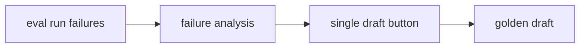
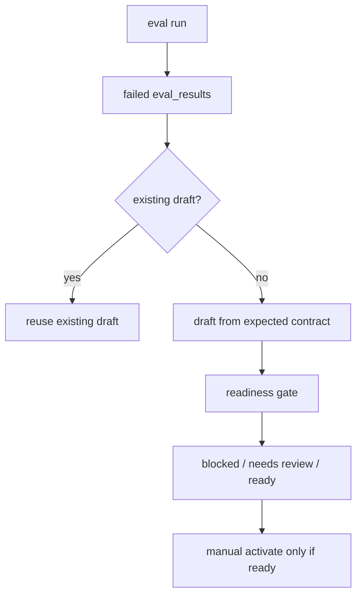

# Golden Case Auto Promotion Design

## 1. 目标

Failure Analysis 已能对单个失败 case 生成 golden 草案，但流程依赖用户逐条点击，真实失败容易漏沉淀。目标是把一次 eval run 中的所有失败批量转成 golden draft，并继续通过 readiness gate 控制是否能激活。

## 2. 明确不做

- 不把失败 case 自动设为 active。
- 不用失败时实际召回到的错误 top hit 反推 `must_hit`。
- 不改变 eval run 的判定逻辑。
- 不删除单条生成和单条激活入口。

## 3. 根因

当前闭环有 failure analysis 和 draft/activate 两个点，但缺少批量编排：

这会导致测试失败是否沉淀取决于人工逐条操作。同时，草案生成如果在缺少期望锚点时使用实际召回结果作为 `must_hit`，会把错误结果固化成 golden。

## 4. 方案

新增批量草案生成编排：

关键契约：

- 批量 API：`POST /draft-golden-from-failures`
- 输入：`eval_run_id`，可选 `case_ids`、`failure_types`、`limit`
- 输出：`drafted_count`、`existing_count`、`readiness_counts`、`draft_cases`
- `must_hit` 只来自原 golden case 的 expected contract，不从失败实际召回结果反推。
- 缺少 `must_hit` 和 `expected_evidence_shape` 的草案保持 blocked。

## 5. 验收场景

- 一个 eval run 中多个失败可以一次性生成 draft。
- 第二次批量生成不会重复创建，返回 existing。
- 缺少明确期望锚点的失败不会把错误 retrieved item 写成 `must_hit`。
- Workbench Failure Analysis 提供“生成全部 Golden 草案”入口。
- 单条 draft / activate 旧接口仍可用。
