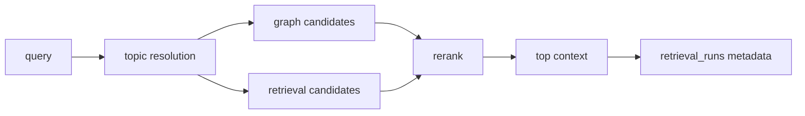
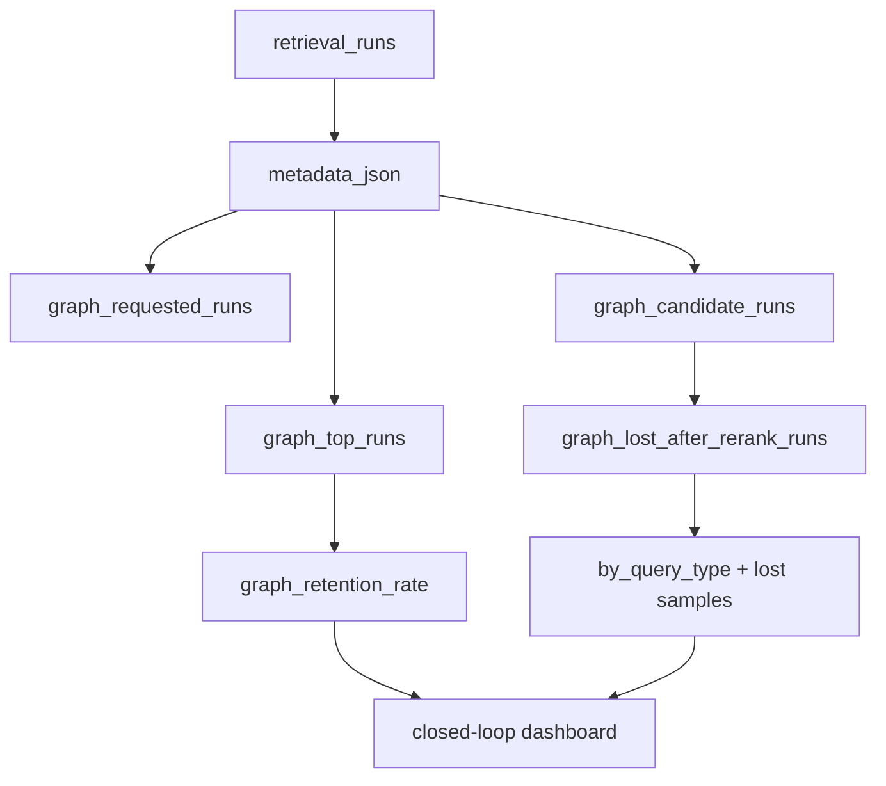

# Graph Contribution Dashboard Design

## 1. 目标

用户在 Raw retrieval metadata 中只能看到单次 `graph_hit_count` 和 reranked ids，无法判断 graph 是稳定发挥作用，还是生成候选后被 rerank 挤掉。目标是在 closed-loop dashboard 中增加 graph 贡献度快照，让召回闭环能按批量历史运行回答：

- graph 是否被请求；
- graph 是否产生候选；
- graph 候选是否进入最终 top 结果；
- graph 候选是否主要在 rerank 后丢失；
- 哪些 query_type 最容易丢失 graph 候选。

## 2. 明确不做

- 不修改 graph 检索逻辑。
- 不修改 rerank 权重。
- 不把某个查询的正确答案硬编码进召回规则。
- 不把 graph 作为最终事实裁决层；最终事实仍由候选约束、证据形状和答案策略决定。

## 3. 根因

当前架构里 graph 是候选增强通道，但召回闭环只记录单次运行 metadata，没有全局贡献度聚合：

这会产生一个系统性盲点：graph 看起来“接入了”，但如果它的候选长期没有进入 top context，用户只能靠手工查看 Raw metadata 发现问题。根因不是单个查询需要补 alias，而是召回闭环缺少 graph contribution 指标。

## 4. 方案

在 closed-loop dashboard 读取最近 `retrieval_runs`，从 `metadata.retrieval_plan`、`metadata.graph_hit_count` 和 `metadata.rerank_explanations[*].graph_source` 聚合 graph 贡献度：

新增指标：

- `sample_size`
- `graph_requested_runs`
- `graph_candidate_runs`
- `graph_top_runs`
- `graph_lost_after_rerank_runs`
- `graph_top_hit_count`
- `graph_candidate_count_total`
- `graph_request_rate`
- `graph_candidate_rate`
- `graph_retention_rate`
- `by_query_type`
- `lost_after_rerank_samples`

召回健康判断增加 graph 风险：

- 有 graph 候选但从不进入 top：`graph_candidates_never_retained`
- graph 保留率低：`low_graph_retention`
- graph 候选更多时候被 rerank 丢掉：`graph_lost_after_rerank_dominates`

## 5. 验收场景

- dashboard API 返回 `retrieval_loop.graph_contribution`。
- Workbench 顶部闭环指标显示 Graph retained/lost 概况。
- graph retained 和 graph lost 两类 retrieval run 能被正确计数。
- graph lost 多于 retained 时，召回健康风险中出现 `graph_lost_after_rerank_dominates`。
- JSON 异常或旧 metadata 不应导致 dashboard 失败。
