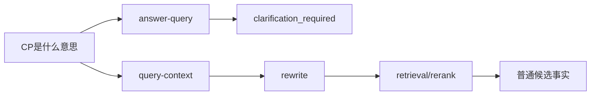
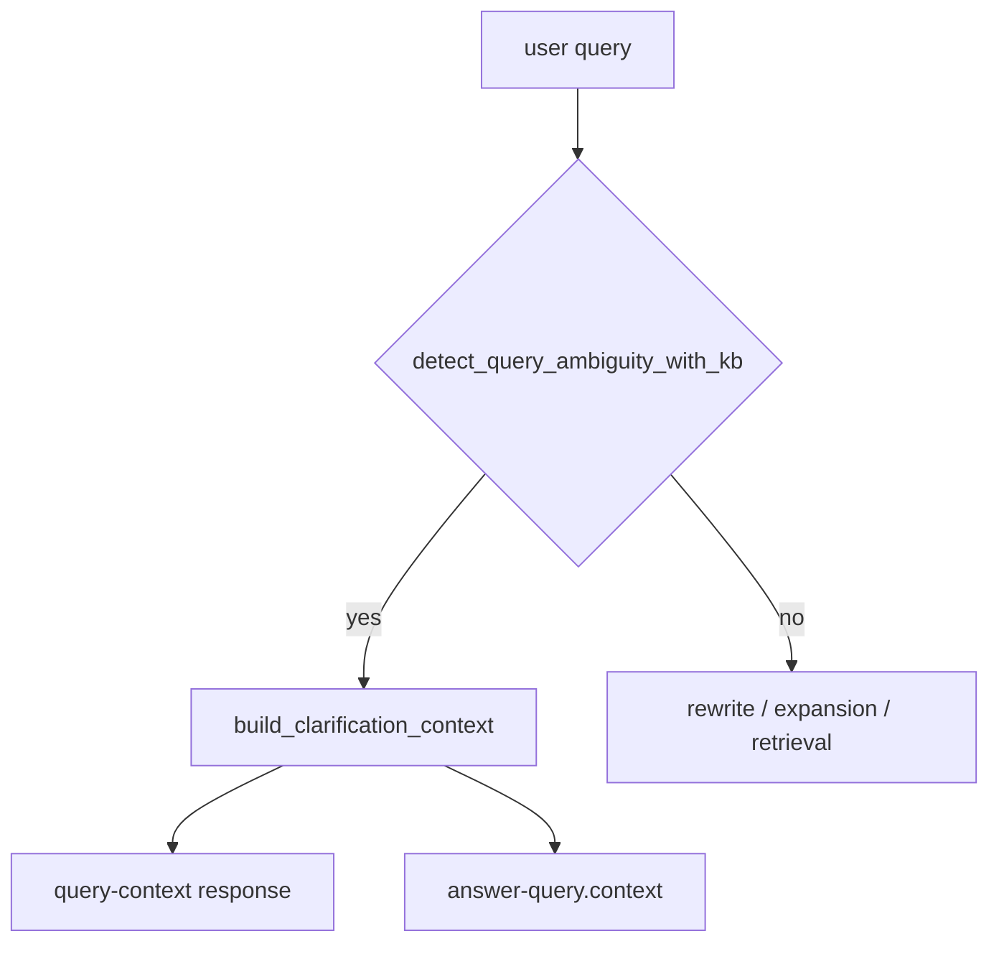

# Query Context Clarification Contract Design

## 1. 目标

短缩写定义类问题需要先澄清语境。此前 `answer-query` 会返回 `clarification_required=true`，但 `query-context` 仍直接进入 rewrite、retrieval、rerank 和 evidence judge，导致 Query Debug / Raw retrieval 看到的是普通召回结果。

目标是把澄清定义成查询链路的一等契约：任何入口只要命中歧义短缩写，就先返回统一的 clarification context，不产生 retrieval run，不让 graph、rerank 或 LLM 扩写继续猜最终事实。

## 2. 明确不做

- 不为某个具体缩写新增单点规则。
- 不删除现有手工 ambiguity registry；它继续作为 KB ambiguity index 缺失时的兜底。
- 不改变已经带上下文的查询，例如 `充电接口里的CC是什么意思`。
- 不改变普通检索、graph retrieval、rerank 或 answer policy 的排序逻辑。

## 3. 根因

澄清机制只挂在 `answer_api.answer_query()` 开头，`query_api.build_query_context()` 没有同等入口检查。

这造成同一问题在不同入口语义不一致：

根因是接口契约分裂，不是 CP 或 CC 某个候选排序错误。

## 4. 方案

新增共享澄清上下文构造函数，由 `query-context` 和 `answer-query` 共同复用。

契约字段：

- `rewrite.query_type=clarification`
- `clarification_required=true`
- `clarification.options[].example_query`
- `retrieval_plan.retrieval_skipped=true`
- `retrieval_run_id=null`
- `hit_count=0`
- `evidence_judgement.evidence_shape=clarification_required`

歧义来源优先使用 `knowledge_base/ambiguity_index.json`，手工 registry 只作为兜底，避免随着文档增多必须逐项注册。

## 5. 验收场景

- `build_query_context("CP是什么意思")` 返回 clarification context，不产生 retrieval run。
- `build_query_context("CC是什么意思")` 返回 clarification context，不产生 retrieval run。
- `answer_query("CP是什么意思")` 和 `answer_query("CC是什么意思")` 继续返回 clarification。
- `build_query_context("充电接口里的CC是什么意思")` 不被拦截，仍走 definition 检索。
- ambiguity index 测试仍通过，证明 KB-driven ambiguity 入口可用。
