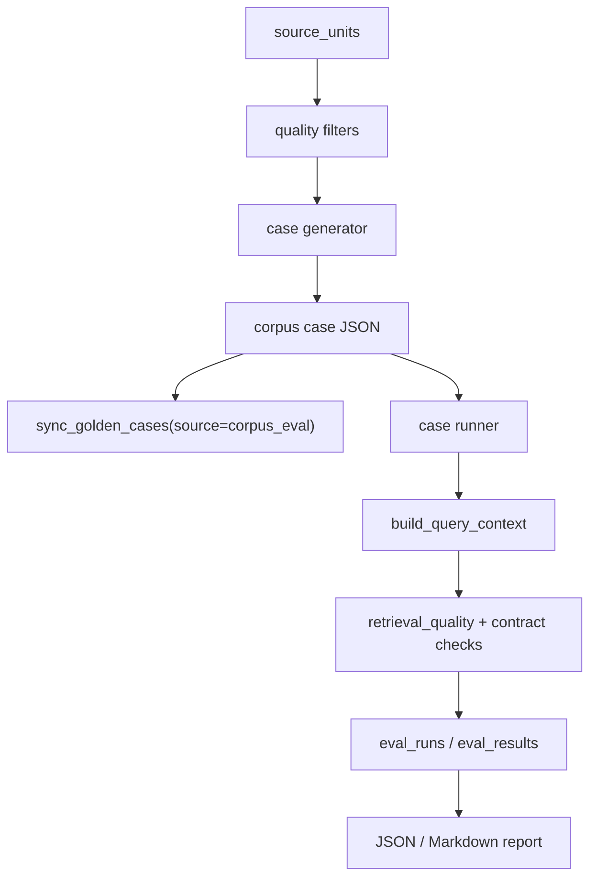

# Corpus Scale Eval Design

## 0. 术语

- `corpus eval`：从已入库知识单元自动生成的规模化评测，不依赖人工逐条编写 golden。
- `corpus case`：由一个 `source_units` 行派生出的评测样例，保留 `coverage_unit_id`、文档、知识类型和期望证据形状。
- `case generator`：把 source unit 转成 query + expected contract 的确定性生成器。
- `case runner`：执行 corpus case，复用现有 query context、retrieval quality 和 eval_runs/eval_results。

## 1. 目标

把“系统是否整体变好”从少量手工样例扩展为覆盖真实入库内容的批量验证。核心根因是当前回归闭环主要围绕人工 golden 和失败沉淀，缺少从 source_units 自动抽样的全局压力测试，因此很多解析、召回、graph、answer policy 的结构性问题只有用户问到才暴露。

明确不做：

- 不用 LLM 自动改写 expected contract。
- 不把自动生成 case 直接等同于人工 golden 的高置信断言。
- 不修改现有 answer 生成策略。
- 不引入分布式评测或外部服务依赖。

复杂度档位：单机 CLI 工具，复用现有 SQLite 和 eval 表。

## 2. 设计

### 2.1 名词层

现状：`source_units` 已记录入库覆盖单元，`golden_cases` / `eval_runs` / `eval_results` 已能保存人工样例和运行结果，但两者之间没有自动桥接。

变化：新增 corpus case JSON 合约：

```json
{
  "case_id": "CORPUS-SU-000001",
  "query": "CC是什么意思",
  "assert_mode": "context_contains",
  "source": "corpus_eval",
  "coverage_unit_id": "SU-000001",
  "source_unit_type": "definition_unit",
  "source_unit_role": "definition",
  "expected_doc_id": "DOC-000001",
  "expected_query_type": "definition",
  "expected_evidence_shape": "term_definition",
  "retrieval_must_hit": ["CC", "连接确认功能"]
}
```

### 2.2 编排层



现状：用户查询评测需要手写 case 文件，无法证明新文档全局覆盖。

变化：新增两个 CLI：

- `generate-corpus-eval-cases`：从 `source_units` 生成 case 文件。
- `run-corpus-retrieval-eval`：运行 case，写入 eval 表并输出报告。

流程约束：

- case generator 只使用 source unit 和已有结构化字段生成断言。
- 生成器跳过目录、前言、异常噪声和缺少可追踪覆盖的单元。
- runner 的判定来源包括 retrieval_quality、expected query type、expected doc、expected evidence shape 和 must_hit。
- 结果必须写入 `eval_runs` / `eval_results`，用于后续 failure analysis。

### 2.3 挂载点

- CLI 命令挂载到 `enterprise_agent_kb.cli`。
- 新增 `enterprise_agent_kb.corpus_eval`，承载生成与运行编排。
- 结果复用 `closed_loop_store.sync_golden_cases` 与 `record_eval_run`。
- 报告输出到 `tests/generated` 或用户指定目录。

### 2.4 推进策略

1. 先落 CodeStable feature spec 和 checklist。
2. 实现 deterministic case generator。
3. 实现 runner、报告和 eval 表写入。
4. 接入 CLI。
5. 补测试验证生成、runner 和 CLI 解析。

### 2.5 结构健康度与微重构

本次不做微重构。原因：

- `cli.py` 只增加两个命令入口，符合当前 operator-facing 命令集中挂载方式。
- 评测编排放入新文件 `corpus_eval.py`，避免继续膨胀已有 `user_query_retrieval_eval.py`。
- 持久化继续复用 `closed_loop_store.py`，不新增平行数据访问层。

## 3. 验收契约

- 给定包含 definition / parameter / process source unit 的库，生成器能输出带 `coverage_unit_id` 和 expected contract 的 case。
- 缺少有效锚点、目录/前言/噪声类 source unit 不生成 case。
- runner 能执行 case，并把 summary 与 per-case result 写入 eval 表。
- runner 报告能显示失败归因，不只给 passed/failed。
- CLI 命令能在 `--root knowledge_base` 下生成和运行小批量 corpus eval。

反向核对：

- 不从错误召回结果反推 must_hit。
- 不绕过现有 query context / retrieval quality。
- 不破坏人工 golden suite 的运行路径。

## 4. 架构影响

该能力归属回归闭环，同时把入库闭环的 `source_units` 作为评测输入，形成 coverage → retrieval → eval 的桥接。后续 acceptance 需要回写闭环架构文档，把 corpus eval 标为规模化验证入口。
