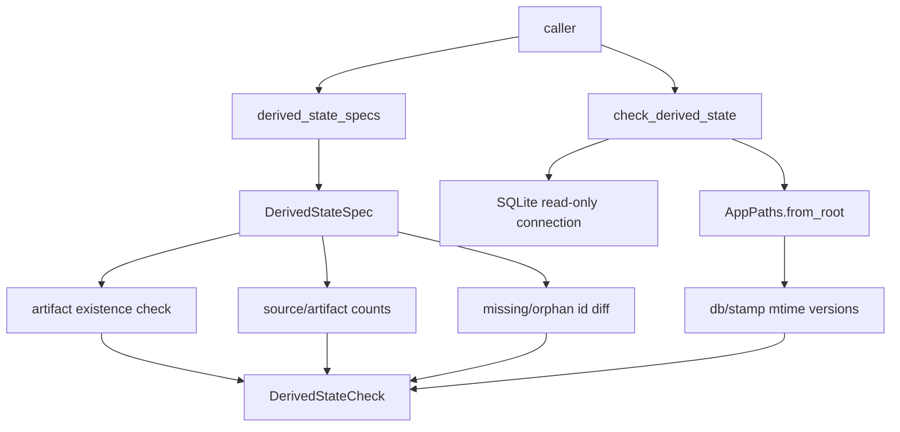

# Derived State Registry Design

## 0. 术语

- `derived state`：由主数据计算得到、会影响查询/评测/可观测但不是事实源的数据，例如 FTS 索引。
- `source`：派生状态依赖的主数据表或文件，例如 `facts`、`evidence`、`wiki_pages`。
- `artifact`：派生状态自身的表或文件，例如 `facts_fts`、`logs/fts_index.stamp`。
- `freshness policy`：判定 source 与 artifact 是否一致的规则，例如 mtime、count、missing/orphan。
- `derived state check`：一次只读诊断结果，说明状态、严重级别、版本、计数、残留和建议动作。

## 1. 目标

把“数据残留”从零散现象提升成可解释的系统对象。当前根因是主数据和派生物缺少统一 registry，导致 FTS 过期、孤儿索引、旧运行记录等问题只能在某个查询失败后临时定位。

明确不做：

- 不自动刷新或重建任何派生状态。
- 不修复共享 connection 检索路径绕过 freshness guard 的问题。
- 不删除旧 retrieval/eval runs。
- 不新增 schema 表；本 feature 只落代码层 registry 和只读检查契约。

复杂度档位：单机只读诊断模块，复用 SQLite 和现有 workspace 路径。

## 2. 设计

### 2.1 名词层

现状：`retrieval.py` 内部知道 `evidence_fts`、`facts_fts`、`wiki_fts`，但这份知识没有可复用的数据结构。其他模块只能通过局部逻辑猜测哪些表是主数据、哪些表是派生物。

变化：新增稳定合约：

```json
{
  "state_id": "facts_fts",
  "kind": "fts_index",
  "source_tables": ["facts"],
  "source_files": [],
  "artifact_tables": ["facts_fts"],
  "artifact_files": ["logs/fts_index.stamp"],
  "freshness_policy": "mtime_and_count",
  "rebuild_command": "rebuild-derived-state --scope fts"
}
```

检查结果示例：

```json
{
  "state_id": "facts_fts",
  "status": "stale",
  "severity": "warn",
  "source_version": "db-mtime:100",
  "artifact_version": "stamp-mtime:90",
  "source_count": 1,
  "artifact_count": 1,
  "orphan_count": 1,
  "missing_count": 1,
  "message": "facts_fts is stale: source DB is newer than stamp; missing indexed rows: 1; orphan indexed rows: 1",
  "recommended_actions": ["rebuild-derived-state --scope fts"]
}
```

### 2.2 编排层



现状：`_ensure_fts_ready()` 能做刷新前的局部判断，但它会写数据，且只属于 retrieval 内部。

变化：新增 `check_derived_state(workspace_root, state_id=None, connection=None)`：

- 默认检查 registry 中全部状态。
- 指定 `state_id` 时只检查一个状态。
- 提供 connection 时不关闭外部 connection。
- 检查只读，不调用 `ensure_fts_schema()`，不存在的 artifact 只报告 `missing`。
- 对 FTS 状态执行 mtime、count、missing/orphan 三类判断。

流程级约束：

- `status=stale` 必须说明原因，不只返回布尔值。
- artifact 缺失是 `fail`，artifact 存在但内容过期是 `warn`。
- 所有建议动作只给命令名，不在 check 阶段执行。

### 2.3 挂载点

- 新增 `enterprise_agent_kb.derived_state` 作为派生状态治理闭环的 registry 和检查入口。
- 后续 `fts-freshness-guard` 从该模块读取 FTS 状态，而不是复制 freshness 规则。
- 后续 `workspace-doctor-cli` 从该模块输出 JSON/表格。
- 单测直接调用公开函数，固定 missing/orphan/stale 语义。

### 2.4 推进策略

1. 落 CodeStable feature spec 和 checklist。
2. 新增 registry 数据结构和 FTS specs。
3. 实现只读检查编排。
4. 补覆盖 missing/stale/orphan 的单测。
5. 运行定向测试并回写 checklist。

### 2.5 结构健康度与微重构

本次不做微重构。原因：

- `retrieval.py` 已经同时承担索引构建和检索，不再往里面追加治理概念，避免继续膨胀。
- 新能力是派生状态治理闭环的独立名词层，放入新文件 `derived_state.py` 更清晰。
- 当前不改 CLI/API 挂载点，避免把 registry、doctor、rebuild 三个 feature 混成一个大改动。

超出范围的观察：`retrieval.py` 的 `_ensure_fts_ready()` 后续应改为消费 registry/check 结果，属于 `fts-freshness-guard`。

## 3. 验收契约

- 调用 registry 能得到 `facts_fts`、`evidence_fts`、`wiki_fts` 三个稳定 spec。
- artifact 表不存在时，check 返回 `status=missing`、`severity=fail`，且不创建 FTS 表。
- artifact 存在但缺少当前 source row 或含孤儿 row 时，check 返回 `status=stale`，并给出 missing/orphan 计数。
- stamp 早于 DB 时，check 返回 stale 原因。
- fresh 状态下返回 `status=fresh`、`severity=ok`。

反向核对：

- 不执行 `refresh_fts_index`。
- 不修改 SQLite schema 或写入 FTS 表。
- 不把本 feature 扩大成 CLI、Workbench 或自动修复。

## 4. 架构影响

该能力归属派生状态治理闭环的基础名词层，为 freshness guard、workspace doctor、rebuild derived state 和 dashboard 提供统一语言。验收后 architecture 可记录“派生状态 registry 已落地，当前只覆盖 FTS 状态检查”。
