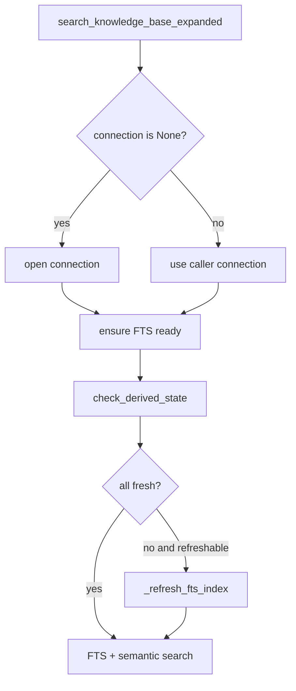

# FTS Freshness Guard Design

## 0. 术语

- `FTS freshness guard`：检索使用 FTS 前检查派生索引是否缺失或过期，并在需要时刷新。
- `shared connection path`：调用方传入 SQLite connection 的检索路径，例如 query context 主链路。
- `own connection path`：检索函数自己打开 SQLite connection 的路径。
- `stale FTS`：FTS artifact 与 source tables 不一致，包括 DB 新于 stamp、count mismatch、missing/orphan row。

## 1. 目标

修复共享 connection 路径绕过 FTS freshness guard 的框架根因，确保所有进入 `search_knowledge_base_expanded()` 的检索都基于当前 FTS 派生索引。

明确不做：

- 不为某个 query 增加 direct fact 兜底。
- 不改变 query rewrite、rerank、evidence judge 或 answer policy。
- 不新增 CLI 或 Workbench UI。
- 不删除旧 FTS 数据以外的 runs/report。

复杂度档位：单机 SQLite 检索层修复，复用 `derived_state` registry/check。

## 2. 设计

### 2.1 名词层

现状：`retrieval.py` 内部有 `_ensure_fts_ready(workspace_root)`，只在 own connection path 调用。它的判断逻辑分散在 stamp、count 和局部 helper 中。

变化：`_ensure_fts_ready(workspace_root, connection=None)` 支持外部 connection，并消费 `check_derived_state()` 的结果。FTS 刷新逻辑提取为 `_refresh_fts_index(connection, paths)`，供公开 `refresh_fts_index()` 和 guard 共用。

### 2.2 编排层

现状：shared connection path 只调用 `ensure_fts_schema()`，不会判断 stamp 和 counts。

变化：

- `search_knowledge_base_expanded()` 无论 own/shared connection 都先执行 `_ensure_fts_ready(paths.root, connection=connection)`。
- `_ensure_fts_ready()` 不再复制 freshness 判断，统一读取 `DerivedStateCheck`。
- `refresh_fts_index()` 继续作为公开维护函数，但内部改为复用同一个刷新节点。

流程级约束：

- FTS 刷新只在 registry/check 返回可刷新 stale/missing 时发生。
- 使用 shared connection 时不再打开第二个写连接，避免本地 SQLite 锁风险。
- 搜索阶段仍保留 `ensure_fts_schema()`，防止极端情况下 artifact 表缺失导致 SQL 错误。

### 2.3 挂载点

- `enterprise_agent_kb.retrieval.search_knowledge_base_expanded()`：统一 guard 入口。
- `enterprise_agent_kb.retrieval._ensure_fts_ready()`：支持外部 connection 并消费 registry。
- `enterprise_agent_kb.retrieval.refresh_fts_index()`：复用刷新节点。
- retrieval 单测构造 stale shared connection 场景。

### 2.4 推进策略

1. 落 feature spec 和 checklist。
2. 重构 FTS refresh 节点，保持公开 `refresh_fts_index()` 行为不变。
3. 让 shared/own connection path 都调用 `_ensure_fts_ready()`。
4. 增加 stale shared connection 回归测试。
5. 运行 retrieval 与 derived-state 定向测试。

### 2.5 结构健康度与微重构

本次做小范围行为内聚，不拆文件。原因：

- 修复点集中在 `retrieval.py` 的 FTS 生命周期职责内，不需要改 query_api。
- 新鲜度判断已抽到 `derived_state.py`，本次只让 retrieval 消费它。
- 不把 direct definition fallback 混入本 feature，避免把根因修复和召回增强混在一起。

## 3. 验收契约

- shared connection 调用 `search_knowledge_base_expanded()` 时，如果 `facts_fts` 缺少当前 fact，会先刷新并召回当前 fact。
- own connection 调用路径仍能正常搜索。
- `refresh_fts_index()` 返回计数语义不变。
- check/refresh 之后 `facts_fts` 不再保留测试构造的孤儿 row。

反向核对：

- 不新增 query-specific special case。
- 不绕开 `derived_state` registry。
- 不修改 answer 或 rerank 策略。

## 4. 架构影响

该 feature 把派生状态治理闭环的 registry 接入召回闭环的实际检索入口。验收后 architecture 应记录：FTS freshness guard 覆盖 own/shared connection 两条搜索路径。
