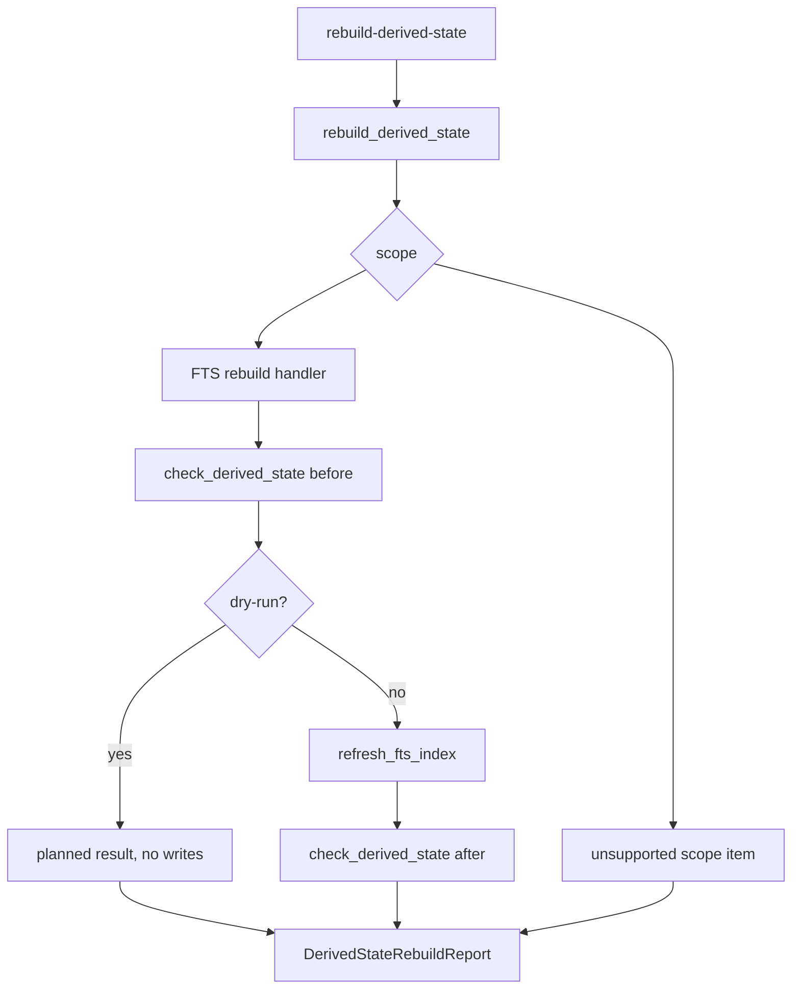

# Rebuild Derived State CLI Design

## 0. 术语

- `rebuild-derived-state`：操作者显式触发的派生状态重建命令。
- `rebuild result`：一次重建动作的前后检查、状态、计数和建议动作。
- `dry-run`：只计算会做什么，不写数据库、不创建 FTS 表、不更新时间戳。
- `implemented scope`：当前已有可幂等、安全重建契约的 scope。

## 1. 目标

把 workspace doctor 的诊断建议变成正式维护动作。当前已经能发现 stale FTS，但操作者仍需要知道内部函数 `refresh_fts_index`。本 feature 提供公开 CLI：`rebuild-derived-state --scope fts --dry-run`。

明确不做：

- 不做 graph/wiki/coverage 的破坏性重建或孤儿删除。
- 不剪枝 retrieval/eval runs。
- 不把 rebuild 隐式挂到 doctor。
- 不修改 query rewrite、answer、eval 策略。

复杂度档位：单机 CLI，当前只对 FTS 提供真实 rebuild；其他 scope 返回 unsupported/skipped，等待各自重建契约落地。

## 2. 设计

### 2.1 名词层

现状：`refresh_fts_index(workspace_root)` 是内部函数，返回 evidence/facts/wiki 计数；`DerivedStateCheck` 能描述重建前后的新鲜度，但没有统一 rebuild result。

变化：新增 `DerivedStateRebuildReport` 和 `DerivedStateRebuildItem`：

```json
{
  "scope": "fts",
  "dry_run": false,
  "status": "ok",
  "items": [
    {
      "scope": "fts",
      "state_id": "fts",
      "action": "refresh",
      "status": "done",
      "before": {"status": "warn"},
      "after": {"status": "ok"},
      "changed_counts": {"evidence": 615, "facts": 3884, "wiki": 980}
    }
  ]
}
```

`DerivedStateSpec.rebuild_command` 对 FTS 改为公开命令 `rebuild-derived-state --scope fts`。Retrieval guard 不再依赖该字符串判断刷新，而是根据 FTS state status 判断。

### 2.2 编排层



现状：FTS refresh 可以被 retrieval guard 自动触发，但没有操作者可审计的显式重建报告。

变化：

- 新增 `enterprise_agent_kb.derived_state_rebuild`。
- 新增 CLI `rebuild-derived-state --scope all|fts|graph|wiki|coverage --dry-run`。
- `scope=fts` 执行真实 FTS rebuild。
- `scope=graph|wiki|coverage` 返回 unsupported，不写数据。
- `scope=all` 当前只执行已实现的 FTS，并在报告里列出非 FTS scope 尚未实现。

流程级约束：

- dry-run 不创建 FTS 表，不刷新 stamp。
- rebuild 前后都记录 `check_derived_state()` 摘要。
- 非 FTS scope 不做猜测式修复；必须等后续设计定义 source/artifact/rebuild contract。

### 2.3 挂载点

- `enterprise_agent_kb.derived_state_rebuild`：rebuild report 和 scope 编排。
- `enterprise_agent_kb.cli`：新增 `rebuild-derived-state` 子命令。
- `enterprise_agent_kb.derived_state`：FTS `rebuild_command` 改为公开 CLI。
- `enterprise_agent_kb.retrieval`：guard 不依赖 command string。

### 2.4 推进策略

1. 落 feature spec 和 checklist。
2. 调整 FTS rebuild_command 和 retrieval guard 解耦。
3. 实现 rebuild orchestrator 和 CLI。
4. 补 dry-run、实际 FTS rebuild、unsupported scope 测试。
5. 验收并回写架构/roadmap。

### 2.5 结构健康度与微重构

本次不做微重构。原因：

- `cli.py` 只新增薄命令入口。
- rebuild 编排放入新文件，避免把维护动作塞进 `workspace_doctor.py`。
- retrieval 只做 guard 判断解耦，不改变搜索算法。

## 3. 验收契约

- `rebuild-derived-state --scope fts --dry-run` 不创建 FTS 表、不写 stamp。
- `rebuild-derived-state --scope fts` 会刷新 stale/missing FTS，并使 doctor FTS scope 变为 ok。
- `scope=graph|wiki|coverage` 返回 unsupported，不删除任何数据。
- `DerivedStateSpec.rebuild_command` 与 doctor 建议动作指向公开命令。
- retrieval guard 仍能自动刷新 stale FTS。

反向核对：

- 不删除 orphan graph/wiki/coverage 数据。
- 不剪枝旧 runs。
- 不把 doctor 和 rebuild 混成一个命令。

## 4. 架构影响

该 feature 让派生状态治理闭环具备显式修复入口。验收后架构应记录：当前 rebuild orchestrator 已安全支持 FTS，非 FTS scope 只报告 unsupported。
