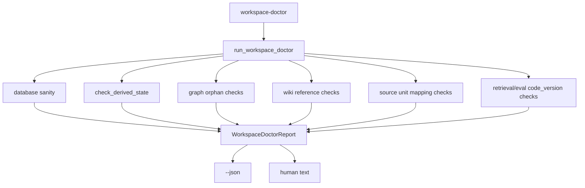

# Workspace Doctor CLI Design

## 0. 术语

- `workspace doctor`：只读健康检查入口，用于发现派生状态、引用一致性和旧运行记录风险。
- `doctor issue`：一个可解释问题，包含 scope、severity、message、details 和 recommended actions。
- `scope`：诊断范围，当前为 `all`、`fts`、`graph`、`wiki`、`coverage`、`runs`。
- `residual state`：主数据变化后残留的派生索引、孤儿引用、空 DB 或旧运行记录。

## 1. 目标

让维护者不用临时写脚本，也能一次看到 KB1 工作区里的残留状态风险。当前根因是检查入口分散：FTS freshness、graph/wiki orphan、source unit 映射、旧 runs 各自散在模块和 dashboard 里，没有统一命令输出。

明确不做：

- 不刷新 FTS 或重建任何派生状态。
- 不删除旧 runs、空 DB 文件或孤儿引用。
- 不新增 Workbench UI。
- 不修改查询、答案或评测策略。

复杂度档位：单机只读 CLI，复用 SQLite 和 `derived_state`。

## 2. 设计

### 2.1 名词层

现状：已有 `DerivedStateCheck` 能描述 FTS 派生状态，但没有面向操作者的汇总报告；graph/wiki/coverage/runs 残留风险没有统一问题对象。

变化：新增 `WorkspaceDoctorReport` 和 `WorkspaceDoctorIssue`：

```json
{
  "scope": "all",
  "status": "warn",
  "summary": {"ok": 3, "warn": 1, "fail": 0},
  "derived_state_checks": [],
  "issues": [
    {
      "issue_id": "wiki_missing_source_fact",
      "scope": "wiki",
      "severity": "warn",
      "message": "wiki source_fact_ids_json contains missing fact ids",
      "details": {"missing_count": 2},
      "recommended_actions": ["rebuild-derived-state --scope wiki"]
    }
  ]
}
```

### 2.2 编排层



现状：CLI 只有 `status`、`reset-workspace` 等分散命令，不能解释派生状态风险。

变化：

- 新增 `enterprise_agent_kb.workspace_doctor` 承载诊断编排。
- `cli.py` 新增 `workspace-doctor --scope all|fts|graph|wiki|coverage|runs --json`。
- `scope=all` 额外检查工作区内可疑空 DB 文件，避免旧空库误导操作。

流程级约束：

- Doctor 只读，不调用 rebuild、refresh、delete。
- FTS 结果必须来自 `check_derived_state()`，不复制 freshness 规则。
- 每个 issue 必须给出可执行建议，但建议动作不在 doctor 内执行。

### 2.3 挂载点

- CLI 挂载点：`enterprise_agent_kb.cli` 新增 `workspace-doctor` 子命令。
- 诊断模块：新增 `enterprise_agent_kb.workspace_doctor`。
- 测试挂载点：新增 workspace doctor 单测和 CLI parser 测试。

### 2.4 推进策略

1. 落 feature spec 和 checklist。
2. 实现 report/issue 数据结构与 scope 编排。
3. 接入 CLI JSON/文本输出。
4. 补 FTS、orphan、runs 和 parser 测试。
5. 验收并回写 architecture/roadmap。

### 2.5 结构健康度与微重构

本次不做微重构。原因：

- `cli.py` 只新增一个薄命令入口，符合当前命令集中挂载方式。
- 诊断逻辑放入新文件 `workspace_doctor.py`，避免把治理逻辑塞进 `workspace_admin.py` 或 `retrieval.py`。
- 该 feature 不改变已有数据写入路径，不需要迁移 schema。

## 3. 验收契约

- `workspace-doctor --scope fts --json` 输出 FTS derived state checks。
- `workspace-doctor --scope all --json` 能发现 stale/missing FTS、graph/wiki/coverage orphan 和旧 code_version runs。
- 默认文本输出能显示总体状态、issue 列表和建议动作。
- Doctor 运行后不会创建 FTS 表、刷新索引、删除 runs 或修改 schema。

反向核对：

- 不调用 `refresh_fts_index`。
- 不把修复动作混入检查命令。
- 不新增 dashboard-only 诊断逻辑。

## 4. 架构影响

该 feature 是派生状态治理闭环的操作者入口。验收后架构应记录：workspace doctor 统一读取 derived state registry 和引用一致性检查，输出只读健康报告。
