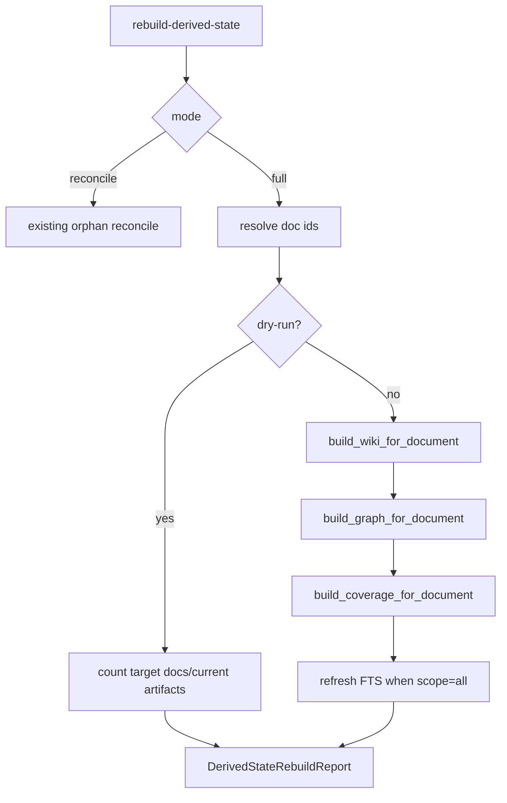

# Full Derived Rebuild Contract Design

## 0. 术语

- `reconcile mode`：只清理 orphan artifact row 的维护模式，已由 structural-derived-rebuild-contract 落地。
- `full rebuild mode`：从主数据重新运行 graph/wiki/coverage 文档级构建器，替换该文档对应派生结构。
- `doc-scoped rebuild`：只重建一个 `doc_id` 的 graph/wiki/coverage 派生物。
- `all-doc rebuild`：对 `documents.is_active = 1` 的全部文档执行 doc-scoped rebuild。
- `idempotent document builder`：同一文档重复 build 后，不保留该文档上一次 build 生成但本次没有生成的派生物。

## 1. 目标

上一阶段已解决 doctor 建议动作和 unsupported rebuild 的断裂，但它只清理断链残留，不能在主数据变化后重新生成 graph/wiki/coverage。继续用外层 cleanup 包住现有 build 不够，因为根因在文档级构建器本身：

- `build_graph_for_document` 只 ensure 新边，不删除该文档旧边。
- `build_wiki_for_document` 只把旧页标为 stale，不删除本次未生成的旧页。
- `build_coverage_for_document` 已经通过 `sync_source_units_from_matrix` 做文档级替换。

本 feature 要补齐显式 full rebuild：

- CLI / API 内部函数支持 `rebuild-derived-state --scope graph|wiki|coverage|all --mode full [--doc-id DOC]`。
- `--mode reconcile` 保持默认，避免把原来的安全 cleanup 语义变成昂贵全量生成。
- full mode 使用既有构建器：wiki -> graph -> coverage -> fts。
- graph/wiki 文档级构建器改成幂等替换。

明确不做：

- 不重跑 parse/evidence/facts/entities。
- 不生成新的事实或实体。
- 不删除 source 主数据表。
- 不在 Workbench 自动执行 full rebuild。
- 不把业务查询失败写入 rebuild 规则。

复杂度档位：中等偏高。涉及重建命令契约、文档级构建器幂等性、CLI 参数和集成测试。

## 2. 设计

### 2.1 名词层

现状：`rebuild_derived_state(workspace_root, scope, dry_run)` 只有 scope/dry-run 两个维度，graph/wiki/coverage scope 代表 orphan reconcile。

变化：

```python
rebuild_derived_state(
    workspace_root,
    scope="all|fts|graph|wiki|coverage",
    dry_run=False,
    mode="reconcile|full",
    doc_id=None,
)
```

`DerivedStateRebuildItem.action`：

- `refresh`：FTS。
- `reconcile_orphans`：结构残留清理。
- `full_rebuild`：从主数据重新生成派生结构。

### 2.2 编排层



流程约束：

- `--doc-id` 只用于 full mode。
- `scope=all --mode full` 顺序固定为 wiki、graph、coverage、fts，匹配入库 pipeline。
- `scope=graph --mode full` 只跑 graph 构建器。
- dry-run 不调用任何 build function，只返回目标文档数和当前 artifact 计数。
- full mode 后仍跑对应 doctor。全库 rebuild 使用全局 doctor 状态判定成功；`--doc-id`
  rebuild 使用 doc-scoped validation 判定成功，避免其他文档的历史残留把本次文档级重建误报为失败。

### 2.3 挂载点

- `src/enterprise_agent_kb/graph.py`：文档级 graph build 前删除该 doc 的旧 graph artifacts。
- `src/enterprise_agent_kb/wiki_compiler.py`：build 后删除该 doc 中仍为 stale 的 wiki page rows。
- `src/enterprise_agent_kb/derived_state_rebuild.py`：新增 full mode、doc id 解析、build orchestration。
- `src/enterprise_agent_kb/cli.py`：`rebuild-derived-state` 新增 `--mode`、`--doc-id`。
- `tests/test_derived_state_rebuild.py`：覆盖 full dry-run、doc-scoped full rebuild、scope all 顺序和幂等边界。

### 2.4 推进策略

1. 新增 feature design/checklist 和 roadmap item。
2. 修改 graph/wiki builders 的文档级幂等性。
3. 扩展 derived_state_rebuild mode/doc_id 参数。
4. 更新 CLI 和测试。
5. 跑派生状态治理闭环组合、query repair、compileall、diff check。
6. 回写架构、需求、用户指南和验收报告。

### 2.5 结构健康度与微重构

本次不拆新模块。虽然 `derived_state_rebuild.py` 会继续变大，但新增逻辑仍围绕同一个公开命令的 orchestration。若后续增加并行 rebuild、批次进度、错误恢复日志，再拆出 `derived_state_full_rebuild.py`。

## 3. 验收契约

- `build_graph_for_document` 重复执行不会保留同 doc 的旧边。
- `build_wiki_for_document` 重复执行不会保留同 doc 的 stale wiki rows。
- `rebuild-derived-state --scope graph|wiki|coverage --mode full --dry-run` 不修改数据。
- `--mode full --doc-id DOC` 只重建指定文档的派生结构。
- `--mode full --doc-id DOC` 的 item 状态只由该 doc 的 graph/wiki/coverage 派生物完整性决定；全局其他 doc 的残留只保留在 after doctor 摘要中。
- `--scope all --mode full` 执行 wiki、graph、coverage、fts，且最终 FTS fresh。
- 默认 `--mode reconcile` 行为保持不变。

反向核对：

- 不重跑 facts/entities。
- 不删除主数据。
- 不改变 Workbench 自动只读原则。

## 4. 架构影响

派生状态治理闭环补齐第二层修复能力：先有 reconcile 清理断链残留，再有 full rebuild 从主数据重新生成派生结构。二者由 mode 显式区分，避免安全 cleanup 和昂贵全量重建混用。
