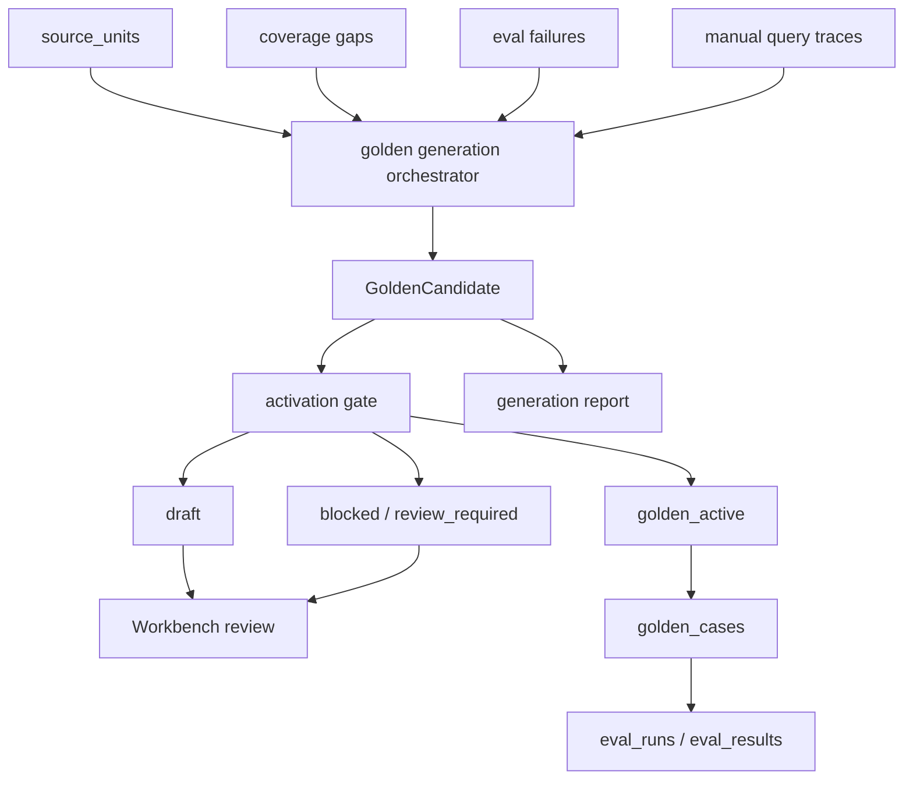

# Golden Generation v1 Design

## 0. 术语

- `golden generation`：从 source_units、coverage gaps、eval failures 和人工 query trace 中生成可回归样例的统一能力。
- `case origin`：样例来源，包括 `source_unit`、`coverage_gap`、`eval_failure`、`manual_query`、`ontology_gap`。
- `confidence tier`：样例置信等级，包括 `corpus_eval`、`draft`、`review_required`、`golden_active`、`blocked`。
- `assertion contract`：可验证断言集合，包括 `must_hit`、`negative_expected`、`expected_doc_id`、`expected_query_type`、`expected_evidence_shape`、`expected_answer_mode`、`clarification_options`。
- `activation gate`：把草案激活为 active golden 前必须通过的规则检查。
- `generation report`：一次生成运行的结构化报告，记录来源、跳过原因、置信等级和下一步动作。

## 1. 目标和边界

目标：把现有分散的 golden 生成能力升级为一个统一闭环，系统能批量生成候选 case，但只有具备稳定断言的 case 才能进入 active golden。

当前现状：

- `closed_loop_store.draft_golden_cases_from_eval_failures()` 能从 eval 失败批量生成 draft。
- `corpus_eval.generate_corpus_eval_cases()` 能从 `source_units` 生成 definition / parameter / process_activity 召回评测样例。
- `generated_tests.close_coverage_test_gaps()` 能从 coverage test gaps 生成、验证、提升 document golden。
- Workbench 能操作部分 draft / activate 流程。

问题根因：

这些能力没有统一的名词层和准入门。`source_units` 生成的是 corpus eval 信号，coverage 生成的是文档 pytest golden，eval failure 生成的是 draft；三者各自维护状态、报告和 readiness，导致系统无法回答“黄金测试集自动生成是否全部完成”。

明确不做：

- 不让错误召回结果反推 `must_hit`。
- 不自动把所有生成 case 激活为 active golden。
- 不让 LLM 生成 expected contract。
- 不替代人工审核；v1 只把审核对象、准入门和报告统一。
- 不引入分布式任务队列或外部评测服务。
- 不一次性完成本体层驱动生成，只预留 `ontology_gap` origin 和 ontology fields。

复杂度档位：中等偏高。它横跨回归闭环、入库覆盖、Failure Analysis、Workbench 和后续 ontology layer，但 v1 先做单机、确定性、可解释的统一编排。

## 2. 设计

### 2.1 名词层

现状：

- `golden_cases` 有 `status`、`source`、`metadata_json`，但没有统一表达生成来源、置信等级、准入门、跳过原因。
- corpus eval case 有 `source=corpus_eval` 和 expected fields，但语义上不等同人工高置信 golden。
- failure draft 的 readiness gate 已存在，但只服务 eval failure 草案。
- coverage promotion 有自己的 readiness / rejection ledger。

变化：

新增统一 `GoldenCandidate` 合约，先以 Python dict / JSON contract 落地，不立即做破坏性 schema 改造：

```json
{
  "case_id": "GGV1-...",
  "query": "OBC输入过压怎么测",
  "origin": "source_unit",
  "confidence_tier": "draft",
  "assertion_contract": {
    "must_hit": ["交流输入过、欠压保护试验"],
    "expected_doc_id": "DOC-000013",
    "expected_query_type": "test_method_lookup",
    "expected_evidence_shape": "test_method",
    "expected_answer_mode": "test_method_lookup",
    "negative_expected": []
  },
  "trace": {
    "coverage_unit_id": "...",
    "source_fact_ids": ["FACT-..."],
    "source_evidence_ids": ["EVID-..."]
  },
  "readiness": {
    "can_activate": false,
    "reasons": ["missing_answer_mode_assertion"]
  }
}
```

`golden_cases` 仍作为持久化主表；v1 把新增字段放入 `metadata_json`，避免 schema churn。后续如果查询和 dashboard 需要高频筛选，再通过迁移补一等列。

置信等级语义：

| tier | 含义 | 是否进入主回归 |
|---|---|---|
| `corpus_eval` | 自动生成的规模化质量信号 | 不等同人工 golden，可运行 eval |
| `draft` | 有基本断言但需要审核 | 不进入主回归 |
| `review_required` | 断言不足或需人工确认 | 不进入主回归 |
| `golden_active` | 通过 activation gate | 进入主回归 |
| `blocked` | 明确不允许激活 | 不进入主回归 |

### 2.2 编排层



现状：

- 每条来源有自己的编排入口。
- 回归 dashboard 只能看到 active/draft 数量，不能解释自动生成覆盖哪些知识类型、哪些被阻断。

变化：

新增统一编排层 `golden_generation`：

- 读取多个来源，生成 `GoldenCandidate`。
- 对每个候选执行统一 activation gate。
- 输出 generation report，汇总 by origin、by tier、by case type、blocked reasons。
- 将可同步的候选写入 `golden_cases`，但保持 status/tier 边界。

v1 支持来源：

1. `source_unit`：从 `source_units` 生成 definition、parameter、process_activity，复用 corpus eval 已有逻辑。
2. `eval_failure`：从失败 eval case 生成 draft，复用现有 failure draft，但统一 metadata。
3. `coverage_gap`：读取 coverage draft readiness / rejection ledger，纳入统一报告。

v1 预留来源：

- `manual_query`：从 Query Lab trace 手动选择生成 draft。
- `ontology_gap`：未来从 ontology type coverage 生成 case。

### 2.3 挂载点

- CLI：新增统一命令 `generate-golden-candidates`，输出 JSON/Markdown report，可选择 origin 和 doc scope。
- Core module：新增 `enterprise_agent_kb.golden_generation`，承载候选合约、准入门和编排。
- Persistence：复用 `closed_loop_store.sync_golden_cases()` / draft upsert，新增 metadata 约定，不破坏旧表。
- API / Workbench：新增 review payload，展示候选分级、阻断原因和激活建议。
- Docs / Regression guide：更新 golden generation 的状态边界和操作说明。

### 2.4 推进策略

1. 名词层骨架：新增 `GoldenCandidate` 合约、confidence tier、origin、activation gate summary。
2. 编排骨架：新增 `generate_golden_candidates()`，先聚合 `source_unit` 和 `eval_failure` 两类来源。
3. 持久化适配：把候选写入 `golden_cases.metadata_json`，保持旧 draft / active API 兼容。
4. CLI 接入：新增 dry-run 默认命令，输出 generation report，不自动激活。
5. Workbench / API：展示候选分级和阻断原因，保留人工激活。
6. 测试和文档：覆盖不从错误召回反推断言、tier 分类、activation gate、report 汇总。

### 2.5 结构健康度与微重构

不做前置微重构。

原因：

- `closed_loop_store.py` 已偏大，但 v1 不继续把生成编排塞进去，而是新增 `golden_generation.py`。
- `corpus_eval.py` 和 `generated_tests.py` 保留现有职责，v1 先复用其输出/逻辑，不搬迁历史代码。
- `api_server.py` 和 `cli.py` 只增加挂载点，符合当前项目 operator/API 集中入口模式。

超出范围的观察：

- 长期看，`closed_loop_store.py` 的 golden/eval/repair task 职责已经很宽，后续适合走独立 refactor，把 golden draft/readiness 逻辑拆成 `golden_store.py` 或 `regression_store.py`。这不是 v1 前置条件。

## 3. 验收契约

- 给定 traceable source unit，生成器能输出带 `origin=source_unit`、`confidence_tier=corpus_eval|draft`、`assertion_contract` 和 `trace` 的候选。
- 给定 eval failure，生成器能输出 draft candidate，但不能从失败实际 retrieved top hit 生成 `must_hit`。
- 给定缺少 `must_hit`、`expected_evidence_shape` 或可验证语义锚点的候选，activation gate 返回 blocked / review_required。
- CLI 默认 dry-run，不会自动激活 golden。
- generation report 汇总 by origin、by confidence tier、blocked reasons。
- 旧 `draft_golden_cases_from_eval_failures()`、`activate_golden_case_draft()` 和 corpus eval runner 仍可用。
- 反向核对：生成器不调用 LLM，不删除 golden_cases，不改写历史 eval_results，不绕过人工审核。

## 4. 架构影响

Golden Generation v1 属于回归闭环，同时连接入库闭环和答案闭环。它不是“更多测试样例”的局部功能，而是自我进化能力的基础设施：系统可以系统性发现应测内容、生成候选断言、阻断不可靠样例，并把可靠样例纳入回归。

它也为后续本体论目标铺路：当 ontology registry 落地后，`origin=ontology_gap` 和 ontology type coverage 可以成为新的生成来源。
