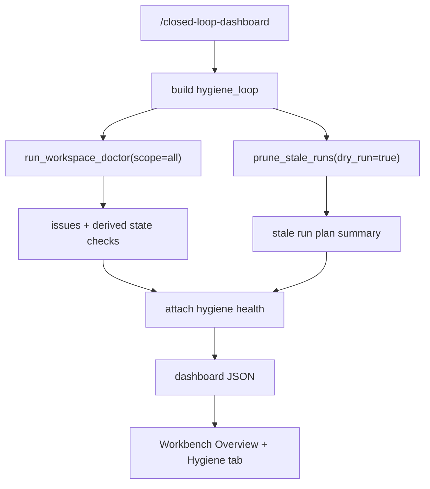

# Hygiene Dashboard Design

## 0. 术语

- `hygiene_loop`：派生状态治理闭环在 `/closed-loop-dashboard` 中的稳定字段，表示派生状态与残留运行记录健康度。
- `workspace doctor snapshot`：`run_workspace_doctor(scope="all")` 的只读诊断结果。
- `prune plan snapshot`：`prune_stale_runs(dry_run=True)` 的只读剪枝计划摘要。
- `recommended action`：由 doctor / derived state registry / run governance 给出的维护命令文本，只展示，不自动执行。

## 1. 目标

把派生状态治理闭环接到现有 dashboard 契约和 Workbench Overview 中，让维护者能直接看到：

- FTS / graph / wiki / coverage / runs 是否存在残留风险；
- stale/unknown retrieval/eval runs 的规模；
- 每类风险的 recommended actions；
- 当前 dashboard 是否基于派生状态治理闭环同一套诊断逻辑，而不是前端另算。

明确不做：

- 不在 Workbench 中执行 `rebuild-derived-state` 或 `prune-stale-runs --execute`。
- 不新增数据库表。
- 不复制 FTS freshness、orphan、stale run 判定规则。
- 不修改查询、答案或评测策略。

复杂度档位：单机 API + 静态 Workbench 展示，复用现有 `closed-loop-dashboard` 和维护命令。

## 2. 设计

### 2.1 名词层

现状：`/closed-loop-dashboard` 只返回 `ingestion_loop`、`retrieval_loop`、`answer_loop`、`regression_loop`。派生状态治理闭环能力已经存在于 `workspace_doctor`、`derived_state_rebuild`、`run_governance`，但 UI 只能靠操作者单独跑 CLI。

变化：新增 `hygiene_loop`：

```json
{
  "status": "warn",
  "doctor_status": "warn",
  "issue_count": 4,
  "issue_summary": {"ok": 3, "warn": 4, "fail": 0},
  "derived_state_checks": [{"state_id": "facts_fts", "status": "fresh"}],
  "issues": [{"issue_id": "retrieval_runs_unknown_code_version", "scope": "runs"}],
  "stale_run_summary": {"retrieval_runs": 2018, "eval_runs": 61, "eval_results": 505},
  "prune_plan": {"dry_run": true, "items": [{"table": "retrieval_runs", "candidate_count": 2018}]},
  "risks": [],
  "next_actions": ["prune-stale-runs --keep-current-code-version --dry-run"],
  "artifacts": {
    "workspace_doctor": "workspace-doctor --scope all --json",
    "prune_stale_runs": "prune-stale-runs --keep-current-code-version --dry-run"
  }
}
```

### 2.2 编排层



现状：Workbench Overview 渲染 Four Loop Dashboard，只有四个 loop health box。

变化：

- API 层新增 `_hygiene_loop_snapshot()` 和 `_attach_hygiene_health()`，输出 `hygiene_loop`。
- Workbench 把标题改为 Five Loop Dashboard，并加入派生状态治理闭环指标卡和 health box。
- 新增 `Hygiene` tab 展示 doctor issues、derived state checks、prune plan 和 recommended actions。

流程级约束：

- dashboard API 只读，不执行 rebuild 或 prune。
- hygiene_loop 只复用 `run_workspace_doctor()` 和 `prune_stale_runs(dry_run=True)`。
- prune plan 进入 dashboard 时压缩候选 ID，避免大 payload。
- doctor 失败或异常时，hygiene_loop 返回 `status=fail` 和错误风险，不影响其他四个闭环字段。

### 2.3 挂载点

- `enterprise_agent_kb.api_server`：`/closed-loop-dashboard` 返回 `hygiene_loop`，并提供 health 计算函数。
- `examples/demo.html`：Overview 增加派生状态治理闭环摘要，新增 Hygiene tab 细节视图。
- `tests/test_api_server.py` / `tests/test_delivery_assets.py`：覆盖 API contract 与 UI 资产文本。
- `.codestable/architecture/closed-loop-architecture.md`：验收后记录派生状态治理闭环 Workbench 可观测入口。

### 2.4 推进策略

1. 补 feature spec 并同步 roadmap 状态。
2. API 增加 hygiene_loop 聚合，复用 doctor 和 dry-run prune。
3. Workbench Overview 与 Hygiene tab 展示派生状态治理闭环。
4. 补 API / UI 资产回归。
5. 运行定向测试并回写 checklist。

### 2.5 结构健康度与微重构

本次不做微重构。原因：

- `api_server.py` 已经承载 dashboard 聚合，新增派生状态治理闭环字段属于现有职责延伸。
- `examples/demo.html` 是当前唯一 Workbench 资产，新增 tab 和渲染函数必须落在同一文件才能接入现有状态机。
- 不新建平行 dashboard 模块，避免形成与 `/closed-loop-dashboard` 不一致的第二套健康判断。

超出范围观察：`api_server.py` 和 `demo.html` 已偏大，后续若继续扩展 Workbench，应单独走 refactor，把 dashboard snapshot 和 UI render helpers 拆分。

## 3. 验收契约

- `/closed-loop-dashboard` 返回 `hygiene_loop`。
- `hygiene_loop` 的 doctor issues 来自 `run_workspace_doctor(scope="all")`。
- `hygiene_loop.prune_plan` 是 dry-run 摘要，删除计数为 0，且候选 ID 被压缩。
- stale/unknown runs 存在时，派生状态治理闭环 status 为 warn，next_actions 包含 `prune-stale-runs --keep-current-code-version --dry-run`。
- Workbench Overview 显示 Five Loop Dashboard 和派生状态/残留 runs 摘要。
- Hygiene tab 显示 doctor issues、derived state checks、prune plan 和 recommended actions。

反向核对：

- 不执行 `--execute`。
- 不修改 FTS、graph、wiki、coverage、retrieval_runs、eval_runs 或 eval_results。
- 不在前端复制判定规则。

## 4. 架构影响

验收后，closed-loop architecture 应记录派生状态治理闭环已进入 API / Workbench 可观测面：CLI 负责诊断和显式维护，dashboard 只读展示同一套诊断结果。
