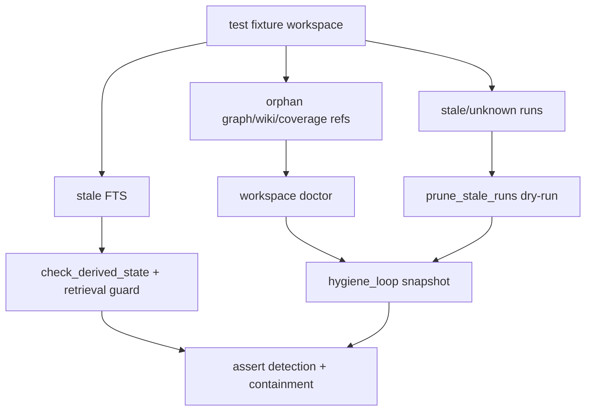

# Residual State Regression Suite Design

## 0. 术语

- `residual state`：主数据或代码版本变化后遗留的派生状态，包括 stale FTS、orphan graph/wiki/coverage refs、旧/未知 runs。
- `residual-state regression suite`：专门构造残留态并验证派生状态治理闭环行为的 pytest 套件。
- `detection path`：doctor / derived-state check / hygiene dashboard 能发现残留。
- `containment path`：检索 guard、dry-run prune、unsupported rebuild 边界能防止残留污染或被误删。

## 1. 目标

把派生状态治理闭环从“功能已经有单点测试”推进到“残留态作为系统级回归场景长期存在”。每个典型残留态必须证明：

- 能被正式诊断入口发现；
- 不会默认删除或重写主数据；
- 必要时能被正确刷新或隔离；
- dashboard 展示与 CLI 诊断一致。

明确不做：

- 不新增生产代码。
- 不访问真实 `knowledge_base`，全部使用临时 workspace。
- 不执行破坏性 reset。
- 不把某个业务 query 的失败写成断言。

复杂度档位：测试体系 feature，新增集成测试文件，复用既有 helper 和公开 API。

## 2. 设计

### 2.1 名词层

现状：`test_derived_state.py`、`test_retrieval_fts_guard.py`、`test_workspace_doctor.py`、`test_run_governance.py`、`test_api_server.py` 分别覆盖各自模块，但没有一个 suite 把同一类 residual state 作为派生状态治理闭环契约一起验证。

变化：新增 `tests/test_residual_state_regression.py`，按 residual state 类型组织场景：

```text
stale_fts_detection_and_containment
orphan_structural_refs_reported_as_hygiene_risk
stale_runs_are_visible_but_readonly_until_execute
hygiene_dashboard_matches_doctor_and_prune_plan
```

### 2.2 编排层



流程级约束：

- tests 使用 `initialize_workspace(tmp_path / "kb", schema.sql)`。
- 所有删除类验证先走 dry-run，检查原表数量不变。
- 只有显式 `prune_stale_runs(dry_run=False)` 的场景允许删除，并验证不删 golden/repair 等非目标表。
- graph/wiki/coverage rebuild 仍不在本 suite 中执行，因为当前契约是 unsupported + doctor 可见。

### 2.3 挂载点

- `tests/test_residual_state_regression.py`：新增 residual state 集成回归套件。
- `.codestable/architecture/closed-loop-architecture.md`：验收后记录残留态回归作为派生状态治理闭环最后一层防线。
- `.codestable/requirements/derived-state-governance-loop.md`：验收后可从 draft 升级为 current，因为派生状态治理闭环最小产品能力闭合。

### 2.4 推进策略

1. 补 feature spec 并同步 roadmap 状态。
2. 新增 residual state 测试 fixture 和最小插入 helper。
3. 增加 stale FTS 检测 + retrieval guard containment 场景。
4. 增加 orphan graph/wiki/coverage + doctor/hygiene 场景。
5. 增加 stale/unknown runs dry-run/execute 边界场景。
6. 跑派生状态治理闭环组合测试并回写 checklist。

### 2.5 结构健康度与微重构

本次不做微重构。原因：

- 这是测试体系 feature，新增独立测试文件比继续扩大已有单点测试更清晰。
- 不改生产模块，避免为了测试 suite 改动派生状态治理闭环运行逻辑。
- helper 重复只限测试夹具插入 SQL，后续若继续扩展可再抽公共 fixture。

## 3. 验收契约

- stale FTS 同时表现为 `check_derived_state(status=stale)`，并且检索 guard 能刷新到当前 fact。
- orphan graph/wiki/coverage refs 能被 `workspace_doctor(scope="all")` 归因，不需要访问真实库。
- stale/unknown runs 在 dry-run prune 中可见，dry-run 不删除；显式 execute 只删除目标 runs 和 eval_results。
- hygiene dashboard snapshot 与 doctor/prune plan 一致，且只读。
- 派生状态治理闭环相关测试组合通过。

反向核对：

- 不新增生产代码。
- 不执行 database reset。
- 不把业务答案正确性混入 residual-state suite。

## 4. 架构影响

验收后，派生状态治理闭环拥有最后的回归防线：每个派生状态治理能力不只可手工操作，还能通过 residual state suite 防止未来改动重新引入残留污染。
