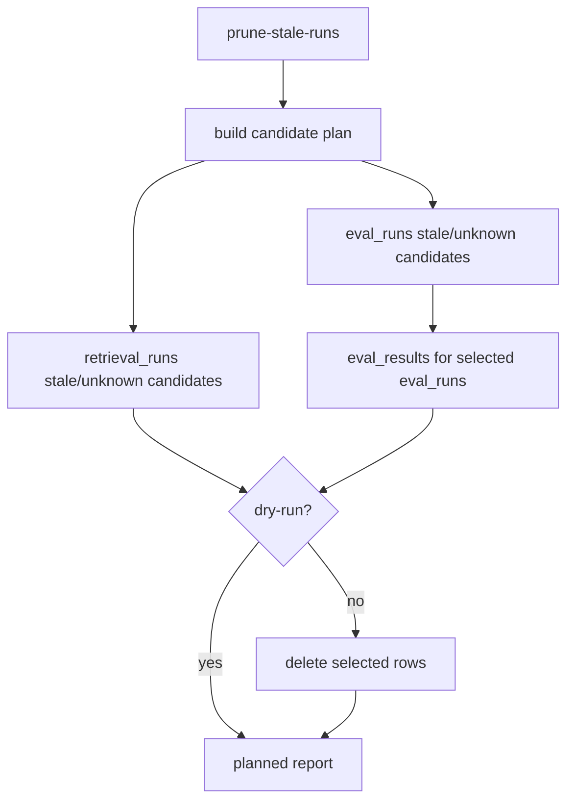

# Stale Run Governance Design

## 0. 术语

- `current code version`：运行时源码指纹，由 `_runtime_code_version()` 计算。
- `stale run`：`code_version` 非空且不等于 current code version 的运行记录。
- `unknown run`：`code_version` 为空或缺失的运行记录。
- `prune plan`：剪枝前的候选清单和计数，不写数据库。
- `prune execution`：显式非 dry-run 时删除候选 retrieval/eval runs；eval runs 同步删除 eval_results。

## 1. 目标

把 doctor 已经能发现的旧/未知 `code_version` runs 变成可解释、可 dry-run、可显式剪枝的治理入口，避免旧运行记录污染 dashboard 和回归判断。

明确不做：

- 不默认删除任何运行记录。
- 不删除 golden_cases、repair_tasks 或报告文件。
- 不把旧 runs 改写成当前 code_version。
- 不修改 dashboard 评估口径；现有 dashboard 仍按 current code version 过滤。

复杂度档位：单机 SQLite 维护命令，先覆盖 `retrieval_runs`、`eval_runs`、`eval_results`。

## 2. 设计

### 2.1 名词层

现状：`retrieval_runs` 和 `eval_runs` 已有 `code_version` 字段，doctor 能报告旧/未知版本风险，但没有统一剪枝报告。

变化：新增 `RunPruneReport` 和 `RunPruneItem`：

```json
{
  "dry_run": true,
  "current_code_version": "src-xxx",
  "summary": {"retrieval_runs": 2, "eval_runs": 1, "eval_results": 3},
  "items": [
    {
      "table": "eval_runs",
      "status": "planned",
      "candidate_count": 1,
      "deleted_count": 0,
      "candidate_ids": ["EVAL-OLD"],
      "candidate_ids_truncated": false
    }
  ]
}
```

### 2.2 编排层



现状：旧/未知 runs 只能被 doctor 报告，不能统一计划和剪枝。

变化：

- 新增 `enterprise_agent_kb.run_governance`。
- 新增 CLI `prune-stale-runs --suite-id optional --older-than-days N --keep-current-code-version --dry-run|--execute`。
- CLI 默认 dry-run；只有显式传入 `--execute` 才删除候选记录。
- 默认候选只包含 stale/unknown runs，不包含 current code version。
- `suite_id` 只作用于 `eval_runs`；指定 suite 时 `retrieval_runs` 返回 skipped，避免错误套用不存在的 suite 字段。
- `older_than_days` 作为额外年龄过滤；日期无法解析的记录在启用该过滤时不删除。

流程级约束：

- dry-run 不写数据库。
- `--execute` 只删除 candidate rows；`eval_results` 必须先于 `eval_runs` 删除。
- `keep_current_code_version` 为 true 时绝不删除 current code version runs。

### 2.3 挂载点

- `enterprise_agent_kb.run_governance`：候选选择、dry-run、剪枝执行。
- `enterprise_agent_kb.cli`：新增 `prune-stale-runs` 子命令。
- `enterprise_agent_kb.workspace_doctor`：推荐动作改为公开命令 `prune-stale-runs --keep-current-code-version --dry-run`。

### 2.4 推进策略

1. 落 feature spec 和 checklist。
2. 实现 run prune report 和候选选择。
3. 接入 CLI。
4. 更新 doctor 推荐动作。
5. 补 dry-run、实际删除、suite filter、older filter 测试。

### 2.5 结构健康度与微重构

本次不做微重构。原因：

- 剪枝治理是新职责，放入新文件 `run_governance.py`。
- `cli.py` 只新增薄命令入口。
- 不改 `closed_loop_store.py` 的记录写入逻辑，避免把治理和写入混在一起。

## 3. 验收契约

- dry-run 能列出 stale/unknown retrieval/eval runs，不删除数据。
- 显式 `--execute` 删除 stale/unknown retrieval_runs、eval_runs，并同步删除对应 eval_results。
- current code version runs 保留。
- `--suite-id` 只剪指定 suite 的 eval_runs，并跳过 retrieval_runs。
- `--older-than-days` 生效，未达到年龄阈值的旧 runs 保留。
- doctor 对 runs 的 recommended_actions 指向 `prune-stale-runs --keep-current-code-version --dry-run`。

反向核对：

- 不删除 golden_cases、repair_tasks、reports。
- 不修改 code_version。
- 不影响 query/answer/eval 执行链路。

## 4. 架构影响

该 feature 完成派生状态治理闭环对运行派生物的基础治理：旧/未知 runs 可被识别、计划和显式剪枝。验收后 architecture 应记录 prune 命令的 dry-run 默认检查方式和删除边界。
