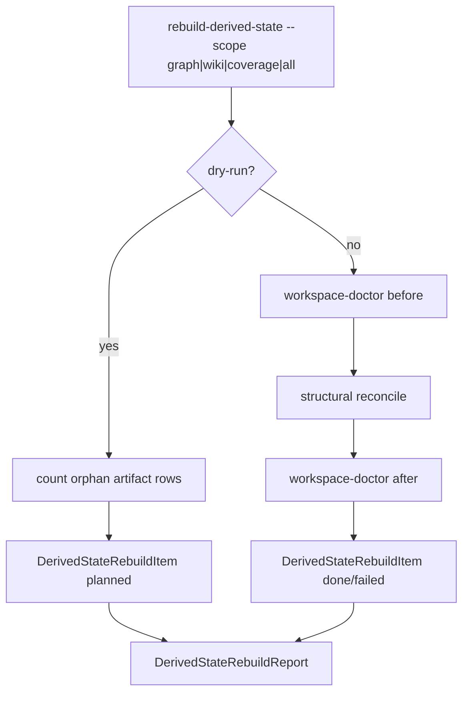

# Structural Derived Rebuild Contract Design

## 0. 术语

- `structural derived state`：由主数据派生的结构状态，包括 `graph_edges`、`edge_evidence_map`、`wiki_pages`、`source_unit_fact_map`、`source_unit_evidence_map`。
- `orphan artifact row`：引用的主数据或上游派生行已不存在的派生行。
- `structural reconcile`：只清理 orphan artifact row，不重建主数据，不猜测生成新事实。
- `dependent FTS`：`wiki_pages` 变化后可能过期的 `wiki_fts`，由 FTS guard 或 `--scope all` 的 FTS 阶段刷新。

## 1. 目标

当前 `workspace-doctor` 已能发现 graph/wiki/coverage 残留，并推荐 `rebuild-derived-state --scope graph|wiki|coverage`，但 `derived_state_rebuild` 对这些 scope 返回 unsupported。根因是诊断闭环和修复闭环的契约没有打通，不是某个孤儿行的单点问题。

本 feature 要把这三个 scope 的最小安全重建契约落地：

- graph：删除 src/dst entity 已不存在的 `graph_edges`，以及 edge/evidence 已不存在的 `edge_evidence_map`。
- wiki：删除 entity/source fact/source doc 无效或 JSON 无法解析的 `wiki_pages` 记录。
- coverage：删除 unit/fact/evidence 已不存在的 source unit 映射行。
- dry-run：只返回 planned counts，不修改数据。
- execute：只改派生 artifact 表，不碰主数据表。

明确不做：

- 不重新生成 graph/wiki/coverage 全量内容。
- 不删除 facts、evidence、entities、documents、source_units。
- 不删除 wiki markdown 文件。
- 不修改 query/rerank/answer 业务策略。
- 不把某个业务 query 写成重建规则。

复杂度档位：中等。改动集中在 `derived_state_rebuild` 和测试，CLI 入口沿用现有命令。

## 2. 设计

### 2.1 名词层

现状：`DerivedStateRebuildItem` 可以表达任意 scope 的 before/after/changed_counts，但 graph/wiki/coverage 只有 `_unsupported_scope_item`。

变化：新增结构派生物 reconcile 节点，复用现有 `DerivedStateRebuildItem`：

```text
scope=graph    action=reconcile_orphans  changed_counts={"graph_edges": N, "edge_evidence_map": M}
scope=wiki     action=reconcile_orphans  changed_counts={"wiki_pages": N}
scope=coverage action=reconcile_orphans  changed_counts={"source_unit_fact_map": N, "source_unit_evidence_map": M}
```

`before` / `after` 使用 `workspace-doctor --scope {scope}` 的 summary 和 issue IDs，而不是新增一套 dashboard-only 检查逻辑。

### 2.2 编排层



流程约束：

- `scope=all` 先执行 graph/wiki/coverage reconcile，再执行 FTS rebuild，避免 wiki 行变更后立即留下 stale `wiki_fts`。
- dry-run 必须可解释地返回将改变的表级计数。
- execute 后再次跑同 scope doctor，仍有 issue 则 item `status=failed`。
- 所有 SQL 只作用于派生 artifact 表。

### 2.3 挂载点

- `src/enterprise_agent_kb/derived_state_rebuild.py`：新增 graph/wiki/coverage reconcile 实现。
- `tests/test_derived_state_rebuild.py`：替换 unsupported 断言，覆盖 dry-run、execute、scope all 顺序和边界。
- `tests/test_residual_state_regression.py`：把 structural orphan case 从“只可见”推进到“可重建清理且不碰主数据”。
- CodeStable roadmap / architecture / requirement：验收后记录 structural rebuild contract 已落地。

### 2.4 推进策略

1. 新增 feature design/checklist，并同步 roadmap item 状态。
2. 在 `derived_state_rebuild` 中实现通用 structural item builder。
3. 实现 graph/wiki/coverage orphan count 与 execute cleanup。
4. 更新测试，证明 dry-run 只读、execute 只清理派生 artifact、scope all 后 FTS 不被 wiki 变更再次弄 stale。
5. 跑派生状态治理闭环相关测试和 query repair 回归。

### 2.5 结构健康度与微重构

本次不做模块拆分。`derived_state_rebuild.py` 当前仍是单一 orchestration 模块，新增逻辑与现有 `DerivedStateRebuildItem` 强相关。若后续重建 graph/wiki 的“全量再生成”契约落地，再考虑拆出 `structural_reconcile.py`。

## 3. 验收契约

- `rebuild-derived-state --scope graph --dry-run` 能报告将清理的 graph/edge evidence orphan 数量，且表行数不变。
- `--scope graph|wiki|coverage` execute 后，对应 `workspace-doctor --scope` 不再报告该类 orphan issue。
- execute 不删除 `facts`、`evidence`、`entities`、`documents`、`source_units`。
- `--scope all` 不再返回 unsupported，且结构 reconcile 后执行 FTS rebuild。
- residual-state regression suite 覆盖 structural cleanup 边界。

反向核对：

- 不做 database reset。
- 不让 rebuild 入口变成业务 query 修复器。
- 不新增分布式依赖。

## 4. 架构影响

派生状态治理闭环从“能发现结构残留”推进到“能安全清理结构派生残留”。这仍不是 graph/wiki/coverage 的全量再生成，而是 orphan artifact row 的最小安全重建契约。
