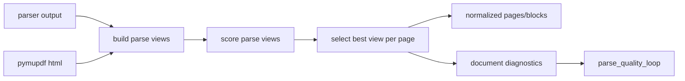

# Multi Parse View Foundation Design

## 0. 需求摘要

目标：把“PDF 转 HTML 是否更好”的讨论落成可验证的解析框架。系统先保存多种页面解析视图，再用规则评分选择 best parse view，后续 evidence/facts/source_units 只消费被选中的视图。

本 feature 的阶段边界：

- 做：新增 parse view 名词层、评分合同、选择结果和诊断出口。
- 做：先把当前 parser 输出登记为 `native_text` 或 `ocr_html` 视图，证明选择框架可运行。
- 做：接入内置 PyMuPDF HTML 候选，验证 PDF-to-HTML 作为候选 view 的通用接入方式。
- 不做：本阶段不接入新的外部 OCR-to-HTML 服务或重型第三方转换器。
- 不做：不改 evidence/facts/source_units 的业务抽取规则，不为某个 PDF 特例调 parser。

复杂度档位：中等。它跨 schema、parse pipeline、quality diagnostics 和测试，但第一阶段不引入外部依赖。

## 1. 决策与约束

现状：

- `parse.py` 直接把 parser 输出写入 `pages`、`blocks` 和 `normalized/{doc_id}.json`。
- `quality.py` 只评估最终 normalized pages。
- `doc_diagnostics.py` 已有 `parse_quality` profile，但看不到“候选解析视图”和“为什么选择某个视图”。

变化：

- 新增 `parse_views` 作为候选解析视图表，保存每页、每种 view 的文本、结构、质量和状态。
- 新增 `page_parse_selection` 保存每页被选中的 view 和选择原因。
- 当前 parse pipeline 登记主 parser 输出和内置 `pymupdf_html` 候选，再由规则 selection 决定 best view；后续 HTML/OCR 工具只需要新增候选生成器，不改下游消费合同。

硬约束：

- LLM 不能直接决定 best view。
- 选择必须可解释：每页要有 `selected_reason` 和 `fallback_chain_json`。
- schema 变更必须 additive，不能重置现有数据库。
- 当前 normalized JSON 保持兼容，避免 evidence/facts 下游断裂。

## 2. 名词层与编排层

### 2.1 名词层

现状：

- `pages` 和 `blocks` 是最终解析结果。
- `quality_reports.report_json.pages` 是最终结果的页级质量指标。
- 没有持久化的“候选解析结果”概念。

变化：

`parse_views`：

```text
view_id
doc_id
page_no
view_type        native_text | html | ocr_html
parser_name
parser_version
text
structure_json
quality_json
status           candidate | selected | unavailable | rejected
created_at
updated_at
```

`page_parse_selection`：

```text
doc_id
page_no
selected_view_id
selected_reason
fallback_chain_json
created_at
updated_at
```

示例：

```json
{
  "page_no": 4,
  "selected_view_type": "ocr_html",
  "selected_reason": "highest_score: readability=0.82 table=0.60 noise=0.08",
  "fallback_chain": ["native_text:low_text_density", "ocr_html:selected"]
}
```

### 2.2 编排层



现状：

- parser 输出直接落入最终 normalized pages。
- 解析质量只能事后看最终结果。

变化：

- parse 阶段先构造 view candidate。
- scoring 节点给每个 view 写 `quality_json`。
- selection 节点按规则选中每页 view。
- 本阶段 normalized 保持旧数据形状，但每页内容由 selected view 驱动，selection 同时作为诊断与后续扩展合同。

### 2.3 挂载点

- `schema.sql`：新增两张表，作为 feature 的持久化边界。
- `parse.py`：parse 阶段登记当前 parser 输出为 parse view 并写 selection。
- `doc_diagnostics.py`：输出 parse view selection 摘要，接入解析质量闭环。
- `/closed-loop-dashboard`：后续展示 workspace 级 parse view 覆盖，本阶段可先只暴露 document diagnostics。

删除这些挂载点后，多解析视图能力从系统视角消失；下游 evidence/facts 仍可继续使用旧路径。

### 2.4 推进策略

1. 建立 schema 和名词层 helper，支持幂等写入 parse views / page selections。
2. 建立规则评分函数，先覆盖文本量、可读性、结构信号、噪声风险。
3. 在 parse pipeline 中把当前 parser 输出和 PyMuPDF HTML 输出登记为候选 view，并写入 selected view。
4. 在 document diagnostics 输出 parse view coverage 和 selection 摘要。
5. 补测试和文档，验证当前行为兼容、诊断新增字段可解释。

### 2.5 结构健康度与微重构

文件级：

- `parse.py` 已经承担多种 parser、远程 OCR、缓存、落库和 normalized 写入，偏胖。
- 本阶段不继续把评分逻辑堆进 `parse.py`；新增独立模块承载 parse view 评分和持久化。

目录级：

- `src/enterprise_agent_kb` 仍是单包扁平结构，当前项目已有多个闭环模块都在此目录。
- 本阶段新增一个小模块即可，不做目录重组。

结论：不做文件搬迁式微重构，但新增逻辑必须放新模块，`parse.py` 只做编排调用。

超出范围观察：

- 未来如果 HTML/OCR 接入导致 parser 数量继续增加，应把 parser provider 拆成独立子模块或包；这属于后续重构，不阻塞本阶段。

## 3. 验收契约

- 输入任意已注册 PDF，运行 parse 后，`parse_views` 至少有与最终 page_count 对齐的候选记录。
- 每个有候选 view 的页面在 `page_parse_selection` 中有且只有一个 selected view。
- selection 不调用 LLM，`selected_reason` 可读且能说明分数或 fallback。
- 当前 normalized JSON、pages、blocks 的字段和数量兼容旧流程，但每页 block 内容来自 selected view。
- document diagnostics 能展示 parse view summary，且不会把 unavailable HTML/OCR 视图当失败。
- 明确不做反向核对：没有新增外部 OCR-to-HTML provider，没有改变 evidence/facts 抽取业务规则。

## 4. 已完成阶段与后续增强

- 已完成：接入 PyMuPDF HTML view provider，并在真实文档上比较 native/html 的评分和入库指标。
- 已完成：让 selected view 驱动 normalized blocks，保留 per-page fallback chain。
- 已完成：Workbench 通过 `/parse-view-detail` 展示页面级候选对比、评分、风险和选择原因。
- 后续增强：接入更强 OCR-to-HTML view provider，优先处理扫描件和 native text 缺失页。
- 后续增强：Workbench 增加差异高亮、表格结构预览和按风险过滤。
