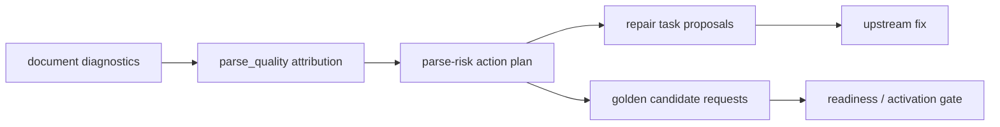

# Parse Risk Action Plan Design

## 0. 需求摘要

解析质量闭环已经能识别风险页和根因，但回归闭环不能直接把所有风险都变成 golden case。需要一个中间层，把 `doc_diagnostics.parse_quality` 的归因翻译成结构化行动计划：

- provider/selection/extraction 问题先回到上游链路修复。
- 只有 `test_coverage_gap` 才生成 golden/corpus 候选请求。
- 默认 dry-run，不写 `repair_tasks`，不激活 golden。

## 1. 数据流



## 2. 归因到动作映射

| attribution | module | action |
|---|---|---|
| `provider_quality_issue` | `parse.py / parser provider` | 修 PDF/HTML/OCR provider 或 fallback。 |
| `selection_rule_issue` | `parse_views.py` | 修候选视图 selection 评分。 |
| `extraction_chain_issue` | `evidence / source_units / facts` | 修抽取链路和映射。 |
| `structural_navigation_noise` | `doc_diagnostics.py / knowledge_units.py` | 目录/图表目录页不生成知识单元，保留为结构性噪声复核，不进入修复 backlog。 |
| `test_coverage_gap` | `golden_generation.py / corpus_eval.py` | 生成 golden/corpus 候选请求。 |
| `review_only` | `doc_diagnostics.py` | 保留人工复核 backlog。 |

## 3. 接口

CLI：

```powershell
C:\Python314\python.exe -m enterprise_agent_kb.cli --root knowledge_base parse-risk-actions --doc-id DOC-...
C:\Python314\python.exe -m enterprise_agent_kb.cli --root knowledge_base parse-risk-actions --doc-id DOC-... --persist-repair-tasks
C:\Python314\python.exe -m enterprise_agent_kb.cli --root knowledge_base parse-risk-repair-review --doc-id DOC-...
```

API：

```text
POST /parse-risk-actions
```

Workbench：Parse Views 页面的“生成行动计划”按钮。

持久化是显式动作。`--persist-repair-tasks` 或 API `persist_repair_tasks=true` 才会写入 `repair_tasks`；默认只生成 JSON/Markdown 报告。持久化任务按 `reason + module + action` 生成稳定 ID，跨文档聚合为同一个系统级任务，具体文档和页码保存在 `metadata.parse_risk_docs`。`impact_count` 使用聚合后的风险页总数，`metadata.parse_risk_doc_count` 和 `metadata.parse_risk_total_page_count` 用于判断同一根因是否跨文档扩散。

回读复核也是显式动作。`parse-risk-repair-review` 读取已持久化的 parse-risk repair task，对比当前 `document_diagnostics.parse_quality`，输出 `suggested_status`：

| suggested_status | 含义 |
|---|---|
| `done` | 旧影响页在当前 diagnostics 中已消失。 |
| `improved` | 当前影响页少于旧影响页。 |
| `still_open` | 当前影响页未改善。 |
| `expanded` | 当前出现新增影响页。 |
| `new_scope` | 当前有影响页，但旧任务没有该文档页码记录。 |

复核只给建议，不自动修改 `repair_tasks.status`。

行动计划和复核报告都会同时写 latest 文件和带时间戳的 history 文件。latest 文件用于 Workbench 快速展示，history 文件用于后续趋势分析和阶段性审计。

`enterprise_agent_kb.parse_risk_history` 汇总 `reports/parse_risk_actions/*-parse-risk-actions-*.json` 和 `*-parse-risk-repair-review-*.json`，按文档输出最新归因、历史样本数、归因 delta 和 review 状态分布。Dashboard 的解析质量闭环直接消费这个汇总。

## 4. 验收契约

- 不把 provider、selection、extraction chain 问题生成 golden 候选请求。
- `test_coverage_gap` 只生成候选请求，不自动激活。
- 输出 JSON 和 Markdown 报告。
- Workbench 可查看 repair task proposals 和 golden candidate requests。
- 默认不写 `repair_tasks`；显式持久化时按系统性问题聚合，不按页生成噪声任务。
- repair review 能基于当前 diagnostics 给出 done/improved/still_open/expanded 建议，但不自动关闭任务。
- Dashboard 显示 parse-risk history 汇总，包括 doc_count、action/review 报告数量、最新归因和 review 状态。
- 目录、图表目录、双语 contents/sommaire 等导航页不能误归因为 provider/extraction/test gap。
