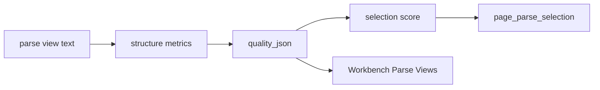

# Structure Aware Parse View Scoring Design

## 0. 需求摘要

目标：把 parse view selection 从“文本量和粗结构信号”提升为“标准文档结构感知”的通用评分。系统需要识别表格、条款编号、页眉页脚噪声、重复行、跨页续接等结构信号，并在 Workbench 中解释为什么某个 view 被选中。

本阶段做：

- 在 `parse_views.quality_json` 中增加结构质量指标。
- 用结构质量参与 selection score。
- Workbench 展示结构指标，并支持只看风险页。
- 用真实盲测文档验证候选、选择和入库验收是否跑通。

本阶段不做：

- 不引入新的外部 OCR 服务。
- 不让 LLM 决定最佳解析视图。
- 不为某个文档、某个表格或某个查询写特例规则。

## 1. 名词层

新增/强化的质量字段：

```text
table_density
row_column_signal_count
clause_number_count
clause_continuity_score
header_footer_noise_ratio
duplicate_line_ratio
continuation_signal_count
structure_quality_score
```

这些字段仍写入 `parse_views.quality_json`，不新增 schema。

## 2. 编排层



## 3. 验收契约

- `score_parse_view` 输出结构质量字段。
- 标准文档中表格/条款结构更完整的候选应获得更高分。
- `selected_reason` 必须包含结构分，fallback chain 必须保留候选分数。
- Workbench Parse Views 展示结构指标和风险过滤。
- IEC 61851 文档能完成 parse view 生成，并进入后续质量/验收检查。
