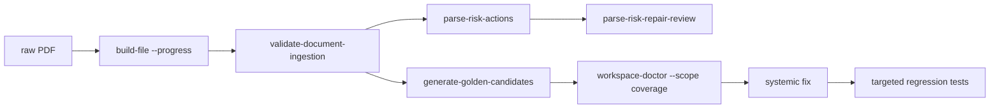
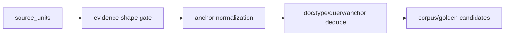
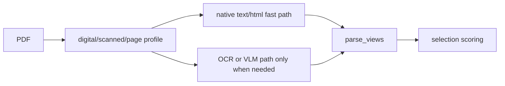
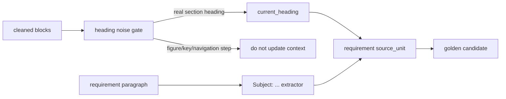

# Multi Document Blind Validation Report

## Goal

用 raw 目录中新加入的文档做盲测，验证“新增一个文档后能否跑完整个过程”，并把失败归因回框架层，而不是为单个 query 或单个 PDF 打补丁。

## Validation Flow



## Documents Tested

| doc_id | file | result | important signals |
|---|---|---|---|
| `DOC-000017` | `188-ISO 14229-7 ... UDSonLIN.pdf` | ingestion `warn`, no failed checks | 22 pages, 8 source units after rebuild, structural navigation noise only, parser slow path about 279 seconds |
| `DOC-000018` | `187-ISO 14229-6 ... UDSonK-Line.pdf` | ingestion `warn`, no failed checks | 18 pages, 6 source units, structural navigation noise only, parser slow path about 431 seconds |
| `DOC-000019` | `186-ISO 14229-5 ... UDSonIP.pdf` | ingestion `warn`, no failed checks | 22 pages, fast-text parser about 1.98 seconds, 11 source units, requirement-only knowledge shape |
| `DOC-000020` | `184-ISO 14229-3 ... UDSonCAN.pdf` | ingestion `warn`, no failed checks | 24 pages, fast-text parser about 2.04 seconds, 18 source units, object coverage 1.0 |

## Root Causes Found

### 1. Structural Navigation Pages Were Misattributed

Contents/list-of-figures/list-of-tables pages can have OCR noise and low readability, but they are not provider failures and should not require source units. The parse quality loop now classifies these pages as `structural_navigation_noise`, keeps them in review-only history, and does not persist provider/extraction/test-gap repair tasks for them.

### 2. Golden Candidate Anchors Needed a Candidate-Quality Gate

Source-unit candidates exposed three generator-level issues:

- English anchors were cut at a fixed character count, producing queries like `primiti有哪些要求`.
- Repeated requirement topics across adjacent pages produced duplicate candidates.
- Requirement anchors sometimes included explanatory tails such as `Table 4 specifies...`, making `must_hit` too broad.

The fix is in the shared corpus/golden bridge:



After the fix:

- `DOC-000018` candidates dropped from 6 to 3.
- Duplicate `UDSonK-Line services overview` cases are skipped as `duplicate_candidate`.
- `Mapping of data link independent service primitives onto K-Line data link dependent service primitives` keeps a complete word-boundary anchor and removes the `Table 4 specifies...` tail from `must_hit`.

### 3. English Definition Shape Was Too Narrow

`workspace-doctor --scope coverage` reported `Mode 3` and `Mode 4` as weak definition shapes, even though the text is valid standard English definition prose: `Mode 3 is a method...`.

The root cause was the definition evidence-shape gate recognizing Chinese definition cues and `means/refers to/defined as`, but missing `is a/is an/is the`. The shared gate now recognizes these English definition cues. After the fix, `workspace-doctor --scope coverage --json` returns `status=ok`.

### 4. Parser Provider Performance Is a Remaining Systemic Risk

`DOC-000017` and `DOC-000018` both selected `minimax_primary+astron_backup+paddlevl` and took hundreds of seconds for short ISO documents. This is not a correctness failure, but it is a general ingestion usability risk.

The root cause was provider ordering: `_parse_pdf()` always tried the MiniMax/Astron/PaddleVL path before checking whether the PDF already had a usable text layer. That made digital PDFs pay OCR/VLM cost even when native text extraction was sufficient.

The parser now applies fast-text-first routing:



Validation on the same DOC-000018 raw PDF:

- `PdfTextProfile(page_count=18, text_page_count=16, average_chars=325.778, coverage_rate=0.888889, digital_text_sufficient=True)`
- selected engine: `pymupdf_fast_text`
- `_parse_pdf()` elapsed time: about 0.44s
- previous full parse stage on the same file: about 431s with `minimax_primary+astron_backup+paddlevl`

MiniMax/Astron remain available and are still used when the text layer is weak or the fast-path feature is disabled with `EAKB_PDF_FAST_TEXT_FIRST=0`.

### 5. English Requirement Extraction Needed a Normative Shape Gate

`DOC-000019` initially parsed quickly with `pymupdf_fast_text`, but `validate-document-ingestion` failed because `source_unit_count=0`. The root cause was not this PDF alone: `knowledge_units._looks_like_requirement` recognized Chinese normative words but did not recognize English standard clauses such as `shall`, `should`, `must` and `is required to`.

The fix adds an English normative gate while rejecting ISO/IEC boilerplate such as patent notices, trade-name notices and copyright text. After rebuilding facts and coverage:

- `fact_count=53`
- `source_unit_count=11`
- `text_coverage_rate=1.0`
- `semantic_coverage_rate=1.0`
- ingestion checks have 0 failed items

### 6. Figure-Key Headings Polluted Requirement Topics

Golden candidate generation exposed a bad query:

```text
Client T_Data.con: Upon the indication of the completed transmission of the TesterPresent (0x3E) request message via T_有哪些要求？
```

The root cause was upstream heading classification. Figure/key steps such as pure numeric headings, `See (n)` headings, and `T_Data/S_Data/N_USData/DoIP_Data...:` timing steps were promoted into `current_heading`, so the later requirement source unit inherited a long figure-step explanation as its canonical key.

The systemic fix is in `knowledge_units._looks_like_navigation_heading_noise` and requirement subject extraction:



After rebuilding `DOC-000019`, the bad long query disappeared. Source-unit golden candidates dropped from 8 to 7, and the repeated `DoIP payload` unit is skipped as `duplicate_candidate`.

### 7. Generated Requirement Queries Needed Rule-First Retrieval

The first DOC-000019 corpus retrieval run timed out before writing an eval run. A single-case smoke then passed but took about 156 seconds. The root cause was not the PDF: generated queries such as `Periodic data response message有哪些要求？` were still routed through text LLM semantic parsing and query expansion, and the rule fallback failed to strip the Chinese requirement suffix from English topics.

The retrieval framework now treats explicit requirement questions as rule-first:


Important constraints:

- `有哪些要求/有什么要求/要求有哪些/要求是什么` maps to `constraint` without LLM semantic parsing.
- Query Expansion returns `requirement_set` without calling the text LLM for explicit requirement questions.
- English lowercase words such as `data`, `requirement` and `shall` are not hard anchors.
- `direct_requirement` injects matching `requirement/table_requirement` facts by normalized topic before final evidence judgement.

After the fix, DOC-000019 corpus retrieval eval passed:

- eval run: `EVAL-B6ABABC563092EED`
- cases: 3
- passed: 3
- failed: 0
- durations: about 25.3s, 19.0s and 14.6s

### 8. Constraint Retrieval Seeds Needed a Quality Gate

DOC-000020 passed ingestion and golden candidate generation, but corpus retrieval eval took about 310 seconds for three cases. The root cause was not correctness: all three cases eventually passed. The cost came from `route_retrieval` using every expansion term as a structured search seed across facts, evidence and wiki. For explicit requirement queries, generic terms such as `要求`, `requirement`, `requirements` and `shall` are evidence-shape hints, not good full-corpus retrieval seeds.

The routing layer now deduplicates structured seeds and skips generic requirement words for `constraint` queries. Direct requirement injection still uses the normalized topic, while evidence judge handles the requirement shape.

After the fix:

- eval run: `EVAL-B48056ED857054D7`
- cases: 3
- passed: 3
- failed: 0
- total duration: about 108 seconds
- previous duration: about 310 seconds

## Validation Commands

```powershell
C:\Python314\python.exe -m enterprise_agent_kb.cli --root knowledge_base build-file --file "E:\AI_Project\opencode_workspace\KB1\knowledge_base\raw\187-ISO 14229-6 2013 Road vehicles -- Unified diagnostic services (UDS) -- Part 6 Unified diagnostic services on K-Line implementation (UDSonK-Line).pdf" --progress
C:\Python314\python.exe -m enterprise_agent_kb.cli --root knowledge_base validate-document-ingestion --doc-id DOC-000018
C:\Python314\python.exe -m enterprise_agent_kb.cli --root knowledge_base parse-risk-actions --doc-id DOC-000018 --persist-repair-tasks
C:\Python314\python.exe -m enterprise_agent_kb.cli --root knowledge_base generate-golden-candidates --origin source_unit --doc-id DOC-000018 --limit-per-type 20
C:\Python314\python.exe -m enterprise_agent_kb.cli --root knowledge_base workspace-doctor --scope coverage --json
```

## Regression Tests

DOC-000018 corpus retrieval eval:

```powershell
C:\Python314\python.exe -m enterprise_agent_kb.cli --root knowledge_base run-corpus-retrieval-eval --doc-id DOC-000018 --generation-limit-per-type 3 --case-limit 3 --limit 10 --progress --suite-id regression:corpus_retrieval:blind-doc-000018 --output-dir output\blind-doc-000018-corpus-eval
```

Result: `EVAL-31B3A9268F7B49FF`, 3 passed, 0 failed. Case durations were about 87s, 52s, and 58s, so retrieval correctness passed but eval runtime remains a performance-governance issue.

```powershell
C:\Python314\python.exe -m pytest tests/test_corpus_eval.py tests/test_coverage.py::test_source_unit_inventory_filters_structural_and_symbol_noise tests/test_doc_diagnostics.py tests/test_parse_risk_actions.py -q
```

Result: `17 passed`.

```powershell
C:\Python314\python.exe -m py_compile src\enterprise_agent_kb\corpus_eval.py src\enterprise_agent_kb\golden_generation.py src\enterprise_agent_kb\coverage.py src\enterprise_agent_kb\doc_diagnostics.py src\enterprise_agent_kb\parse_risk_actions.py src\enterprise_agent_kb\parse_risk_history.py
```

Result: passed.

Additional DOC-000019 regression:

```powershell
C:\Python314\python.exe -m pytest tests/test_knowledge_units.py tests/test_doc_ir.py tests/test_corpus_eval.py -q
```

Result: `23 passed`.

Requirement query regression:

```powershell
C:\Python314\python.exe -m pytest tests/test_query_api.py tests/test_query_expansion.py tests/test_query_rewrite.py -q
```

Result: `10 passed`.

Retrieval seed regression:

```powershell
C:\Python314\python.exe -m pytest tests/test_retrieval_router.py -q
```

Result: `1 passed`.
