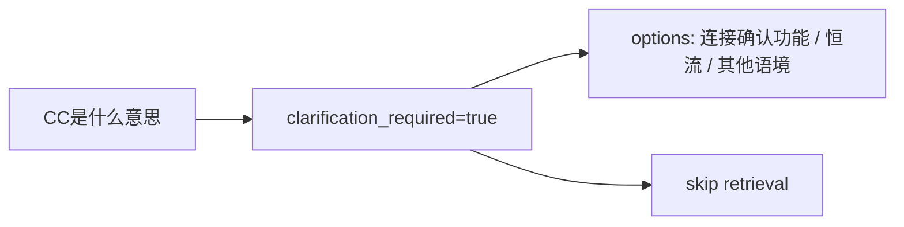

# User Query Eval Clarification Contract Analysis

## 根因

`run_user_query_retrieval_eval()` 面向 retrieval case 设计，默认每个 case 都应有 retrieved items，并通过 `evaluate_retrieval_quality()` 计算 must-hit、recall、MRR。

但短缩写歧义查询的正确行为是：

这种 case 没有 retrieval run，也不应该参与 retrieval recall/MRR。

## 方案

- user query eval 支持 `expected_query_type=clarification`。
- 增加 `expected_clarification_required` 和 `expected_clarification_options`。
- clarification case 使用 neutral retrieval quality：`failure_attribution=ok`，recall/MRR 为 `None`。
- 真实 case 文件把 `CC是什么意思` 改为 clarification contract。
