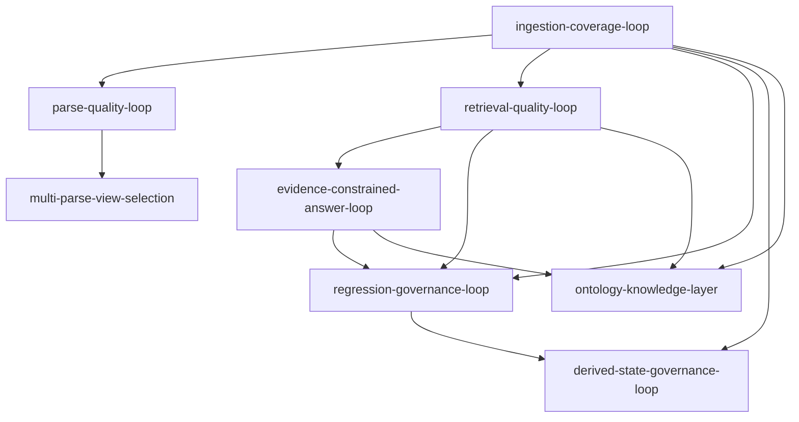

# KB1 能力愿景索引

## Current

> 优先级说明：P0 = 必须立即推进，P1 = 短期推进，P2 = 中期推进，long-term = 长期目标。
> 依赖关系见下方依赖图。

### P0 — 基线能力（已落地，持续维护）

- [ingestion-coverage-loop](ingestion-coverage-loop.md) — 证明文档真的进来了，并能定位未覆盖内容。
- [regression-governance-loop](regression-governance-loop.md) — 用 golden suite 和失败归因证明系统越改越稳。

### P1 — 质量闭环（已落地，持续强化）

- [parse-quality-loop](parse-quality-loop.md) — 把解析风险拆成可处理的根因，避免低可读性页面被误当成入库失败。
- [multi-parse-view-selection](multi-parse-view-selection.md) — 让系统按页比较 PDF 原生文本、HTML 和 OCR 结果，选择最可靠的解析视图。
- [retrieval-quality-loop](retrieval-quality-loop.md) — 证明用户问法能找到正确内容，并能解释召回失败。
- [evidence-constrained-answer-loop](evidence-constrained-answer-loop.md) — 让答案只基于候选证据输出，歧义先澄清，不让 LLM 直接决定事实。
- [derived-state-governance-loop](derived-state-governance-loop.md) — 让系统能发现、刷新和隔离过期派生数据，避免残留状态误导查询和评测。

### long-term — 演进目标（ontology-knowledge-layer 的前置需求已基本具备）

- [ontology-knowledge-layer](ontology-knowledge-layer.md) — 将 KB1 从证据约束知识工程系统逐步演进为具备本体约束、语义校验和有限推理能力的知识库。

### 依赖关系

入库闭环是所有闭环的前置基础；回归闭环依赖召回和答案闭环的产出；本体层是长期目标，依赖所有 P1 闭环的稳定运行。

## Draft

- 暂无。

## Outdated

- 暂无。
