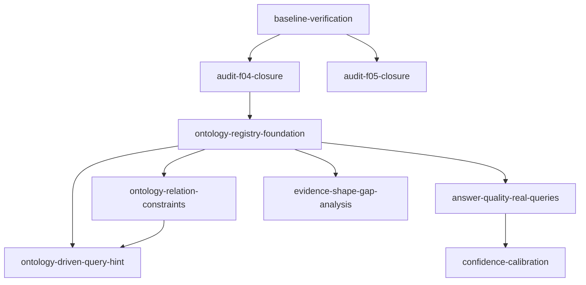

# KB1 下一阶段 Roadmap

## 1. 背景

两个前置 roadmap 已全部完成：

- `kb1-six-loop-hardening`：7/7 done — 六闭环工程化强化
- `kb1-derived-state-governance`：9/9 done — 派生状态治理闭环

2026-05-18 核心回归完整性审计已完成第一轮根因修复（F-01/F-02/F-03），知识库已重建，`workspace-doctor --scope coverage` 当前为 `ok`。

本 roadmap 承接已完成的工作，定义下一阶段可执行的 feature 列表。

## 2. 范围与明确不做

本 roadmap 覆盖：

- 审计遗留关闭（F-04/F-05）
- 本体层阶段一落地（ontology registry）
- 答案质量扩展
- 文档与代码持续同步机制

明确不做：

- 不引入 OWL/RDF 等重型本体框架
- 不绕过 evidence judge 让本体推理直接生成事实
- 不做破坏性 schema reset
- 不引入分布式依赖

## 3. 子 Feature 清单

### Phase 1：基线验证与审计关闭

| 优先级 | 子 feature | 说明 |
|---|---|---|
| P0 | baseline-verification | 跑 workspace-doctor + pytest，确认知识库和测试基线干净 |
| P0 | audit-f04-closure | 确认 F-04（user-style regression golden 合同与 query_type 不一致）状态，未修则修 |
| P1 | audit-f05-closure | 确认 F-05（demo delivery asset 测试断言旧 tab 集合）状态，未修则修 |

### Phase 2：本体层阶段一

| 优先级 | 子 feature | 说明 |
|---|---|---|
| P1 | ontology-registry-foundation | 建立稳定 registry，定义核心 entity types、knowledge types、evidence shapes；当前代码中已有隐式实现（entities.py、evidence_shapes.py、knowledge_contracts.py），需要正式化为可版本化的 registry |
| P1 | ontology-relation-constraints | 定义关系类型及 domain/range（defines、has_parameter、has_test_method、has_activity、belongs_to_standard、measured_at、has_condition、has_expected_observation），让 graph_edges 受约束 |
| P2 | ontology-driven-query-hint | 查询链路使用本体类型做 query understanding hint，把用户问题映射到 ontology type 和 expected evidence shape |

### Phase 3：答案质量扩展

| 优先级 | 子 feature | 说明 |
|---|---|---|
| P1 | answer-quality-real-queries | 扩充 answer_quality 用例，增加真实问法覆盖（短缩写、复合主题、参数含义、过程步骤） |
| P1 | confidence-calibration | confidence.py 当前是简单加权公式（37 行），需要与 answer_quality eval 对齐校准 |
| P2 | evidence-shape-gap-analysis | 按 ontology type 统计 evidence shape 覆盖缺口，发现哪些知识形态缺少形状合同 |

### Phase 4：持续同步

| 优先级 | 子 feature | 说明 |
|---|---|---|
| P2 | code-doc-sync-mechanism | 建立代码与文档持续同步机制：代码改动后自动核对 .codestable 对应文档是否需要更新 |
| P2 | historical-doc-cleanup | 把 docs/ 根目录历史文档归档到 docs/_archive/，保持 docs/ 只含活跃文档 |

## 4. 依赖关系

- 基线验证必须先于所有其他工作
- 本体 registry 是阶段二和阶段三的前置依赖
- 关系约束是查询 hint 的前置依赖
- 答案质量扩展依赖本体 registry 提供类型信息

## 5. 排期建议

1. **立即**：基线验证 + F-04/F-05 关闭（1-2 天）
2. **短期**：本体 registry foundation（3-5 天）
3. **中期**：关系约束 + 答案质量扩展 + confidence 校准（5-7 天）
4. **后续**：查询 hint + shape gap 分析 + 持续同步机制

## 6. 观察项

- `governance.py` 只有 41 行，是 thin wrapper；如果回归闭环需要更复杂的治理逻辑，可能需要扩充
- `synonyms.py` 的 SYNONYM_MAP 是硬编码字典，后续应考虑与 ontology registry 集成
- `advanced_query_planner` 仍在 feature gate 后（EAKB_ENABLE_ADVANCED_QUERY_PLANNER=1），本体层可能为其提供更好的规划依据
- VISION.md 的 8 个 requirement 缺少优先级标注和依赖关系，应在本 roadmap 推进过程中同步更新

## 变更日志

- 2026-05-19：创建 roadmap，承接两个已完成 roadmap 的后续规划。
