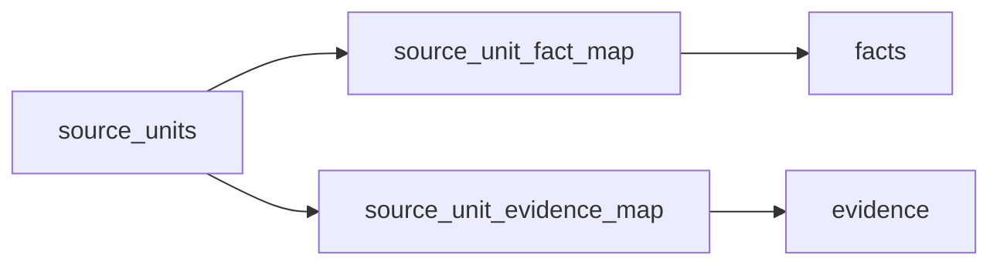
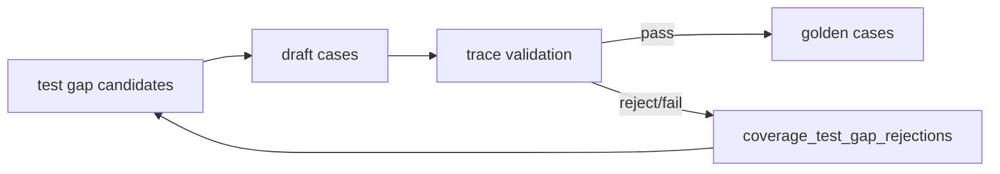

# KB1 当前完整架构方案

日期：2026-05-06（更新 P1-P4 里程碑完成状态）
状态：当前主方案文档
范围：入库、知识建模、查询链路、LLM 边界、Graph、证据判定、歧义澄清、UI、测试体系和后续路线

---

## 1. 文档目的

本文档用于统一 KB1 当前架构，不再只记录某个失败问题的局部修复。

当前系统的核心目标不是“让某一个 query 答对”，而是建立一条：

```text
可追溯
可解释
可回退
可测试
可扩展
```

的企业知识库查询和问答链路。

特别强调：

- LLM 不能直接决定最终事实。
- LLM 只能参与查询规划、扩展、证据裁判等受约束环节。
- 最终答案必须来自候选事实、证据和规则校验。
- 短缩写、歧义问题不能强行猜，要先让用户确认。
- Graph 必须进入召回和证据链路，而不是只作为展示或排序加分。

---

## 2. 总体目标

KB1 面向标准文档、企业知识库和 Agent 可调用知识底座。

核心目标：

- 稳定入库 PDF / Markdown / 文本文档。
- 从原文构建 `evidence -> facts -> entities -> wiki -> graph`。
- 支持用户自然语言查询。
- 支持可解释答案和证据追溯。
- 支持歧义澄清，不强行猜测缩写含义。
- 支持全库覆盖、召回质量、答案质量测试。
- 支持本地单机运行和工作台调试。

当前优先级：

1. 查询链路正确性。
2. LLM 查询规划的边界控制。
3. Graph 参与候选生成和证据约束。
4. Evidence Judge 的规则优先和候选约束。
5. 歧义澄清机制。
6. 回归测试和覆盖测试体系。

不再继续 UI 微调，除非 UI 阻碍核心链路验证。

---

## 3. 六个产品闭环

KB1 不只按模块定义，更要按可验证闭环定义。模块说明系统由什么组成，闭环说明系统是否真的有效。

当前产品目标应收敛为六个闭环：

```text
入库闭环
解析质量闭环
召回闭环
答案闭环
回归闭环
派生状态治理闭环
```

### 3.1 入库闭环

目标：证明文档真的进来了，并且可追溯。

链路：

```text
document
  -> pages
  -> blocks
  -> evidence
  -> source units
  -> coverage report
```

核心问题：

- PDF 是否解析成功？
- 页、块、证据是否生成？
- 高价值 source units 是否被覆盖？
- 哪些原文单元漏掉？
- 解析风险集中在哪些页？

核心指标：

- `page_parse_success_rate`
- `block_count`
- `evidence_count`
- `source_unit_coverage`
- `uncovered_units`
- `parse_risk_pages`
- `actionable_parse_risk_pages`
- `parse_risk_profile`

注意：`parse_risk_pages` 是原始质量 backlog，不能直接等同于解析失败。当前 Dashboard 使用 `parse_risk_profile` 将 high-risk 页面分解为 `no_evidence`、`evidence_without_source_unit`、`source_unit_without_fact`、`fully_backed`，只有 `actionable_parse_risk_pages` 才进入入库闭环健康告警。PDF 主解析器输出空 blocks 时，解析层会用 PDF 原生文本层回填；确认空白页标记为 `blank`，不再计为解析失败。

### 3.2 解析质量闭环

目标：把解析风险拆成可处理的根因，避免低可读性页面被误当成入库失败。

链路：

```text
PDF page
  -> parser output
  -> text fallback / blank-page detection
  -> quality report
  -> parse_risk_profile
  -> root cause classification
  -> recommended action
  -> parse_quality_loop dashboard
```

核心问题：

- 解析器输出是否可靠？
- 高风险页面是否有 evidence 支撑？
- 解析风险归因是 provider、selection 还是 extraction 问题？
- 多解析视图是否选到了最优视图？

核心指标：

- `parse_risk_pages`
- `actionable_parse_risk_pages`
- `chain_gap_pages`
- `review_only_pages`
- `evidence_backed_high_risk_pages`
- `fully_backed_high_risk_pages`

详细定义见 `.codestable/architecture/closed-loop-architecture.md` 解析质量闭环章节。

### 3.3 召回闭环

目标：证明用户问法能找到正确内容。

链路：

```text
user query
  -> query rewrite
  -> ambiguity / topic resolution
  -> graph candidate expansion
  -> retrieval
  -> rerank
  -> context
  -> retrieval_quality score
```

核心问题：

- 用户自然问法是否能召回正确证据？
- 正确内容是否进入 Top K？
- Graph 是否真正贡献候选？
- 负样本是否被误召回？
- must_hit 是否覆盖？

核心指标：

- `Recall@5`
- `Recall@10`
- `MRR`
- `nDCG@5`
- `negative_hit_rate`
- `must_hit_coverage`

### 3.4 答案闭环

目标：证明最终答案可用、可解释、可追溯。

链路：

```text
query
  -> context
  -> evidence judge
  -> answer policy
  -> direct answer
  -> supporting evidence
  -> answer_quality score
```

核心问题：

- 答案是否回答了用户问题？
- 引用的事实和证据是否正确？
- answer_mode 是否正确？
- 是否出现 forbidden answer？
- 置信度是否和实际质量匹配？

核心指标：

- `answer_pass_rate`
- `citation_correct_rate`
- `forbidden_contains_rate`
- `answer_mode_accuracy`
- `confidence_calibration`

### 3.5 回归闭环

目标：证明系统越改越好，而不是越改越乱。

链路：

```text
golden suite
  -> run
  -> compare previous run
  -> failure attribution
  -> regression dashboard
```

核心问题：

- 新增失败是什么？
- 修复了哪些旧失败？
- 哪些失败属于召回退化？
- 哪些失败属于答案退化？
- 修改是否造成无关链路回归？

核心指标：

- `new_failures`
- `fixed_failures`
- `stable_pass_rate`
- `retrieval_regression_count`
- `answer_regression_count`

### 3.6 派生状态治理闭环

目标：让系统能发现、刷新和隔离过期派生数据，避免残留状态误导查询和评测。

链路：

```text
source tables/files
  -> DerivedStateSpec registry
  -> check_derived_state
  -> workspace-doctor (只读诊断)
  -> workspace-governance (策略编排)
  -> rebuild-derived-state (显式修复)
  -> prune-stale-runs (运行治理)
  -> hygiene_loop dashboard
```

核心问题：

- FTS 索引是否与主数据一致？
- 是否存在 orphan graph/wiki/coverage 引用？
- 旧/未知 code_version 的 runs 是否需要治理？
- 派生状态刷新后是否级联生效？

核心指标：

- FTS freshness（fresh/stale/missing）
- orphan reference count
- stale run count
- current code_version run count

详细定义见 `.codestable/architecture/closed-loop-architecture.md` 派生状态治理闭环章节。

这六个闭环是产品层定义。后续模块、数据库表、API、UI 和测试都应服务于这六个闭环。

---

## 4. 基本原则

### 4.1 数据可追溯

所有答案必须能追溯：

```text
source document
  -> page / block
  -> evidence
  -> fact
  -> entity / wiki / graph
  -> query context
  -> evidence judgement
  -> answer
  -> regression / golden case
```

### 4.2 规则优先，LLM 受约束

LLM 可以做：

- query semantic parse
- query expansion
- advanced query planning
- evidence judgement 辅助裁判

LLM 不可以做：

- 直接编造最终事实
- 选择不存在的 fact_id / evidence_id
- 绕过规则输出 sufficient
- 在短缩写歧义时替用户猜含义

### 4.3 短缩写必须先消歧

例如：

```text
CC是什么意思
CP是什么意思
PE是什么意思
OBC是什么意思
V2G是什么意思
V2X是什么意思
```

如果缺少上下文，系统应返回：

```text
clarification_required = true
```

而不是直接回答某个可能含义。

### 4.4 Graph 是查询骨架，不是装饰

Graph 不应只用于：

- answer 层展示 related edges
- 给 fact 加 `_subgraph_bonus`

Graph 应用于：

- canonical entity 定位
- relation 白名单遍历
- 从 `edge_evidence_map` 展开候选 facts/evidence
- 给 Evidence Judge 提供 graph path
- 给最终答案提供可解释路径

### 4.5 不做单点硬修

每次查询失败都要归因到链路层：

- rewrite 错
- ambiguity gate 缺失
- topic resolution 错
- graph candidate 缺失
- retrieval/rerank 错
- judge 误判
- answer policy 错
- UI 展示错
- 测试缺失

修复应优先发生在框架层。

---

## 5. 系统总览

```text
CLI / HTTP API / Workbench / MCP
              |
        Workspace / SQLite
              |
     Ingestion Pipeline
              |
parse -> quality -> evidence -> facts -> entities -> wiki -> graph
              |
        Query Pipeline
              |
ambiguity gate
  -> rewrite
  -> query expansion
  -> advanced planner
  -> topic resolution
  -> graph candidate expansion
  -> routing retrieval
  -> rerank
  -> evidence judge
  -> answer policy
  -> UI / API response
              |
       Golden / Regression / Coverage
```

---

## 6. 模块职责

| 模块 | 文件 | 责任 |
|---|---|---|
| CLI | `src/enterprise_agent_kb/cli.py` | 操作入口、服务启动 |
| API | `src/enterprise_agent_kb/api_server.py` | HTTP API 和 Workbench 后端 |
| Config | `src/enterprise_agent_kb/config.py` | 工作区路径 |
| DB | `src/enterprise_agent_kb/db.py`, `schema.sql` | SQLite 连接和 schema |
| Parse | `src/enterprise_agent_kb/parse.py` | 文档解析，VLM/OCR 调用 |
| Quality | `src/enterprise_agent_kb/quality.py` | 页面质量和风险 |
| Evidence | `src/enterprise_agent_kb/evidence.py` | 证据块生成 |
| Facts | `src/enterprise_agent_kb/facts.py` | 结构化事实抽取 |
| Entities | `src/enterprise_agent_kb/entities.py` | 实体、术语、参数对象 |
| Wiki | `src/enterprise_agent_kb/wiki_compiler.py` | wiki 页面生成 |
| Graph Build | `src/enterprise_agent_kb/graph.py` | 图边构建 |
| Query Rewrite | `src/enterprise_agent_kb/query_rewrite.py` | 意图识别、锚点保护 |
| Ambiguity | `src/enterprise_agent_kb/query_ambiguity.py` | 短缩写歧义澄清 |
| Ambiguity Index | `src/enterprise_agent_kb/ambiguity_index.py` | KB-driven 缩写含义自动发现 |
| Query Expansion | `src/enterprise_agent_kb/query_expansion.py` | LLM 查询扩展 |
| Advanced Planner | `src/enterprise_agent_kb/advanced_query_planner.py` | 实验三路 planner |
| Topic Resolution | `src/enterprise_agent_kb/topic_resolution.py` | query 到 entity/wiki |
| Graph Retrieval | `src/enterprise_agent_kb/graph_retrieval.py` | graph 前置候选扩展 |
| Retrieval Router | `src/enterprise_agent_kb/retrieval_router.py` | 多通道检索 |
| Reranker | `src/enterprise_agent_kb/reranker.py` | 候选重排 |
| Evidence Judge | `src/enterprise_agent_kb/evidence_judge.py` | 规则优先证据裁判 |
| Answer API | `src/enterprise_agent_kb/answer_api.py` | 问答主入口 |
| Answer Policy | `src/enterprise_agent_kb/answer_policy.py` | 答案模板和模式 |
| Coverage | `src/enterprise_agent_kb/coverage.py` | 覆盖分析 |
| Generated Tests | `src/enterprise_agent_kb/generated_tests.py` | Golden 生成和执行 |
| UI | `examples/demo.html` | 本地 Demo Workbench |

---

## 7. 数据模型

核心链路：

```text
documents
  -> pages
  -> blocks
  -> evidence
  -> fact_evidence_map
  -> facts
  -> entities
  -> wiki_pages
  -> graph_edges
  -> edge_evidence_map
```

关键表：

- `documents`：文档元数据。
- `pages`：页级信息。
- `blocks`：文本块、表格块、版面块。
- `evidence`：可引用证据。
- `facts`：结构化事实。
- `fact_evidence_map`：事实到证据。
- `entities`：术语、参数、流程、标准等实体。
- `wiki_pages`：面向人和检索的知识页。
- `graph_edges`：实体关系。
- `edge_evidence_map`：图边到证据。
- `jobs`：后台任务。
- `audit_log`：操作审计。

要求：

- `facts` 不能脱离 evidence。
- `graph_edges` 不能脱离 evidence。
- `wiki_pages` 应保留 `source_fact_ids_json`。
- 所有阶段保留 confidence、risk、doc_id、page_no 等 metadata。

### 7.1 建议新增持久化对象

当前 coverage、golden、eval 的一部分信息仍主要存在 JSON 报告中。长期看，这会让 failure analysis、版本对比和 dashboard 很难做。建议采用 additive schema 扩展，补充以下表。

#### source_units

`source_units` 是入库闭环和 coverage 的核心对象，不应只存在于报告 JSON。

建议字段：

| 字段 | 说明 |
|---|---|
| `unit_id` | source unit ID |
| `doc_id` | 所属文档 |
| `page_no` | 页码 |
| `block_id` | 来源 block |
| `unit_type` | `definition_unit` / `parameter_row_unit` / `requirement_unit` 等 |
| `text` | 原文 |
| `normalized_text` | 归一化文本 |
| `importance` | 重要性 |
| `expected_knowledge_type` | 期望生成的知识类型 |
| `status` | 覆盖状态 |

用途：

- coverage report 的主索引。
- uncovered units 的归因对象。
- golden case 生成的来源。
- 入库完成度的可查询事实。

#### source_unit_fact_map / source_unit_evidence_map

这两张表已经从“建议对象”进入当前实现，是入库闭环证明链的核心关系表。



`source_unit_fact_map` 字段：

| 字段 | 说明 |
|---|---|
| `unit_id` | source unit ID |
| `fact_id` | 覆盖该 source unit 的 fact ID |
| `doc_id` | 所属文档 |
| `support_type` | 映射来源，例如 `coverage_matrix` 或 `coverage_metadata` |
| `created_at` | 写入时间 |

`source_unit_evidence_map` 字段：

| 字段 | 说明 |
|---|---|
| `unit_id` | source unit ID |
| `evidence_id` | 覆盖该 source unit 的 evidence ID |
| `doc_id` | 所属文档 |
| `support_type` | 映射来源，例如 `coverage_matrix` 或 `coverage_metadata` |
| `created_at` | 写入时间 |

用途：

- `evidence_coverage_rate` 按 `source_unit_evidence_map` 中 distinct `unit_id` 计算。
- `fact_coverage_rate` 按 `source_unit_fact_map` 中 distinct `unit_id` 计算。
- 历史 coverage matrix 可从 `source_units.metadata_json.covered_by` 幂等回填。
- 新 coverage 构建在 `sync_source_units_from_matrix` 阶段直接写入映射表。
- fact fallback source unit ID 不允许嵌入 `FACT-*`，必须基于语义键和原文稳定生成。

#### coverage_test_gap_rejections

`coverage_test_gap_rejections.json` 是 golden-gap 自动治理的拒绝账本，用于记录验证失败、弱锚点、噪声标题、过长图表文本等不适合自动提升的 source units。



用途：

- 防止同一失败草案在后续批次反复占用生成预算。
- 保留为什么不能自动进入 golden 的可解释原因。
- 让 `close-coverage-test-gaps` 可以按批次稳定推进，而不是人工挑选单个 case。

当前实现还包含两条保护：

- source unit inventory 会在 coverage 义务形成前过滤目录/目次/引言/结语、短结构标题、图例标引说明、表格语法残片、纯符号参数行。
- promotion 会剪掉 obsolete coverage case，但只有当 `coverage_unit_id` 和 `coverage_semantic_key` 都无法匹配当前 coverage matrix 时才剪掉。

当前全库基线：

| 指标 | 值 |
|---|---:|
| `source_unit_count` | 2145 |
| `source_unit_coverage_rate` | 0.987879 |
| `evidence_coverage_rate` | 1.0 |
| `fact_coverage_rate` | 1.0 |
| `uncovered_units` | 26 |
| `actionable_uncovered_units` | 0 |
| `parse_risk_pages` | 120 |
| `actionable_parse_risk_pages` | 0 |
| remaining uncovered root cause | `test_gap_rejected` only |

#### retrieval_runs

`retrieval_runs` 用于记录每次查询的召回结果，支撑 Query Debug 和 Failure Analysis。

建议字段：

| 字段 | 说明 |
|---|---|
| `run_id` | 召回运行 ID |
| `query` | 原始问题 |
| `query_type` | rewrite 后类型 |
| `doc_scope` | 全库或文档范围 |
| `retrieved_evidence_ids` | 初召回 evidence IDs |
| `reranked_ids` | rerank 后结果 |
| `scores` | 分数和解释 |
| `created_at` | 运行时间 |

用途：

- 对比 graph / routing / lexical / vector 的贡献。
- 追踪为什么某次查询命中错误内容。
- 支撑 retrieval regression。

#### golden_cases

Golden case 不应只存在 JSON 文件中，数据库里也应有索引。

建议字段：

| 字段 | 说明 |
|---|---|
| `case_id` | case ID |
| `doc_id` | 所属文档 |
| `assert_mode` | `context_contains` / `retrieval_quality` / `rich_answer` |
| `query` | 用户问题 |
| `must_hit` | 必须命中的内容 |
| `negative_expected` | 不应命中的内容 |
| `expected_pages` | 期望页码 |
| `expected_sections` | 期望章节 |
| `status` | active / draft / deprecated |
| `source` | generated / promoted / manual |

用途：

- UI 检索和筛选 case。
- 关联 source unit。
- 形成长期 regression suite。

#### eval_runs / eval_results

`eval_runs` 记录一次评测运行，`eval_results` 记录每条 case 结果。

`eval_runs` 建议字段：

| 字段 | 说明 |
|---|---|
| `eval_run_id` | 评测运行 ID |
| `suite_id` | suite ID |
| `started_at` | 开始时间 |
| `config_hash` | 配置 hash |
| `code_version` | 代码版本 |
| `result_summary` | 聚合结果 |

`eval_results` 建议字段：

| 字段 | 说明 |
|---|---|
| `eval_run_id` | 评测运行 ID |
| `case_id` | case ID |
| `passed` | 是否通过 |
| `failure_reason` | 失败原因 |
| `retrieved_items` | 实际召回 |
| `answer` | 实际答案 |
| `metrics` | case 级指标 |

用途：

- 比较不同版本效果。
- 计算 `new_failures` / `fixed_failures`。
- 支撑 regression dashboard。

这些表应作为 additive schema 演进，不要求一次性全部实现，但设计上必须承认它们是六个闭环的基础设施。

---

## 8. LLM Provider 策略

### 8.1 文本 LLM

当前文本 LLM 调用入口保留历史函数名 `_call_astron_text`，但实际策略为：

```text
MiniMax primary
  -> astron / anthropic-compatible backup
```

主力模型：

```text
OPENAI_BASE_URL
OPENAI_API_KEY
LLM_MODEL = MiniMax-M2.7
```

备用：

```text
ANTHROPIC_BASE_URL = https://maas-coding-api.cn-huabei-1.xf-yun.com/anthropic
ANTHROPIC_AUTH_TOKEN
ANTHROPIC_MODEL
```

### 8.2 VLM / OCR

文档解析中的多模态能力同样遵循：

```text
MiniMax primary
  -> astron backup
```

### 8.3 LLM 边界

LLM 输出必须经过：

- JSON 解析。
- 质量门。
- fallback。
- ID 候选集合约束。
- drift filtering。
- rule-based final validation。

---

## 9. 当前查询链路

当前目标链路：

```text
answer_query()
  -> detect_query_ambiguity()
  -> build_query_context()
       -> rewrite_query()
       -> expand_query()
       -> plan_advanced_query()
       -> resolve_topic_entities()
       -> retrieve_graph_candidates()
            -> expand topic source facts by evidence shape
       -> route_retrieval()
       -> direct_routing_hits()
       -> merge graph/routing/retrieval hits
       -> rerank_candidates()
       -> hydrate evidence/facts/wiki/entities/graph
       -> judge_evidence()
  -> select_answer_policy()
  -> prioritize judged facts
  -> select supporting evidence
  -> build direct answer
```

---

## 10. Query Rewrite

文件：

```text
src/enterprise_agent_kb/query_rewrite.py
```

职责：

- 识别 `query_type`。
- 生成 `normalized_query`。
- 生成 `target_topic`。
- 提取 `must_terms`、`should_terms`、`aliases`。
- 保护关键锚点。
- 防止 LLM 语义解析漂移。

当前支持的主要类型：

- `definition`
- `parameter_lookup`
- `timing_lookup`
- `standard_lookup`
- `lifecycle_lookup`
- `constraint`
- `comparison`
- `section_lookup`
- `general_search`
- `no_answer_candidate`

关键规则：

- `CP是什么意思` 这类短缩写释义不能因为包含 `CP` 被抢成 `parameter_lookup`。
- 释义类问题优先 `definition`。
- 只有出现明确参数形状才走 `parameter_lookup`，例如：
  - `阻值`
  - `电阻`
  - `电压`
  - `检测点1`
  - `占空比`
  - `PWM`
  - `9V`
- `CP的时序是什么样的` 优先 `timing_lookup`。
- `CC电阻` 规范化为 `CC阻值`。

---

## 11. Ambiguity Gate

文件：

```text
src/enterprise_agent_kb/query_ambiguity.py
```

职责：

- 在检索前识别短缩写歧义。
- 对无上下文的缩写问题返回 clarification。
- 阻止系统强行猜测。

当前行为：

```text
CP是什么意思
  -> clarification_required = true

CC是什么意思
  -> clarification_required = true

充电接口里的 CP 控制导引功能是什么意思
  -> definition

CP占空比是什么意思
  -> parameter_meaning
```

当前 registry 覆盖：

- `CC`
- `CP`
- `PE`
- `OBC`
- `V2G`
- `V2X`

注意：registry 不是长期完整方案，只是种子层。

长期方案应为：

```text
KB-driven ambiguity index
```

也就是从 `entities / wiki_pages / facts / graph_edges` 自动发现：

- 同一 acronym 是否有多个 sense。
- 每个 sense 的上下文词。
- 每个 sense 对应的 wiki/fact/graph path。
- 是否需要 clarification。

人工 registry 只作为高风险缩写 seed 和业务兜底。

---

## 12. Query Expansion v0

文件：

```text
src/enterprise_agent_kb/query_expansion.py
```

职责：

- 使用 LLM 把原始问题扩展成结构化检索计划。
- 输出：
  - `preserved_anchors`
  - `expanded_terms`
  - `expanded_queries`
  - `intent_candidates`
  - `risk_notes`
  - `possible_answer_shape`

质量门：

- LLM 输出不合格时 fallback。
- 必须保留原始锚点。
- 不允许 CP/CC/PWM/电压/时序类问题语义漂移。

CP 控制导引语境下过滤：

- `Charge Pump`
- `Control Pin`
- `Clock Pulse`
- `Charging Protocol`

---

## 13. Advanced Query Planner

文件：

```text
src/enterprise_agent_kb/advanced_query_planner.py
```

状态：

```text
默认关闭
```

开启：

```text
EAKB_ENABLE_ADVANCED_QUERY_PLANNER=1
```

设计：

```text
standard_structure planner
engineering_semantics planner
terminology_alias planner
  -> synthesizer
  -> RetrievalPlan
```

输出会合并进 `retrieval_rewrite`，但最终仍受：

- anchor preservation
- drift filtering
- query_type rule
- evidence judge

约束。

---

## 14. Topic Resolution

文件：

```text
src/enterprise_agent_kb/topic_resolution.py
```

职责：

- 将 query target 映射到 `entities` 和 `wiki_pages`。
- 对不同 query_type 选择不同 entity type。

示例：

```text
parameter_lookup
  -> parameter_topic / term / parameter_group

definition
  -> term / parameter_topic

timing_lookup
  -> process
```

注意：

- topic resolution 只解决“用户问的对象是谁”。
- 它不能单独决定最终答案。
- 它的结果会作为 graph candidate expansion 的 seed。

---

## 15. Graph 架构

### 15.1 Graph Build

文件：

```text
src/enterprise_agent_kb/graph.py
```

当前关系类型：

- `references_standard`
- `replaces_standard`
- `defines_term`
- `has_process`
- `has_parameter_group`
- `has_parameter_topic`
- `has_constraint`
- `has_comparison`
- `relates_to_term`

关系强度分层：

强关系：

- `defines_term`
- `has_parameter_topic`
- `has_process`
- `has_parameter_group`
- `has_constraint`
- `has_comparison`
- `references_standard`
- `replaces_standard`

弱关系：

- `relates_to_term`

### 15.2 Graph Retrieval

文件：

```text
src/enterprise_agent_kb/graph_retrieval.py
```

Graph 已经前移到候选生成阶段：

```text
topic entity ids
  -> graph_edges by relation whitelist
  -> edge_evidence_map
  -> fact_evidence_map
  -> topic wiki source_fact_ids_json
  -> evidence shape filter
  -> graph candidates
```

说明：

- Graph candidate 不只表示“关系存在”，还必须尽量成为可进入 top context 的证据候选。
- 对 `lifecycle_lookup`，`has_process` 命中 process entity 后，会沿 process wiki 的 `source_fact_ids_json` 取回 topic source facts，并用 `process_activity` 证据形状过滤。
- 生命周期/活动类查询优先返回带 BP 锚点的 `process_fact`；过程概览表、章节标题和宽泛表格不能压过活动事实。

每个 graph candidate 保留：

```json
{
  "result_type": "fact",
  "result_id": "FACT-xxxxx",
  "channel": "graph",
  "graph_source": true,
  "edge_id": "EDGE-xxxxx",
  "relation": "has_parameter_topic",
  "trust_tier": "strong",
  "evidence_ids": ["EVIDENCE-xxxxx"],
  "graph_path": [
    {
      "src_name": "...",
      "relation": "has_parameter_topic",
      "dst_name": "..."
    },
    {
      "relation": "supported_by",
      "evidence_id": "..."
    },
    {
      "relation": "supports_fact",
      "fact_id": "..."
    }
  ]
}
```

当前状态：

- Graph 不再只是 answer 层 bonus。
- Graph candidates 会进入 rerank 前候选池。
- `context.graph_candidates` 会输出。
- `retrieval_plan.channels` 会包含 `graph`。
- facts/evidence 会携带 `graph_path`、`graph_relation`、`graph_trust_tier`。
- Raw retrieval metadata 中的 graph 命中必须能在 `rerank_explanations` 里看到是否留在 top context；不能只看 `graph_candidate_count`。

### 15.3 Graph 当前边界

仍需治理：

- `relates_to_term` 噪声较大。
- graph build 阶段的 payload 扫描容易产生跨文档弱连接。
- relation confidence 还不够细。
- graph path 目前用于 judge 强信号，但还不是所有 query_type 的硬约束。

下一步：

- 降低 `relates_to_term` 在召回和 judge 中的权重。
- 增加 relation-specific coverage tests。
- 建立 graph quality report。

---

## 16. Retrieval / Rerank

当前检索候选来源：

```text
graph candidates
routing_summary hits
structured retrieval
direct term definition hits
direct wiki hits
exact standard hits
```

合并后进入：

```text
rerank_candidates()
```

rerank 维度：

- base score
- lexical score
- exact match bonus
- standard match bonus
- term match bonus
- query type alignment
- subtype bonus
- document title bonus
- routing bonus
- quality bonus / risk penalty

设计目标：

- 召回层尽量多元。
- 排序层必须可解释。
- exact anchors 不匹配时不能放任候选进入答案。

---

## 17. Evidence Judge

文件：

```text
src/enterprise_agent_kb/evidence_judge.py
```

职责：

- 判断候选事实/证据是否足以回答问题。
- 输出：
  - `sufficient`
  - `confidence`
  - `matched_anchors`
  - `missing_anchors`
  - `best_fact_ids`
  - `best_evidence_ids`
  - `rejected_reasons`
  - `suggested_followup_queries`

规则优先：

```text
rules first
  -> LLM judge only when insufficient / low confidence / forced
```

LLM judge 约束：

- `best_fact_ids` 只能来自候选集合。
- `best_evidence_ids` 只能来自候选集合。
- 没有合法 ID 时不能判 sufficient。
- LLM 不能引入外部事实。

当前已支持的证据形状：

- signal-state，例如 `CP 9V PWM`
- timing，例如 `CP的时序是什么样的`
- strong graph support，例如 `has_parameter_topic` / `defines_term` / `has_process`

---

## 18. Answer API / Answer Policy

文件：

```text
src/enterprise_agent_kb/answer_api.py
src/enterprise_agent_kb/answer_policy.py
```

职责：

- 调用 `build_query_context()`。
- 复用 context 中的 rewrite，不再二次 rewrite。
- 尊重 `evidence_judgement.best_fact_ids`。
- 根据 answer policy 生成 direct answer。

当前 answer modes：

- `clarification`
- `definition`
- `parameter_meaning`
- `parameter_value`
- `standard_lookup`
- `lifecycle_lookup`
- `timing_lookup`
- `comparison`
- `general_search`
- `no_answer_candidate`

关键修复：

- `answer_query` 和 `build_query_context` 不再各自 rewrite 导致策略不一致。
- evidence judgement 的 best facts 不应被后续排序挤掉。
- exact anchor missing 或 judge insufficient 时，answer 层不能无约束扩展答案。

---

## 19. Workbench UI

Workbench 是六个闭环的操作台，不只是查询页面。

当前主要区域：

- 文档列表。
- 文档详情。
- Trace。
- Query Debug。
- API Result。
- Query Lab。
- Golden / Regression。
- Coverage / Test Gaps / Drafts。

### 19.1 Clarification UI

文件：

```text
examples/demo.html
```

当前行为：

- 当后端返回 `clarification_required = true` 时，前端不按普通答案显示。
- 展示可点击选项。
- 点击后使用 `option.example_query` 重新发起 `/answer-query`。

示例：

```text
CP是什么意思
  -> 请选择语境：
     1. 控制导引功能 / control pilot
     2. 控制导引电路或信号
     3. 其他语境
```

点击第一项：

```text
充电接口里的 CP 控制导引功能是什么意思
  -> definition
  -> FACT-053454
```

### 19.2 Failure Analysis 页面

建议新增 Failure Analysis 页面。它是回归闭环的关键页面，用于把失败从“看起来没答对”拆成可行动归因。

当某个 golden case 失败时，页面应展示：

```text
失败问题：
  用户问法是什么？

期望命中：
  must_hit 是什么？
  expected page / section 是什么？

实际召回：
  top 10 chunks / facts / evidence 是什么？

失败类型：
  parse_missing？
  evidence_missing？
  retrieval_miss？
  rerank_wrong？
  graph_path_missing？
  evidence_judge_wrong？
  answer_policy_wrong？
  llm_generation_wrong？

建议动作：
  重新切分？
  加 metadata？
  加 query expansion？
  加 synonym？
  修 graph relation？
  加 answer_quality case？
```

Failure Analysis 的目标是把知识库优化从“拍脑袋调 prompt”变成“按失败归因修系统”。

该页面依赖：

- `source_units`
- `retrieval_runs`
- `golden_cases`
- `eval_runs`
- `eval_results`

---

## 20. 关键已验证链路

### 20.1 CC 短缩写

```text
CC是什么意思
  -> clarification_required = true
```

带上下文：

```text
充电接口里的CC是什么意思
  -> definition
  -> 连接确认功能 connection confirm function; CC
```

参数问题：

```text
CC阻值代表什么意思
  -> parameter_meaning
```

### 20.2 CC 电阻定义

```text
CC电阻有哪些定义
  -> normalized_query = CC阻值
  -> query_type = parameter_lookup
  -> graph candidates present
  -> has_parameter_topic graph path
  -> answer_mode = parameter_meaning
  -> first_fact = FACT-054508
```

不应返回：

```text
GB：代替 GB/T 18487.1—2015
```

### 20.3 CP 短缩写

```text
CP是什么意思
  -> clarification_required = true
```

带上下文：

```text
充电接口里的 CP 控制导引功能是什么意思
  -> definition
  -> FACT-053454
  -> 控制导引功能 control pilot function; CP
```

明确参数状态：

```text
cp 9V PWM是什么意思
  -> parameter_meaning
  -> 表 A.4
  -> 状态 2'ᶠ
```

时序：

```text
CP的时序是什么样的
  -> timing_lookup
  -> 表 A.7
```

---

## 21. 测试体系

### 21.1 当前回归测试

主要文件：

```text
tests/test_query_repair_regression.py
```

覆盖：

- LLM MiniMax primary / fallback。
- query expansion drift filtering。
- advanced planner 开关。
- evidence judge ID 约束。
- ambiguity clarification。
- CP/CC 参数和定义链路。
- Graph candidate channel。
- CP timing。
- CP 9V PWM。

### 21.2 Golden Suite

统一入口：

```text
generate golden tests
run golden tests
```

分维度评价：

- `coverage_recall`
- `retrieval_quality`
- `answer_quality`

不能只看：

```text
all passed
```

必须看：

```text
coverage_recall: 原文是否覆盖
retrieval_quality: 用户问题能否召回正确片段
answer_quality: 最终答案是否正确
```

### 21.3 新增测试要求

以后每个修复必须至少落到一个层级测试：

| 修复类型 | 应补测试 |
|---|---|
| rewrite | query rewrite unit test |
| ambiguity | clarification test |
| graph | graph candidate / graph path test |
| evidence judge | sufficient / insufficient test |
| answer | answer_quality integration |
| UI | browser smoke test |

---

## 22. 当前已知边界

### 22.1 Ambiguity registry 已有 KB-driven 补充

当前 `AMBIGUOUS_ACRONYMS` 人工 registry 保留用于领域知识种子（如 CC=constant current，不在标准文档中）。

已实现 KB-driven 补充：

```text
src/enterprise_agent_kb/ambiguity_index.py
  -> build_ambiguity_index() 从 term_definition / entities 自动发现多义词
  -> save_ambiguity_index() 持久化到 knowledge_base/ambiguity_index.json
  -> detect_query_ambiguity_with_kb() KB 优先，人工兜底
```

发现逻辑：从 `term` 字段的 `; ACRONYM` 模式和 `(ACRONYM)` 模式提取缩写，聚合同名缩写的多个 sense。单 sense 缩写不触发澄清。

### 22.2 Graph 构建噪声

`relates_to_term` 仍有噪声，需要进一步分层。

方向：

- same-doc exact term 才可较高权重。
- cross-doc weak relation 默认低权。
- strong relation 才可作为 judge sufficiency 信号。

### 22.3 Query Context 与 Answer Query 的行为差异

`/answer-query` 会先经过 ambiguity gate。  
`/query-context` 如果直接调用完整 context，可能仍会跑检索链路。

要求：

- UI 查询答案必须使用 `/answer-query`。
- Debug 使用 `/query-context` 时要明确它不是最终用户答案。

### 22.4 LLM 延迟

真实 HTTP 验证可能很慢，尤其是 query expansion / semantic parser / judge 触发在线 LLM。

测试中应使用 `_disable_query_llms()` 保证确定性。

---

## 23. 后续路线

### M1：闭环数据模型落地

目标：

- 把六个闭环需要的核心对象从报告 JSON 提升为可查询数据。
- 支撑 Failure Analysis 和 regression dashboard。

优先表：

- `source_units`
- `retrieval_runs`
- `golden_cases`
- `eval_runs`
- `eval_results`

实施原则：

- additive migration。
- 不破坏现有 JSON 报告。
- 先写入索引和摘要，再逐步迁移 UI 和报告读取路径。

完成标准：

- source unit 能从 DB 查询。
- golden case 能从 DB 查询和过滤。
- eval run 能比较前后两次结果。
- 失败 case 能定位到 source unit / retrieval run / answer output。

### M2：Failure Analysis 页面

目标：

- 把 failed case 自动归因到入库、召回、答案或回归闭环。
- 为每个失败给出建议动作。

失败类型：

- `parse_missing`
- `evidence_missing`
- `source_unit_missing`
- `retrieval_miss`
- `rerank_wrong`
- `graph_path_missing`
- `evidence_judge_wrong`
- `answer_policy_wrong`
- `llm_generation_wrong`

完成标准：

- 每个 failed golden case 有 expected vs actual 对照。
- 显示 Top 10 实际召回。
- 显示 failure attribution。
- 显示建议动作。

### M3：KB-driven Ambiguity Index ✅ 已完成

已实现模块 `ambiguity_index.py`：

- `build_ambiguity_index(connection)` 从 term_definition 和 entities 自动发现缩写含义。
- `save_ambiguity_index()` / `load_ambiguity_index()` 持久化到 `knowledge_base/ambiguity_index.json`。
- `detect_query_ambiguity_with_kb()` 优先查 KB index，fallback 到人工 registry。
- Pipeline 入口 `build_workspace_ambiguity_index()` 在 `pipeline.py` 中。
- 回归测试 `tests/test_ambiguity_index.py`（12 cases）。

### M4：Graph Quality Report

目标：

- 评估 graph 是否真正参与召回。
- 评估 relation 噪声。
- 对 `relates_to_term` 做治理。

指标：

- graph_candidate_count
- strong_relation_candidate_count
- graph_path_to_fact_rate
- weak_relation_noise_rate
- answer_fact_has_graph_path_rate

### M5：Evidence Judge Graph Hardening

目标：

- 对不同 query_type 建立 relation whitelist。
- 判断 sufficient 时检查：
  - exact anchors
  - relation type
  - graph path
  - evidence shape

### M6：Answer Quality 扩展 ✅ 部分完成

已完成：

- `parameter_value` 策略（`answer_policy.py`）：从 parameter_value facts 提取标称值/范围/单位。
- `parameter_meaning` 策略：参数释义。
- `_build_answer_quality_cases()`：从 parameter_value facts 自动生成 AQ golden cases。
- `_DEFAULT_FORBIDDEN`：全局默认禁止规则（"没有找到足够的结构化结果"、"GB：代替"）。
- `_build_process_answer()` 增强：状态迁移链 + 时序约束渲染（`_render_transition_chain`）。

待扩展：

- 时序问题的 answer_quality golden cases。
- 负样本和 forbidden answer 扩展。

### M7：UI Debug 可解释性

Query Debug 应展示：

- rewrite
- ambiguity
- graph candidates
- evidence judgement
- selected facts
- rejected reasons

---

## 24. 当前服务运行

启动模式：

```powershell
C:\Python314\python.exe -m enterprise_agent_kb.cli --root knowledge_base serve-api --host 127.0.0.1 --port 8000
```

访问：

```text
http://127.0.0.1:8000/demo
```

健康检查：

```text
GET /health
```

注意：

- PowerShell 直接写中文 here-string 有时会变成 `?????`。
- HTTP 验证建议使用 Python Unicode 转义字符串发送。

---

## 25. 完成定义

一个查询能力不能只以“某个问题答对”为完成标准。

完成定义：

```text
规则链路正确
  + graph / evidence / answer 可追溯
  + LLM 输出受约束
  + 歧义问题先澄清
  + 有回归测试
  + 有负样本
  + UI 展示不误导
```

一个文档入库不能只以“pipeline 跑完”为完成标准。

完成定义：

```text
pipeline 完成
  + coverage_recall 达标
  + retrieval_quality 达标
  + answer_quality 达到最低样本要求
  + graph path 可解释
  + evidence/facts/wiki 可追溯
```

六个闭环的完成定义：

| 闭环 | 完成标准 |
|---|---|
| 入库闭环 | source units 可查询，coverage report 可解释，uncovered units 可定位 |
| 解析质量闭环 | parse risk 可归因，高风险页面有 evidence 链路判定，多解析视图可选 |
| 召回闭环 | retrieval_quality 有 Recall@K / MRR / negative_hit_rate，失败能归因 |
| 答案闭环 | answer_quality 校验 answer_mode、citation、forbidden_contains 和置信度 |
| 回归闭环 | eval runs 可比较，new/fixed/stable failures 可统计 |
| 派生状态治理闭环 | FTS freshness 可检查，orphan 引用可发现，stale runs 可治理 |

---

## 26. 最终结论

KB1 当前主线是知识链路质量，而不是 UI 或单点问答修补。

产品定义上，KB1 应围绕六个闭环推进：

```text
入库闭环：证明文档真的进来了
解析质量闭环：证明解析风险可归因、可处理
召回闭环：证明用户问法能找到正确内容
答案闭环：证明最终答案可用
回归闭环：证明系统越改越好
派生状态治理闭环：证明派生数据与主数据一致
```

当前架构已经从：

```text
文本检索 -> 排序 -> 答案
```

演进为：

```text
歧义澄清
  -> 查询改写
  -> LLM 受约束规划
  -> topic/entity 定位
  -> graph 候选扩展
  -> 多通道检索
  -> evidence judge
  -> answer policy
  -> regression / golden
```

后续最重要的架构升级不是继续人工补 `CC/CP/PE`，而是：

```text
KB-driven ambiguity index
Graph quality control
Evidence judge relation hardening
Answer quality golden expansion
```

这样系统才能支撑成百上千个真实问题，而不是靠手工修补每个失败点。
