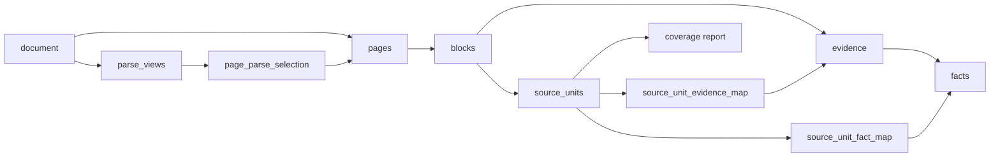
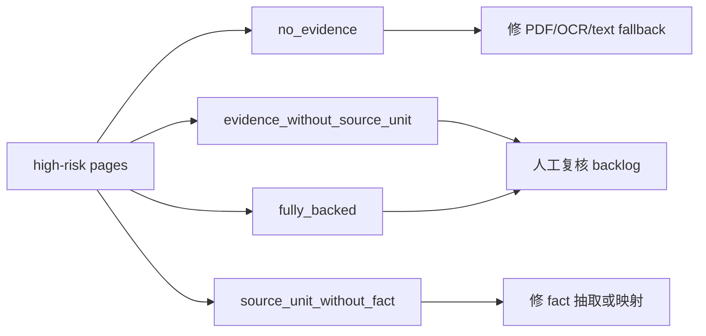
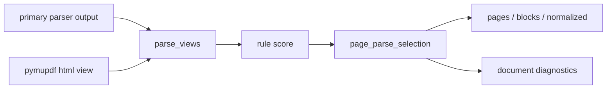
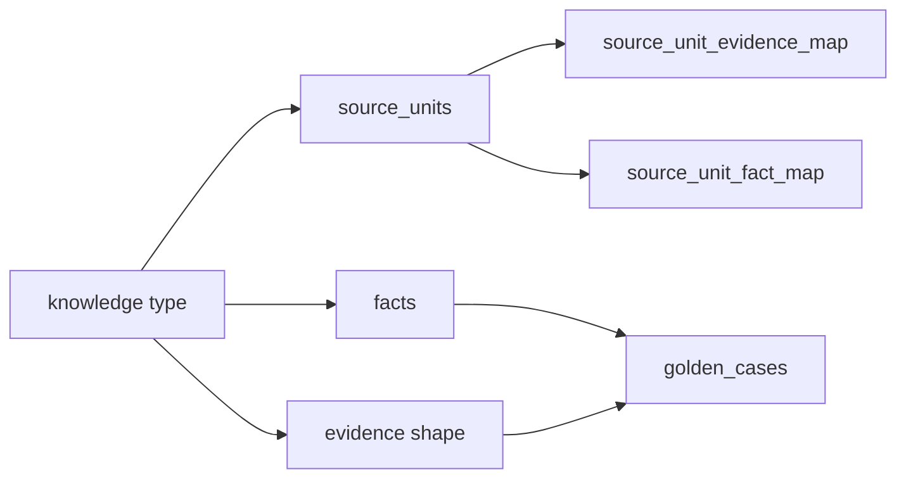

# Ingestion And Coverage Development Guide

## 概述

入库闭环证明文档内容真正进入系统，并能追踪到 evidence、facts、wiki、graph 和测试覆盖。开发时要保护 `evidence -> facts -> wiki` 的可追溯链路，同时把 `source_units` 作为覆盖义务的一等对象。页面级低可读性和 high-risk 根因由解析质量闭环承接，不要在 coverage 或答案层补丁式屏蔽。

## 前置依赖

- 工作目录：`E:\AI_Project\opencode_workspace\KB1`
- 知识库根目录：`knowledge_base`
- 相关架构文档：`.codestable/architecture/closed-loop-architecture.md`

## 快速上手

查看覆盖摘要：

```powershell
C:\Python314\python.exe -m enterprise_agent_kb.cli --root knowledge_base coverage-summary
```

闭合 coverage test gaps：

```powershell
C:\Python314\python.exe -m enterprise_agent_kb.cli --root knowledge_base close-coverage-test-gaps --limit-per-doc 25 --mode trace
```

重建指定文档 coverage 派生物：

```powershell
C:\Python314\python.exe -m enterprise_agent_kb.cli --root knowledge_base rebuild-derived-state --scope coverage --mode full --doc-id DOC-000013
```

新文档端到端入库并验收：

```powershell
C:\Python314\python.exe -m enterprise_agent_kb.cli --root knowledge_base build-file --file "E:\path\to\your.pdf" --progress
C:\Python314\python.exe -m enterprise_agent_kb.cli --root knowledge_base validate-document-ingestion --doc-id DOC-...
```

`build-file` 负责 register、parse、quality、evidence、facts、entities、wiki、graph、coverage，并在返回 payload 中附带 `ingestion_acceptance` 摘要。`validate-document-ingestion` 可单独重跑验收，用于确认这条链路是否真正落库和产出可追踪报告。

长文档盲测时优先用 `--progress`。CLI 会向 stderr 输出每个 pipeline stage 的 JSON 事件，包含 `doc_id`、`stage`、`status`、`progress`、`elapsed_seconds` 和阶段摘要。`build-file` 如果长时间无进度，不应直接判断文档失败；先看最后一条 progress event，再按 `parse-document`、`quality-document`、`build-evidence`、`build-facts`、`build-entities`、`build-wiki`、`build-graph`、`build-coverage` 分段复现。端到端命令超时但只留下 queued 文档，属于流水线可观测性/阶段超时问题，应进入系统性治理。

新英文标准文档需要额外关注标准号和标题抽取。标准号不能从版权页、页眉页脚或 `© ISO 2013` 这类出版信息中推断；当正文首页缺少机器可读标准号时，facts 层允许从 `source_filename` 提取 `ISO 14229-1—2013`、`ISO/IEC xxxx`、`GB/T xxxx—yyyy` 等标准锚点，并把版权/boilerplate 行作为噪声候选排除。

## 核心概念

| 概念 | 说明 |
|---|---|
| pages | 文档页级解析结果，必须保留质量状态。 |
| blocks | 页面结构块。 |
| evidence | 可引用证据片段。 |
| facts | 从 evidence 生成的结构化事实。 |
| source_units | 覆盖闭环最小追踪单元。 |
| source_unit_fact_map | source unit 到 facts 的一等覆盖映射。 |
| source_unit_evidence_map | source unit 到 evidence 的一等覆盖映射。 |
| coverage_test_gap_rejections | 自动 promotion 不适合处理的缺口 ledger。 |
| ingestion acceptance | 新文档入库后的通用验收报告，检查每阶段产物、coverage 阈值和诊断告警。 |
| parse_quality | document diagnostics 中的解析质量 profile，把 high-risk 页面拆成 no_evidence、chain gap 和 review-only。 |
| parse_views | 每页候选解析视图，当前登记 native_text / ocr_html，后续可接入 html / ocr_html provider。 |
| page_parse_selection | 每页被选中的解析视图及选择原因。 |

## 数据流



## 模块入口

| 文件 | 责任 |
|---|---|
| `src/enterprise_agent_kb/coverage.py` | source unit 同步、coverage matrix 和映射构建。 |
| `src/enterprise_agent_kb/closed_loop_store.py` | golden/eval/run 等闭环表写入。 |
| `src/enterprise_agent_kb/ingestion_acceptance.py` | 新文档端到端入库验收。 |
| `src/enterprise_agent_kb/knowledge_contracts.py` | 文档知识类型合同，统一 source_unit、fact、evidence shape、golden 的追踪口径。 |
| `src/enterprise_agent_kb/cli.py` | coverage、gap closing、派生重建命令入口。 |
| `src/enterprise_agent_kb/schema.sql` | source_units 与映射表结构。 |

## 常见场景

### 新增 source unit 规则

1. 先确认是否是通用解析/切分问题，不要为单个 PDF 特例硬编码。
2. 生成稳定 ID，不能嵌入会随重建变化的 `FACT-*`。
3. 同步写入 `source_unit_fact_map` 和 `source_unit_evidence_map`。
4. 跑 coverage 相关测试和真实 coverage summary。
5. 更新 `.codestable/architecture/closed-loop-architecture.md` 和本指南。

### 验收新文档入库

1. 用 `build-file --file` 导入真实文档，或先 `register` 后用 `build-document --doc-id` 构建。
2. 运行 `validate-document-ingestion --doc-id DOC-...`。
3. 重点看 `status`、`failed_count` 和每个 check：
   - `document_registered`
   - `pages_present`
   - `blocks_present`
   - `evidence_present`
   - `facts_present`
   - `wiki_present`
   - `source_units_present`
   - `text_coverage_rate`
   - `semantic_coverage_rate`
   - `answerability_score`
   - `coverage_summary_exists`
   - `coverage_report_exists`
   - `document_knowledge_contract`
4. `failed` 表示通用入库链路断裂，应回到对应阶段修根因；`warn` 表示链路跑通但质量不足，需要进入 coverage 或解析质量治理。
5. 验收报告写入 `knowledge_base/acceptance_reports/{doc_id}.ingestion_acceptance.json` 和 `.md`。

### 处理解析质量风险

`document-diagnostics` 和 `/closed-loop-dashboard` 都会暴露解析质量 profile：



处理原则：

1. `no_evidence` 是真正解析缺口，优先确认页面是否空白；非空白页要修解析或 OCR 回填。
2. `source_unit_without_fact` 是链路缺口，修 coverage/facts 映射，不改 query 或 answer。
3. `evidence_without_source_unit` 不直接等于解析失败；source unit 是知识单元覆盖义务，不是每页必须存在的对象。
4. `fully_backed` 表示低可读性页面已有 evidence 和可追踪事实支撑，只进入复核 backlog，不应让新文档验收失败。

生成解析风险行动计划：

```powershell
C:\Python314\python.exe -m enterprise_agent_kb.cli --root knowledge_base parse-risk-actions --doc-id DOC-...
```

该命令读取 `document-diagnostics` 的 `parse_quality`，输出 `reports/parse_risk_actions/{doc_id}-parse-risk-actions.json/.md`。它是 dry-run 桥接层：provider、selection、extraction chain 归因只生成修复建议；只有 `test_coverage_gap` 会生成 golden/corpus 候选请求，且仍需走 `generate-golden-candidates`、readiness review 和 activation gate。不要把解析 provider 或抽取链路问题直接写进 golden suite。
目录、图表目录、contents/sommaire、list of figures/list of tables 等导航页会归因为 `structural_navigation_noise`，它们不进入修复 backlog，也不生成 golden 候选请求。

需要把行动计划写入 `repair_tasks` 时必须显式指定：

```powershell
C:\Python314\python.exe -m enterprise_agent_kb.cli --root knowledge_base parse-risk-actions --doc-id DOC-... --persist-repair-tasks
```

持久化按系统性问题聚合，而不是按页面拆任务。`metadata.parse_risk_docs` 保存各文档页码，用于后续评估同一根因是否跨文档反复出现。
`impact_count` 是所有已聚合文档的风险页总数，不是最后一次运行的页数；`metadata.parse_risk_doc_count` 和 `metadata.parse_risk_total_page_count` 可用于判断根因影响面。

复核已持久化的解析风险修复任务：

```powershell
C:\Python314\python.exe -m enterprise_agent_kb.cli --root knowledge_base parse-risk-repair-review --doc-id DOC-...
```

该命令重新读取当前 diagnostics，并与 `repair_tasks.metadata.parse_risk_docs` 中记录的旧页码比较，输出 `suggested_status`。`done` 表示旧影响页已消失，`improved` 表示影响面减少，`expanded` 表示出现新增页，`still_open` 表示未改善。复核阶段只给建议，不自动改 `repair_tasks.status`。
action plan 和 repair review 都会同时写 latest 报告和 timestamped history 报告；latest 供 Workbench 展示，history 供趋势审计和阶段性验收。
`closed-loop-dashboard.parse_quality_loop.parse_risk_history` 会汇总这些 history 文件，输出每个文档的最新归因、历史样本数、归因变化和 review 状态。新增解析质量能力时，应先看 history 是否显示趋势改善，再关闭系统级 repair task。

### 多解析视图基础层

当前阶段已经建立多解析视图的持久化合同，并接入了 PyMuPDF HTML 候选。外部 OCR-to-HTML 或更强的 PDF-to-HTML provider 仍属于后续增强，但它们必须作为候选 view 进入 selection：



原则：

1. `parse_views` 是候选层，`pages/blocks/normalized` 保持旧数据形状，但内容来自 `page_parse_selection` 选中的 view。
2. `page_parse_selection.selected_reason` 必须解释选择，不允许 LLM 直接决定。
3. 后续 PDF-to-HTML 或 OCR-to-HTML 只能新增候选 view，再通过 selection 进入最终解析链路。

Workbench 通过 `/parse-view-detail` 展示页面级候选对比。这个出口是接入新 provider 前后的主要验收点：先确认候选进入 `parse_views`，再看 scoring、fallback chain 和 selected view 是否符合页面证据形状，最后才进入 evidence/facts/source_units 质量归因。

结构评分不是单纯文本长度比较。`parse_views.quality_json` 会保留 `structure_quality_score`、`table_density`、`row_column_signal_count`、`clause_number_count`、`clause_continuity_score`、`header_footer_noise_ratio`、`duplicate_line_ratio` 和 `continuation_signal_count`。这些指标参与 best view selection，用于让表格、条款编号、跨页续表更完整的候选优先；页眉页脚噪声和重复行会降低结构质量。新增 provider 必须先让这些指标可解释，再进入盲测验收。

Parse risk 自动归因写在 `document_diagnostics.parse_quality` 中。页面级 `attribution` 用规则判断下一步动作：

| attribution | 含义 | 下一步 |
|---|---|---|
| `provider_quality_issue` | 所有候选解析视图都低质量 | 增强 PDF/HTML/OCR provider |
| `selection_rule_issue` | 更好的候选没有被选中 | 调整 parse view selection 评分 |
| `extraction_chain_issue` | selected view 可用但 evidence/source_unit/fact 链路断开 | 修抽取和映射 |
| `review_only` | 证据链不阻断，只是质量复核 | 进入人工 backlog |
| `test_coverage_gap` | 证据链完整但测试覆盖不足 | 生成并激活 golden/corpus case |

文档级 `attribution_counts` 和 `recommended_actions` 是 Failure Analysis 的入口，不应在 Workbench 前端重新实现同一套规则。

### 文档知识合同

`validate-document-ingestion` 不只看数量，还会通过 `DocumentKnowledgeContract` 检查当前文档中已经出现的知识类型是否有一致链路：



当前合同覆盖：

- `standard_metadata`：`document_standard`、`document_title`、`document_lifecycle`、`document_versioning`
- `definition`：`definition_unit` -> `term_definition/concept_definition` -> `term_definition` shape
- `parameter`：`parameter_row_unit` -> `parameter_value/parameter_definition` -> `parameter_definition` shape
- `process_activity`：`process_unit` -> `process_fact` -> `process_activity` shape
- `requirement`：`requirement_unit` -> `requirement/table_requirement` -> `requirement` shape
- `test_method`：显式 test/procedure role -> `test_method` shape

合同结果为 `failed` 时表示链路断裂，例如 source unit 没有对应 fact/evidence 映射；结果为 `warn` 时表示链路可用但还不完整，例如某类事实尚无 active golden case。不要为单个文档关闭合同，应修 source unit 分类、fact 抽取、映射或 golden 激活流程。

### 验收自动 Golden 生成

新文档生成 golden 不是越多越好，必须先通过质量门：

1. 过滤版权页、目录页、Foreword 出版流程、HTML 图片残片和纯页眉页脚。
2. 标准号 case 只接受 `_is_valid_standard_code` 判定通过的锚点，`ISO 2013` 这类版权年份不是标准号。
3. `context_contains` 类 generated pytest 默认关闭 LLM evidence judge，避免长文档测试被 judge 调用放大到不可接受耗时。
4. 全量 generated suite 如果超时，应先用单条/小批 smoke 证明断言可跑，再把问题归到性能预算或测试分层，而不是把低质量 case 激活进 golden。
5. coverage draft 和 promoted golden 必须保留 `expected_evidence_shape`。如果 shape 在 promotion 或去重时丢失，`DocumentKnowledgeContract` 会把 active golden 当作无效覆盖。
6. 目录点线条目不是 requirement source unit。类似 `Automatic reclosing ... 47 15 Emergency switching ... 48` 的 TOC 残片必须在 source unit inventory 和 test gap 候选层过滤，不能等 corpus eval 失败后单条屏蔽。

2026-05-14 真实库验收记录：

- 命令：`validate-document-ingestion --doc-id DOC-000005 --output-dir output\ingestion-acceptance-smoke`
- 结果：`status=warn`，`passed_count=12`，`failed_count=0`，`warn_count=1`。
- 产物：`output/ingestion-acceptance-smoke/DOC-000005.ingestion_acceptance.json` 和 `.md`。
- 解释：入库链路未断裂；warning 来自 document diagnostics，包含未抽取到标题和低可读性页面。

2026-05-14 新增 ISO 14229 英文标准验收记录：

- 文档：`DOC-000014`，`182-ISO 14229-1-2013 Road vehicles -- Unified diagnostic services (UDS) -- Part 1 Specification and requirements.pdf`。
- 修复前根因：标准号被版权页误抽为 `ISO 2013`，golden 从版权/目录/HTML 片段出题，证据不足时答案层仍输出确定性标准号。
- 修复后状态：`document_standard=ISO 14229-1—2013`，`document_title` 已抽取；英文 `term_definition_count=18`；`validate-document-ingestion` 主链路无 failed。
- coverage：`source_unit_count=100`，`test_coverage_rate=0.36`，`u3_not_tested=64`。
- generated golden：78 条，已执行前 3 条 smoke 通过。长文档 full suite 仍需要分层和耗时归因，不能通过删除高价值样本来换速度。
- 查询复测：`ISO 14229-1里的 diagnostic service 是什么`、`diagnostic data是什么` 均走 `definition`，答案来自 `term_definition`，首要 `supporting_facts` 也是对应 `defines_term`。
- knowledge contract：合同 gate 已通过，`active_evidence_shapes=["requirement","standard_metadata","term_definition"]`。本轮修复了两个根因：generated golden case 缺少 `expected_evidence_shape`，以及 corpus eval 的 cross-suite golden 使用 `metadata.expected_doc_id` 而不是 `golden_cases.doc_id` 表示目标文档。
- requirement shape：`constraint` contract 已允许 `requirement`，evidence judge 已支持 requirement/table_requirement 证据形状；`DOC-000014` requirement corpus smoke 由失败转为通过。
- doctor：英文定义 source unit 不再被误报为 `source_unit_weak_definition_shape`；当前 `workspace-doctor --scope all` 仅剩历史 retrieval/eval runs 的旧或未知 `code_version` warning。

2026-05-16 新增 IEC 61851 英文标准盲测记录：

- 文档：`DOC-000015`，`IEC 61851-1-2017.pdf`，292 页。
- 分阶段结果：parse 约 20 分钟完成，`block_count=292`；quality `overall_score=0.9027`，17 页 high risk/review required；evidence 292；facts 583；wiki 4；graph edges 5。
- 验收结果：`validate-document-ingestion` 最终 `status=passed`，`failed_count=0`，`document_knowledge_contract=passed`；低可读性页面由解析质量闭环归入 review backlog，不再误报为入库 warning。
- coverage：`source_unit_count=115`，`text_coverage_rate=1.0`，`semantic_coverage_rate=1.0`，`object_coverage_rate=1.0`，`test_coverage_rate=0.0696`。
- golden 闭环：自动提升 6 条 coverage golden，`run-coverage-promoted-tests` 6/6 通过；requirement corpus smoke 3/3 通过。
- 本轮根因修复：coverage promotion 丢失 `expected_evidence_shape`；定义术语中的 Markdown 包裹导致精确定义匹配失败并错误触发 section fallback；目录点线条目被 fact fallback 误升为 requirement source unit。
- 2026-05-17 解析质量复验：`parse_quality.high_risk_page_count=17`，`actionable_parse_risk_pages=0`，`chain_gap_pages=0`，`review_only_pages=17`；验收报告输出到 `output/doc-000015-parse-quality-loop/`。

### 处理 uncovered units

先看 root cause。`test_gap_rejected` 不是解析失败；它表示自动生成 golden case 不适合覆盖该 unit。只有 `no_evidence` 或 `source_unit_without_fact` 才优先进入解析/事实生成修复。

### 处理 source unit 质量问题

`workspace-doctor --scope coverage --json` 会报告 `source_unit_weak_definition_shape`。这表示某些 `definition_unit` 缺少可验证的定义证据形状，例如图例、作者行或摘要碎片被误标成 definition。英文标准术语也必须通过同一质量门：`is a/is an/is the`、`function that`、`data that`、`software which`、`part of`、`set of` 等英文定义信号属于合法定义形状，不能被中文-only 规则误报。

处理原则：

1. 不要在查询、Golden 或答案层对单个词加黑名单。
2. 先看 issue details 中的 `quality_summary.samples`，确认噪声来源。
3. 如果是图例或作者行，应修 source unit 抽取/分类规则，或重建 coverage。
4. 如果是正常术语定义被误报，应修 evidence-shape gate，而不是忽略 doctor。

当前源头规则在 `knowledge_units._looks_like_definition_term`：作者姓名列表和图例说明不能被配对成 definition unit。修复后需要重新生成对应文档的 `knowledge_units`/facts，再按 entities、wiki、graph、coverage 顺序刷新派生链。

2026-05-18 多文档盲测记录：

- `DOC-000017`：`188-ISO 14229-7 ... UDSonLIN.pdf`，22 页，入库主链路无 failed checks；结构性导航页被归为 `structural_navigation_noise`；golden 候选从 8 条降为 7 条，重复候选被跳过。
- `DOC-000018`：`187-ISO 14229-6 ... UDSonK-Line.pdf`，18 页，入库主链路无 failed checks；只有 `structural_navigation_noise`，未持久化 provider/extraction/test-gap 修复任务；golden 候选从 6 条降为 3 条，重复 `UDSonK-Line services overview` 候选被跳过。
- 根因修复：source-unit/corpus/golden 桥接层增加词边界锚点、说明性表格尾巴剥离、重复候选跳过；coverage doctor 的英文定义形状门增加 `is a/is an/is the`。
- 召回复验：`run-corpus-retrieval-eval --doc-id DOC-000018 --case-limit 3` 生成 `EVAL-31B3A9268F7B49FF`，3 passed、0 failed，说明候选质量门没有破坏真实召回。
- 性能根因：这两份 ISO 短文档都走了 `minimax_primary+astron_backup+paddlevl` 慢路径，DOC-000017 约 279 秒，DOC-000018 约 431 秒。根因不是 provider 不可用，而是 `_parse_pdf()` 在确认数字 PDF 文本层前就调用 VLM/OCR。
- 修复后：`_profile_pdf_text_layer` 先判断文本层覆盖率、平均字符数、可读页数、readability、symbol ratio 和 unreadable ratio。DOC-000018 profile 为 `page_count=18`、`text_page_count=16`、`coverage_rate=0.888889`、`average_chars=325.778`，因此 `_parse_pdf()` 选择 `pymupdf_fast_text`，耗时约 0.44 秒。文本层弱、乱码或符号噪声过高时仍会使用 MiniMax/Astron/PaddleVL 慢路径。
- 2026-05-18 回归修复：`DOC-000003` 的文本层覆盖率看似充足，但 `readable_page_count=1/157`、`average_readability_score=0.003182`、`average_symbol_ratio=0.637285`，因此不能走 fast text。重建后使用 `minimax_primary+astron_backup`，恢复 `fact_count=1293`、`source_unit_count=707`。
- 2026-05-18 结构化修复：`DOC-000009` 的 PyMuPDF HTML view 存在逐字换行和重复行噪声，旧 selection 会错误覆盖更适合抽取的文本视图。现在 parse view 结构分数受 readability、重复行和页眉页脚噪声约束，同时 PyMuPDF 文本块会按章节号和步骤号拆分；重建后 `process_fact=81`、`source_unit_count=170`，`OBC输入过压怎么测` 可命中 `5.4.1 交流输入过、欠压保护试验`。
- `DOC-000019`：`186-ISO 14229-5 ... UDSonIP.pdf`，22 页，fast-text-first 选择 `pymupdf_fast_text`，parse 阶段约 1.98 秒；入库验收 `status=warn`、0 failed，warn 来自无术语定义和尚未激活 golden case。
- `DOC-000019` 根因修复：英文标准的 `shall/should/must/is required to` 规范性语句必须进入 requirement source unit；ISO 版权/专利 boilerplate 不能因为含有 `shall` 被当成 requirement；图示 Key 中的纯编号、`See (n)`、`T_Data/S_Data/N_USData/DoIP_Data...:` 步骤说明不能更新 `current_heading`。
- `DOC-000019` Golden 复验：错误候选 `Client T_Data.con: Upon the indication...有哪些要求？` 不再生成；source-unit 候选从 8 条降为 7 条，重复的 `DoIP payload` requirement 以 `duplicate_candidate` 跳过。相关回归：`tests/test_knowledge_units.py tests/test_doc_ir.py tests/test_corpus_eval.py` 共 23 passed。
- `DOC-000019` 召回复验：`run-corpus-retrieval-eval --case-limit 3` 生成 `EVAL-B6ABABC563092EED`，3 passed、0 failed。根因修复包括 requirement/constraint 查询规则优先、Query Expansion 对 `有哪些要求` 不再调用 LLM、英文 constraint topic 去壳保留、lowercase 泛词不升为 hard anchor、以及 `direct_requirement` 对明确 requirement fact 的直接注入。
- `DOC-000020`：`184-ISO 14229-3 ... UDSonCAN.pdf`，24 页，fast-text-first 选择 `pymupdf_fast_text`，parse 阶段约 2.04 秒；入库验收 `status=warn`、0 failed，coverage `source_unit_count=18`、`object_coverage_rate=1.0`。
- `DOC-000020` 召回复验：首次 3 case eval 正确性通过但耗时 310 秒，根因是 constraint 路由把 `要求/requirement/requirements/shall` 泛词作为结构化检索 seeds，在 facts/evidence/wiki 三个 channel 全库搜索。修复后 `retrieval_router._structured_search_seeds` 对 constraint query 跳过这些泛词，只保留 topic 和硬锚点；复验 `EVAL-B48056ED857054D7`，3 passed、0 failed，总耗时约 108 秒。

## 测试

```powershell
C:\Python314\python.exe -m pytest tests/test_closed_loop_schema.py tests/test_corpus_eval.py -q
```

如果改了 coverage rebuild：

```powershell
C:\Python314\python.exe -m pytest tests/test_derived_state_rebuild.py -q -k coverage
```

## 已知限制与注意事项

- 不要把 coverage 只存在 JSON 报告里，数据库映射表是闭环核心。
- 不要把目录、图例残片、纯符号行升级为高价值 source unit。
- 新入库规则必须保留质量 metadata，避免后续 failure analysis 无法归因。
- 不要把所有 `low_readability` 页面都当作解析失败；必须先看 `parse_quality.root_cause_counts`。
- 不能只以 pipeline 命令返回 0 作为新文档成功标准；必须跑 `validate-document-ingestion`，确认每个阶段都有可追踪产物。
- 重建 facts 后必须刷新 entities、wiki、graph、FTS 和 coverage。否则 `workspace-doctor --scope all` 会报告 `source_unit_fact_map` 指向旧 `FACT-*` 的残留，这是派生状态治理闭环要捕获的问题。

## 相关文档

- `.codestable/architecture/closed-loop-architecture.md`
- `.codestable/requirements/ingestion-coverage-loop.md`
- `docs/dev/regression-eval-development-guide.md`
