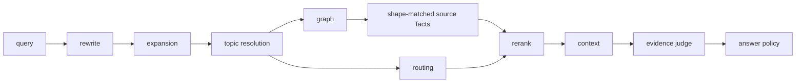

# KB1 Development Guide

## 概述

KB1 是本地单机企业知识库项目。核心链路是把文档解析为 evidence、facts、entities、wiki、graph 和 source_units，再通过查询改写、召回、证据判定和答案策略回答用户问题。

当前开发流程按 CodeStable 结构维护：

- `.codestable/requirements/`：能力愿景。
- `.codestable/roadmap/`：大需求拆解和子 feature 清单。
- `.codestable/features/`：单个 feature 的 design、checklist、acceptance。
- `.codestable/issues/`：问题报告、根因分析和修复记录。
- `.codestable/architecture/`：只记录当前真实架构。
- `docs/dev/`：面向开发者的操作指南。

每次开发完成都要同步更新文档。最低要求是核对 `.codestable` 中对应的 architecture、requirement、roadmap、feature 或 issue；只要行为、接口、命令、开发流程或用户操作变化，就同步更新 `docs/dev` 或 `docs/user`。

## 前置依赖

- 工作目录：`E:\AI_Project\opencode_workspace\KB1`
- Python：`C:\Python314\python.exe`
- 知识库根目录：`knowledge_base`
- 本地 API：`http://127.0.0.1:8000`

PowerShell 直接写中文 here-string 有时会变成 `????`。HTTP 自动化验证中文查询时，优先用 Python Unicode escape 字符串。

## 快速上手

检查知识库状态：

```powershell
C:\Python314\python.exe -m enterprise_agent_kb.cli --root knowledge_base status
```

启动本地 API：

```powershell
C:\Python314\python.exe -m enterprise_agent_kb.cli --root knowledge_base serve-api --host 127.0.0.1 --port 8000
```

健康检查：

```powershell
Invoke-WebRequest -Uri 'http://127.0.0.1:8000/health' -UseBasicParsing | Select-Object -ExpandProperty Content
```

构建查询上下文：

```powershell
C:\Python314\python.exe -m enterprise_agent_kb.cli --root knowledge_base query-context --query "CP是什么意思" --limit 3
```

生成答案：

```powershell
C:\Python314\python.exe -m enterprise_agent_kb.cli --root knowledge_base answer-query --query "OBC输入过压怎么测" --limit 5
```

批量闭合入库 golden gaps：

```powershell
C:\Python314\python.exe -m enterprise_agent_kb.cli --root knowledge_base close-coverage-test-gaps --limit-per-doc 25 --mode trace
```

当前全库入库覆盖基线：

```text
source_unit_count = 2145
source_unit_coverage_rate = 0.987879
evidence_coverage_rate = 1.0
fact_coverage_rate = 1.0
uncovered_units = 26
actionable_uncovered_units = 0
parse_risk_pages = 120
remaining root cause = test_gap_rejected only
```

解析质量闭环基线：

```text
parse_risk_pages = 120
actionable_parse_risk_pages = 0
```

## 核心概念

| 概念 | 说明 |
|---|---|
| evidence | 文档中可引用的证据片段。 |
| facts | 从 evidence 归纳出的结构化事实。 |
| source_units | 覆盖闭环的最小追踪单元。 |
| source_unit_fact_map | source unit 到 fact 的覆盖映射，用于计算 fact_coverage_rate。 |
| source_unit_evidence_map | source unit 到 evidence 的覆盖映射，用于计算 evidence_coverage_rate。 |
| coverage_test_gap_rejections | 文件型 rejection ledger，记录不适合自动提升为 golden 的 source units。 |
| parse_risk_profile | 解析质量闭环 profile，将 raw high-risk 页面拆成 no_evidence、evidence_without_source_unit、source_unit_without_fact、fully_backed。 |
| parse_views | 每页候选解析视图，用于比较 native_text、html、ocr_html 等解析来源。 |
| page_parse_selection | 每页 best parse view 的选择结果和 fallback chain。 |
| wiki_pages | 面向主题对象的可读知识页。 |
| graph_edges | 文档、实体、事实和 evidence 之间的关系。 |
| retrieval_runs | 每次查询召回结果的审计记录。 |
| golden_cases | 回归评测样例。 |
| evidence shape | 对证据结构的期望形状，例如 term_definition、test_method、timing。 |

## 查询链路



关键原则：

- LLM 可以参与查询规划和证据裁判，但不能直接决定最终事实。
- 短缩写定义问题需要先澄清或走规则回退。
- Evidence Judge 的 best ids 必须来自候选集合。
- 无合法候选 ID 时不能判定 sufficient。
- Graph 命中 topic entity 后，要把符合证据形状的 topic source facts 带入 rerank。生命周期/活动类查询应优先进入带 BP 锚点的 `process_fact`，不能只把过程概览表作为 graph 命中。

## 常见开发场景

### 修复查询失败

1. 先用 `answer-query` 复现用户问题。
2. 再用 `query-context` 查看 rewrite、expansion、topic_resolution、retrieval_plan、evidence_judgement。
3. 判断失败归因：入库缺失、召回 miss、rerank 错、证据形状不匹配、答案策略错误。
4. 在 `.codestable/issues/` 记录 report、analysis、fix-note。
5. 把复现问题加入回归测试或 golden case。

### 验证短缩写问题

`CP是什么意思`、`CC是什么意思` 这类问题应该先澄清或规则回退，不应先调用 LLM 扩写。

相关测试：

```powershell
C:\Python314\python.exe -m pytest tests/test_query_repair_regression.py -q -k "short_acronym or ambiguous"
```

### 验证 OBC 试验方法

```powershell
C:\Python314\python.exe -m enterprise_agent_kb.cli --root knowledge_base answer-query --query "OBC输入过压怎么测" --limit 5
```

期望：

- `answer_mode=test_method_lookup`
- evidence judgement sufficient
- direct answer 不含 `&nbsp;`

## 测试

查询修复主回归：

```powershell
C:\Python314\python.exe -m pytest tests/test_query_repair_regression.py -q
```

pytest 输出 `deselected` 表示被 `-k` 过滤掉的测试，不是失败。

CodeStable YAML 校验：

```powershell
C:\Python314\python.exe .codestable\tools\validate-yaml.py --dir .codestable --require doc_type --require status
```

对纯 YAML 文件：

```powershell
C:\Python314\python.exe .codestable\tools\validate-yaml.py --file .codestable\roadmap\kb1-four-loop-hardening\kb1-six-loop-hardening-items.yaml --yaml-only
```

## 文档流程

新能力：

1. 需要先有 requirement。
2. 范围大时建 roadmap。
3. 单个 feature 写 design 和 checklist。
4. 实现后写 acceptance。
5. 回写 architecture、requirements、roadmap items 和 guide。

问题修复：

1. 写 issue report。
2. 读代码做 root cause analysis。
3. 按确认方案修复。
4. 写 fix-note。
5. 跑回归，必要时加入 golden case。

## 已知限制与注意事项

- 当前工作区可能很脏，不要执行 destructive reset。
- 旧 `docs/` 保留历史记录，新开发流程以 `.codestable/` 为准。
- API 日志 `api-server.log` 和 `api-server.err.log` 是运行产物，不代表功能文档。
- Advanced Query Planner 默认关闭；实验时设置 `EAKB_ENABLE_ADVANCED_QUERY_PLANNER=1`。

## 相关文档

- `.codestable/attention.md`
- `.codestable/architecture/ARCHITECTURE.md`
- `.codestable/architecture/closed-loop-architecture.md`
- `.codestable/architecture/query-chain-architecture.md`
- `.codestable/roadmap/kb1-four-loop-hardening/kb1-six-loop-hardening-roadmap.md`
- `docs/dev/query-chain-development-guide.md`
- `docs/dev/ingestion-coverage-development-guide.md`
- `docs/dev/regression-eval-development-guide.md`
- `docs/dev/derived-state-governance-development-guide.md`
- `docs/dev/api-cli-development-guide.md`
