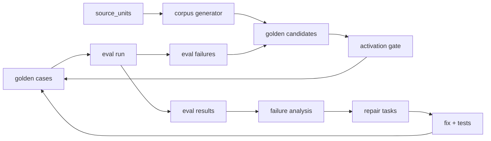

# Regression Eval Development Guide

## 概述

回归闭环证明系统越改越好，而不是靠单次 query 手工验证。所有失败案例都应进入可追溯的 golden、eval 或 issue 流程；但不能从错误召回结果反推出断言，也不能让旧代码版本的 run 污染当前健康状态。

## 前置依赖

- 工作目录：`E:\AI_Project\opencode_workspace\KB1`
- 知识库根目录：`knowledge_base`
- 相关架构文档：`.codestable/architecture/closed-loop-architecture.md`

## 快速上手

运行查询修复回归：

```powershell
C:\Python314\python.exe -m pytest tests/test_query_repair_regression.py -q
```

查看 workspace doctor 中的 run 状态：

```powershell
C:\Python314\python.exe -m enterprise_agent_kb.cli --root knowledge_base workspace-doctor --scope runs --json
```

输出中的 `current_count` 表示当前源码内容版本已有多少 run；`unknown_count` 和 `stale_count` 只表示历史残留风险，不能直接判定当前闭环失败。

查看旧 run 清理计划：

```powershell
C:\Python314\python.exe -m enterprise_agent_kb.cli --root knowledge_base prune-stale-runs --keep-current-code-version --dry-run
```

保留最近几个源码版本的旧 run，再查看清理计划：

```powershell
C:\Python314\python.exe -m enterprise_agent_kb.cli --root knowledge_base prune-stale-runs --keep-current-code-version --keep-latest-code-versions 3 --dry-run
```

执行剪枝时先写归档文件：

```powershell
C:\Python314\python.exe -m enterprise_agent_kb.cli --root knowledge_base prune-stale-runs --keep-current-code-version --keep-latest-code-versions 3 --archive-dir knowledge_base\quarantine\run-prune --execute
```

生成统一 golden 候选 dry-run 报告：

```powershell
C:\Python314\python.exe -m enterprise_agent_kb.cli --root knowledge_base generate-golden-candidates --origin source_unit --limit-per-type 20
```

该命令只输出 JSON/Markdown 审核报告，不自动激活 `golden_cases`。如果从 eval 失败生成候选，必须显式指定 eval run：

```powershell
C:\Python314\python.exe -m enterprise_agent_kb.cli --root knowledge_base generate-golden-candidates --origin eval_failure --eval-run-id EVAL-...
```

分批运行 corpus retrieval eval：

```powershell
C:\Python314\python.exe -m enterprise_agent_kb.cli --root knowledge_base run-corpus-retrieval-eval --case-file output\corpus-baseline-20260513\corpus_retrieval_cases_2026-05-13.json --suite-id regression:corpus_retrieval:baseline-20260513:batch-001 --case-offset 0 --case-limit 15 --limit 10 --progress --output-dir output\corpus-baseline-20260513\batch-001
```

`--case-offset` 是 0-based 起点，`--case-limit` 是本批最多运行数量。分批运行只限制本次 `eval_results`，不会把未运行的 corpus case 标记为 deprecated。`--progress` 会在每条 case 结束后向 stderr 写一行 JSON，便于长任务观察进度。

## 核心概念

| 概念 | 说明 |
|---|---|
| golden_cases | 回归样例定义，不应只存在临时 JSON。 |
| eval_runs | 一次评估运行，必须带 `code_version`。 |
| eval_results | case 级评估结果和失败原因。 |
| retrieval_runs | 查询召回审计记录。 |
| repair_tasks | failure analysis 生成的修复任务。 |
| code_version | 当前源码内容指纹，是 run 新旧边界。指纹由源码内容生成，不使用 mtime。 |
| golden candidate | 自动生成的待审核候选，包含 origin、confidence tier、assertion contract、trace 和 readiness。 |
| activation gate | 判断候选是否能进入 active golden 的规则门；缺少稳定断言、来自 corpus_eval 或 ontology_gap 未实现时不能直接激活。 |
| corpus eval batch | 大规模 corpus retrieval eval 的分批窗口，由 `case_offset`、`case_limit` 和 `evaluation_window` 描述。 |
| duration_summary | corpus eval 的耗时摘要，包含 case_count、total_seconds、average_seconds 和 max_seconds。 |

## 数据流



## 模块入口

| 文件 | 责任 |
|---|---|
| `src/enterprise_agent_kb/closed_loop_store.py` | golden/eval/run/repair task 写入和 code_version。 |
| `src/enterprise_agent_kb/corpus_eval.py` | 从 source_units 生成 corpus eval cases 并运行召回评估。 |
| `src/enterprise_agent_kb/golden_generation.py` | 统一 golden candidate、confidence tier、activation gate 和 dry-run report。 |
| `src/enterprise_agent_kb/run_governance.py` | 旧/未知 run 的 dry-run 和显式剪枝。 |
| `src/enterprise_agent_kb/api_server.py` | closed-loop dashboard 数据出口。 |

## 常见场景

### 把失败查询纳入回归

1. 复现 query，并保存 trace。
2. 判断失败层：parse、evidence、retrieval、rerank、answer policy、LLM generation。
3. 如果断言稳定，加入 golden case 或测试。
4. 如果是系统缺口，先开 issue report/analysis，再修复。
5. 修复后运行相关 suite，并记录 fixed failure。

### 生成 golden 候选

1. 从 `source_units` 生成候选时，断言只能来自 source unit 自身的 `covered_by`、doc、query type 和 evidence shape。
2. 从 `eval_failure` 生成候选时，错误召回 top items 只能进入 trace，不能反向写入 `must_hit`。
3. 查看 report 中的 `readiness_counts` 和 `blocked_reasons`，先处理缺少稳定断言的 blocked 候选。
4. 只有 activation gate 给出 ready/active 且人工确认后，才允许写入 active golden。
5. definition 候选必须通过定义证据形状门：anchor 要出现在正文中，正文前段要有定义/解释 cue，姓名列表、作者行、摘要碎片等弱定义形状应计入 `weak_definition_shape`，不能生成“X 是什么意思”候选。
6. 英文 requirement 候选不能按固定字符数硬截断。长锚点必须按词边界截断，且要去掉 `Table N specifies...`、`Figure N shows...` 这类说明性尾巴，避免生成不可读 query 或过宽 `must_hit`。
7. 同一文档、同一 case type、同一 query/primary anchor 的 source-unit 候选应按 `duplicate_candidate` 跳过。重复页可以保留在 coverage trace 中，但不应重复占用人工审核和黄金测试预算。
8. 英文定义形状包括 `is a/is an/is the`、`means`、`refers to`、`defined as` 以及 publishable definition body 信号。`Mode 3 is a method...` 这类标准英文定义不能被误报为 `weak_definition_shape`。

### 运行 corpus 基线

1. 先用 `generate-corpus-eval-cases` 生成固定 case file，后续所有批次都引用同一个文件。
2. 对大于 smoke 规模的 case file 使用 `--case-offset` 和 `--case-limit` 分批运行；每个批次使用不同 `suite-id` 后缀，便于追踪和重跑。
3. 读取 eval summary 里的 `evaluation_window` 确认本批覆盖范围：`total_case_count`、`case_offset`、`case_limit`、`evaluated_count`。
4. 分批 runner 会把完整 case file 同步到 `golden_cases(source=corpus_eval)`，但只记录本批 `eval_results`。未运行 case 保持 active，不会因为子集运行被误废弃。
5. 长任务加 `--progress`，并用 `duration_summary` 判断批次规模是否合适。
6. 如果外部超时中断，可能已经产生本批 query 的 `retrieval_runs`，但不会产生虚假的 passed/failed eval run。下一步应重跑同一批次或缩小 `case_limit`，不要把残留 retrieval run 当成成功评测。

2026-05-13 基线记录：

- 全库 case file：`output/corpus-baseline-20260513/corpus_retrieval_cases_2026-05-13.json`
- 生成规模：60 cases，其中 definition 20、parameter 20、process_activity 20；DOC-000003 40、DOC-000005 20。
- 全量 60 case 单次运行超过 15 分钟被中止；根因是 runner 一次性顺序执行且完成前不写 eval_run，不适合作为大批量验收方式。
- 当前 smoke baseline：`output/corpus-baseline-smoke-20260513/corpus_retrieval_cases_2026-05-13.json`
- Smoke eval run：`EVAL-AE24EBCA6EFFF64E`
- Smoke 结果：15 passed、0 failed、pass rate 1.0；evidence shapes 为 parameter_definition 5、process_activity 5、term_definition 5。
- Smoke 耗时约 8 分 44 秒；正式全库基线应按批次运行，而不是单次长任务。
- 分批 runner 验收：`EVAL-147D76DC6D76310A`，suite `regression:corpus_retrieval:baseline-20260513:batch-smoke`，`case_offset=15`，`case_limit=2`，2 passed、0 failed，`evaluation_window.total_case_count=60`。
- 性能风险：2 条 definition case 约 2 分钟级，说明下一步应治理 query context/evidence judge 评测耗时，并给 runner 增加进度输出或更短的批次策略。

### 处理旧 run 干扰

Dashboard 只应用当前 `code_version` 的 run 判断当前健康。旧/未知 run 作为历史背景或 hygiene 风险展示，不能直接让当前闭环失败。清理必须先 dry-run，只有确认后才加 `--execute`。

`code_version` 只由源码内容 hash 生成，不受文件 mtime 影响。日常开发中若要保留最近几个版本的调试背景，使用 `--keep-latest-code-versions N`；大量 unknown run 不能伪装成当前版本，只能通过年龄过滤和显式 `--execute` 剪枝。执行剪枝前会导出 JSON archive；可以用 `--archive-dir` 指定目录，默认写到 `knowledge_base/quarantine/run-prune`。

2026-05-13 dry-run 记录：

- 报告文件：`output/run-governance/prune-stale-runs-dry-run-20260513-233017.json`
- 过滤条件：保留当前源码版本，保留最近 3 个非空源码版本。
- 候选规模：`retrieval_runs=2031`，`eval_runs=65`，`eval_results=509`。
- 删除计数：全部为 0；本次只归档 dry-run 报告，没有执行剪枝。

## 测试

```powershell
C:\Python314\python.exe -m pytest tests/test_closed_loop_schema.py tests/test_corpus_eval.py tests/test_run_governance.py -q
```

API 测试分层：

- 局部 API 改动优先补专门的 `unit` 契约测试，使用临时 workspace 或 mock 后端函数验证参数、返回结构和写入边界。
- `test_api_health_and_answer_query` 属于 `integration`，会使用真实 `knowledge_base` 并串起 demo、dashboard、build、coverage、answer 和 background job。它用于人工或阶段性验收，不进入默认 `pytest` 快速集。
- 新接口不要只依赖重 smoke 覆盖；否则构建或 answer 链路的性能波动会掩盖当前改动的真实质量。

Golden Generation v1：

```powershell
C:\Python314\python.exe -m pytest tests/test_golden_generation.py tests/test_corpus_eval.py -q
```

派生状态和 run hygiene：

```powershell
C:\Python314\python.exe -m pytest tests/test_residual_state_regression.py tests/test_workspace_doctor.py -q
```

## 已知限制与注意事项

- `deselected` 是 pytest `-k` 过滤后的正常输出，不是失败。
- corpus eval 的 `evidence_shape_quality` 和 judge 的 `shape_contract_quality` 含义不同，不能混用。
- 不要把历史 run 的 `code_version` 改写成当前版本。
- 不要在没有 archive 的情况下手工删除历史 run；使用 `prune-stale-runs --execute` 让系统先导出候选记录。
- `generate-golden-candidates` 默认 dry-run，不会写入或激活 `golden_cases`。
- 不要把 LLM 生成文本或错误召回结果作为 expected contract；LLM 最多辅助解释失败，最终断言必须来自规则、source unit 或人工确认。
- `weak_definition_shape` 表示 source unit 被标成 definition，但缺少可验证的定义形状。应回到 source unit/解析/coverage 质量治理，不要在 Golden 生成器里加单个词的黑名单。
- 大规模 corpus eval 不应单次长时间运行。使用 `--case-offset`/`--case-limit` 分批，并用 `evaluation_window` 审计覆盖范围。
- 2026-05-18 盲测修复后，DOC-000018 source-unit golden 候选从 6 条降到 3 条，重复候选进入 `skipped_counts.duplicate_candidate`；DOC-000017 候选从 8 条降到 7 条，版权页和 Introduction 不再进入候选。

## 相关文档

- `.codestable/architecture/closed-loop-architecture.md`
- `.codestable/requirements/regression-governance-loop.md`
- `docs/dev/query-chain-development-guide.md`
